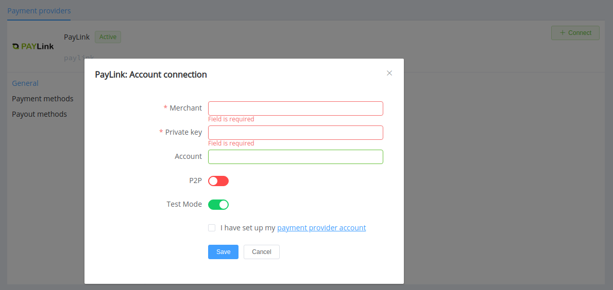
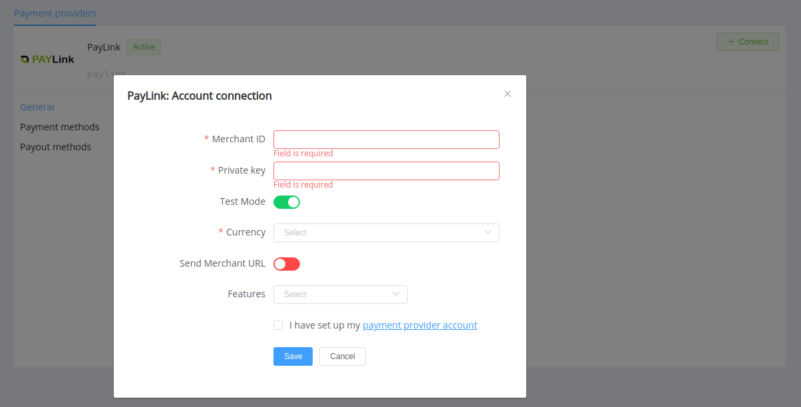

# PayLink (TAS Link)

quote ""
    TAS LINK is a high-tech and innovative company specializing in payment solutions.

**Website**: [taslink.com.ua](https://taslink.com.ua/)

**Login**: [application](https://paylink.com.ua/app/login.php)

Follow the guidance for setting up a connection with PayLink (TAS LINK) payment service provider.

## Set Up Account

### Step 1. Contact with PayLink Support Manager

Send a request on the [website](https://taslink.com.ua/#contacts) or call the hotline. Submit the required documents to verify your account and gain access.

### Step 2: Get credentials

- Merchant (Terminal ID)
- Private Key

## Connect Provider Account

### Step 1. Connect account at the {{custom.company_name}} Dashboard

Press **Connect** at [*PayLink Provider Overview*]({{custom.dashboard_base_url}}connect-directory/payment-providers/paylink/general) page in *'New connection'* and choose **Provider account** option to open a Connection form.

Enter credentials:

- Merchant (Terminal ID)
- Private Key
- Account (Bank Account)

!!! attention "Be aware"
    The *Account* field has its specificities to fill in:

    * it is obligatory only for non-P2P connections
    * and you shouldn't fill in the full IBAN (International Bank Account Number) there, just your bank account identifier (up to 14 digits)

Also, you should toggle P2P mode for connection in peer-to-peer payment network. And choose Test Mode if you want to test the connection with PayLink.

!!! success
    You have connected **PayLink** account!

## Connect H2H Merchant Account

### Step 1. Connect H2H account at the {{custom.company_name}} Dashboard

Press **Connect** at [*PayLink Provider Overview*]({{custom.dashboard_base_url}}connect-directory/payment-providers/paylink/general) page in *'New connection'* and choose **H2H Merchant account** option to open a Connection form.

Enter credentials:

- Merchant (Terminal ID)
- Private Key

Choose Test Mode to test the connection with PayLink. Also, check an option *Send Merchant URL* if you want to transfer Merchant URL (specified in the Commerce general settings) to the provider.

Choose Currency and Features. You can set these parameters according to available currencies and features for your PayLink account, but it is necessary to check details of the connection with your {{custom.company_name}} account manager.

!!! success
    You have connected **PayLink** H2H merchant account!

!!! question "Still looking for help connecting your PayLink account?"
    [Please contact our support team!](mailto:{{custom.support_email}})
