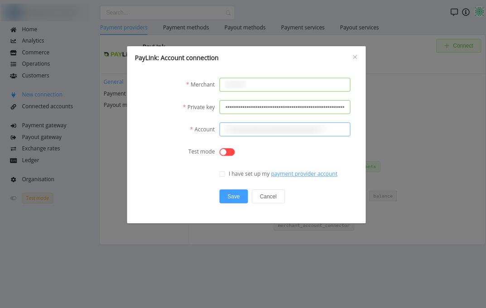
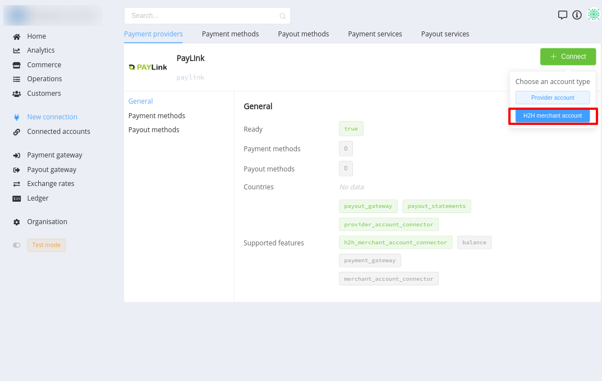
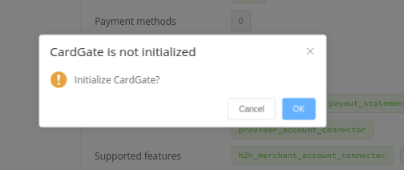
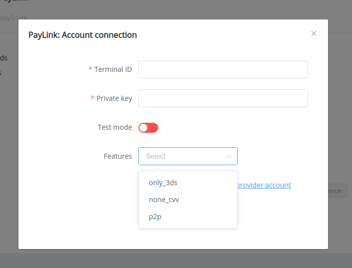

# PayLink Connector

## Introduction

Here You can find  instructions for setting up **PayLink**  account.

## Payouts

Connect **PayLink** **`Provider account`** to make payouts.

### Setup account

#### Step 1 Contact with PayLink Support Manager

#### Step 2: Get required credentials

- Merchant (Terminal ID)
- Private Key
- Account (Bank account)

!!! success
    You have configured account!

### Connect account

#### Step 1: Copy required credentials

#### Step 2: Enter credentials

- Merchant (Terminal ID)
- Private Key
- Account (Bank account)

!!! tip
    Press **`Connect`** at PayLink **`Provider Overview page`** in **`New connection`** section to open Connection form!

#### Step 3: Set up additional parameters 

- Test mode

!!! note
    These parameters are set according to your Merchant account type and it's available currencies!

!!! success
    You have connected **PayLink** for payouts!

## Payments

Connect **PayLink** **`H2H merchant account`** to make payouts.

### Setup account

#### Step 1 Contact with PayLink Support Manager

#### Step 2: Get required credentials

- Terminal ID
- Private key

!!! success
    You have configured account!

### Connect account

#### Step 1: Copy required credentials

#### Step 2 (OPTIONAL): Initialize the CardGate

!!! info
    Initialize the CardGate if it had not been done before.

#### Step 3: Enter credentials

#### Step 3: Set up additional parameters 

- Test mode
- Features

!!! note
    These parameters are set according to your Merchant account type and it's available currencies!

!!! success
    You have connected **PayLink** for payments!