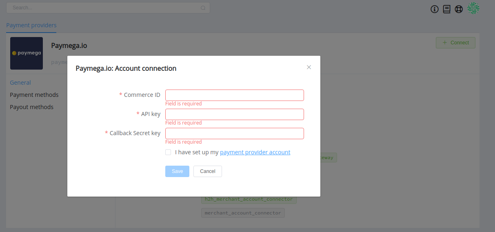
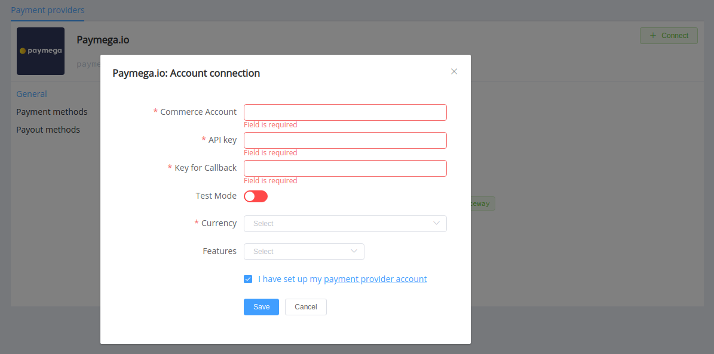

# PayMega.io

> Accept payments from all over the world on your website

**Website**: [paymega.io](https://paymega.io/)

Follow the guidance for setting up a connection with PayMega.io payment provider.

## Set Up Account

### Step 1: Leave the application to integrate

Send a request on the website and contact PayMega.io support manager.

### Step 2: Get credentials

Credentials that have to be issued:

- Commerce Account ID
- API key
- Callback Secret key

## Connect Provider Account

### Step 1. Connect account at the {{custom.company_name}} Dashboard

Press **Connect** at [*PayMega.io Provider Overview*]({{custom.dashboard_base_url}}connect-directory/payment-providers/paymegaio/general) page in *'New connection'* and choose **Provider account** option to open Connection form.

Enter credentials:

- Commerce Account ID
- API key
- Callback Secret key

!!! success
    You have connected **PayMega.io** account!

## Connect H2H Merchant Account

### Step 1. Connect H2H account at the {{custom.company_name}} Dashboard

Press **Connect** at [*PayMega.io Provider Overview*]({{custom.dashboard_base_url}}connect-directory/payment-providers/paymegaio/general) page in *'New connection'* and choose **H2H Merchant account** option to open Connection form.

Enter credentials:

- Commerce Account ID
- API Key
- Callback Secret key

Choose Test Mode for test connection with PayMega.io.

Choose Currency and Features. You can set these parameters according to available currencies and features for your PayMega.io account, but it is necessary to check details of the connection with your {{custom.company_name}} account manager..

!!! success
    You have connected **PayMega.io** H2H merchant account!

!!! question "Still looking for help connecting your PayMega.io account?"
    [Please contact our support team!](mailto:{{custom.support_email}})
