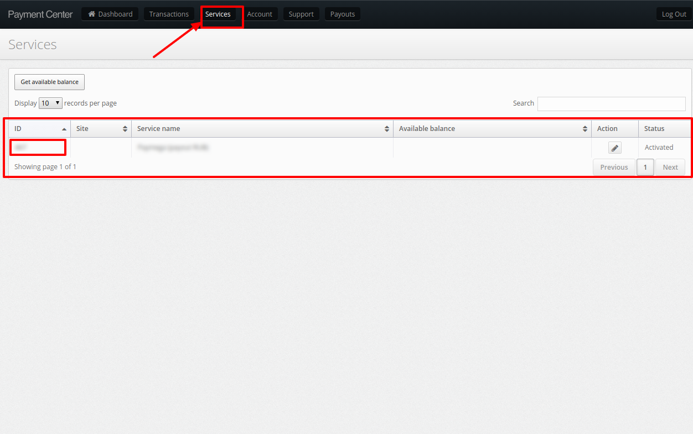
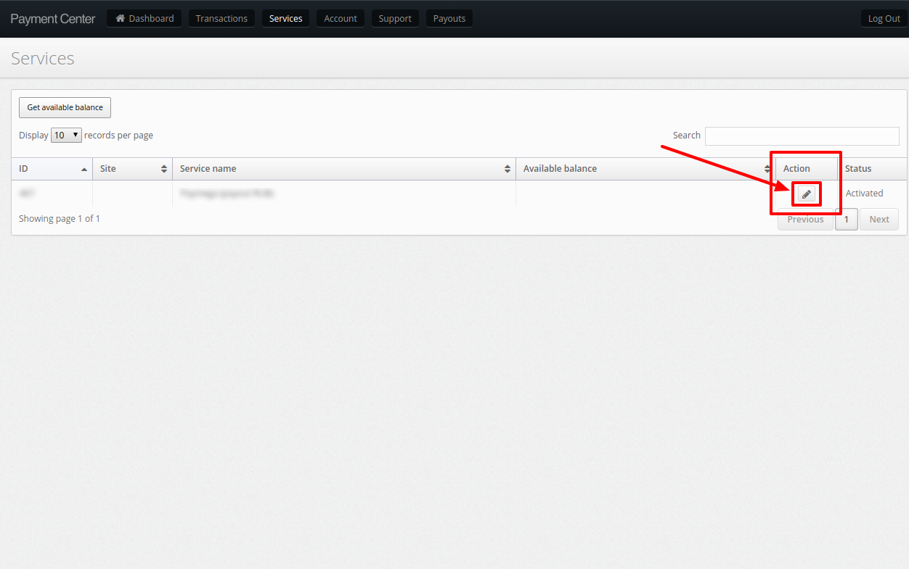
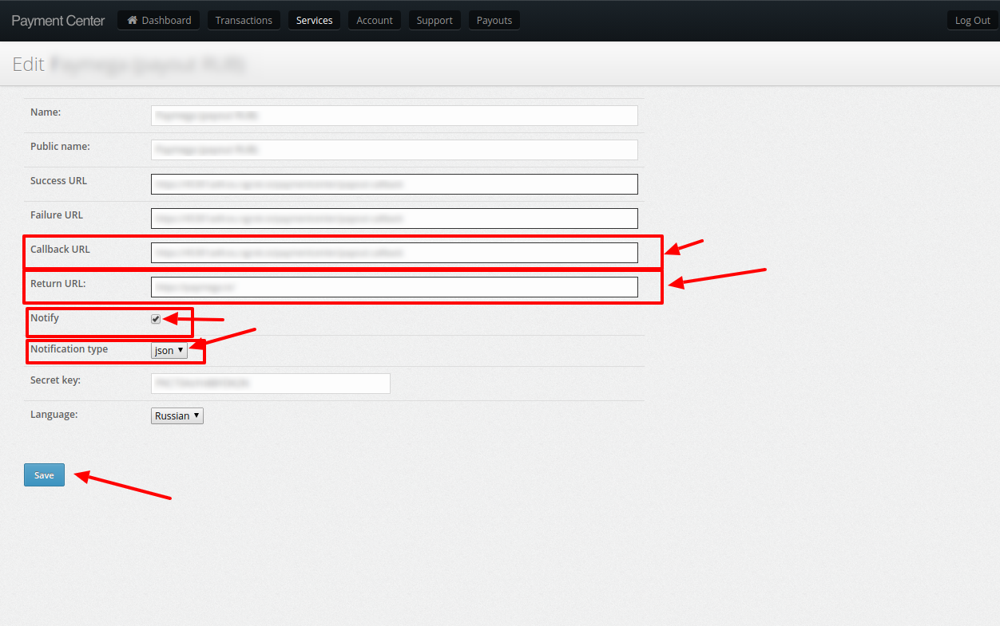

# PaymentCenter Connector

## Introduction

Here You can find  instructions for setting up [**PaymentCenter**  account](https://cabinet.payment.center/login/).

## Setup account

#### Step 1: Contact with PaymentCenter Support Manager
Get **`Login`** and **`Password`** for [Your personal account](https://cabinet.payment.center/login/)

#### Step 2: Get required credentials

1. Go to the Services
    
    ??? note
        Services are created by PaymentCenter manager!
    
    !!! info "Screenshot"
        [](images/paymentcenter__services1.png)    

2. Find and Copy:
    -  **Service ID**


3. Go to the **`Actions list`**

    !!! info "Screenshot"
        [](images/paymentcenter__actions.png) 

4. Find and Copy:
    -  **Secret Key**

    !!! info "Screenshot"
        [](images/paymentcenter__secret_key.png) 

    ??? Note
        You can set a new one, but ensure that copied key is actual.


#### Step 3: Set up parameters

- Return URL: ```https://psp-ext.paycore.io/paymentcenter/return```
- Callback URL: ```https://psp-ext.paycore.io/paymentcenter/callback```
- Notifications: **`ENABLED`**
- Callback data format : **`JSON`**

    !!! info "Screenshot"
        [](images/paymentcenter__paramenters.png) 

!!! success
    You have configured account!


## Connect account

#### Step 1: Copy required credentials

 -  **Service ID**
 -  **Secret Key**

#### Step 2: Enter credentials


!!! tip
    Press **`Connect`** at PaymentCenter **`Provider Overview page`** in **`New connection`** section to open Connection form!


!!! info "Screenshot"
    [](images/paymentcenter_connect.png)


!!! success
    You have connected **PaymentCenter**!