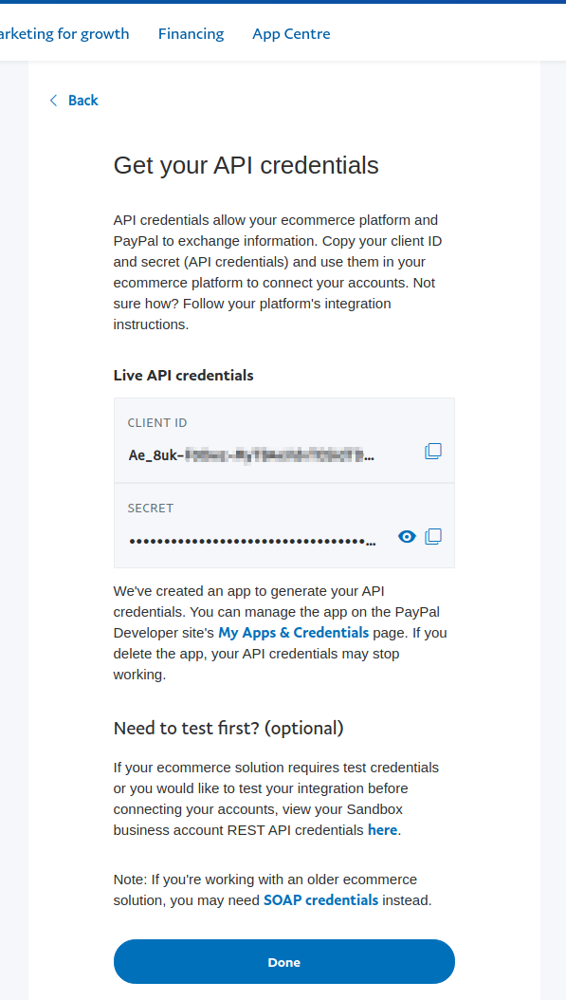
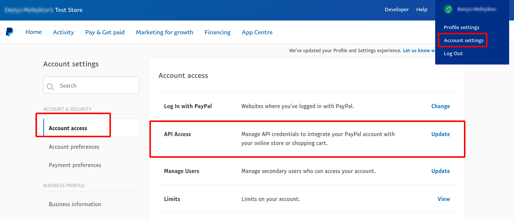
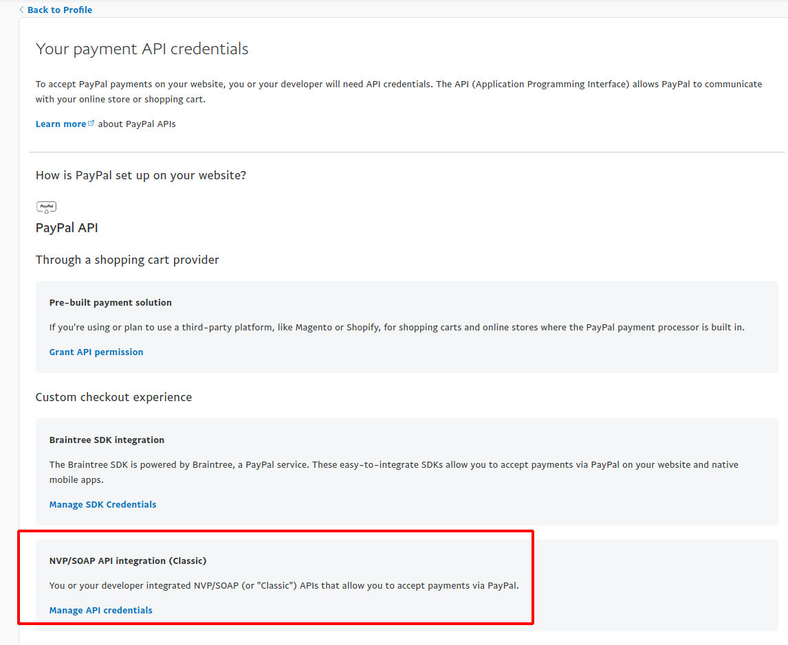
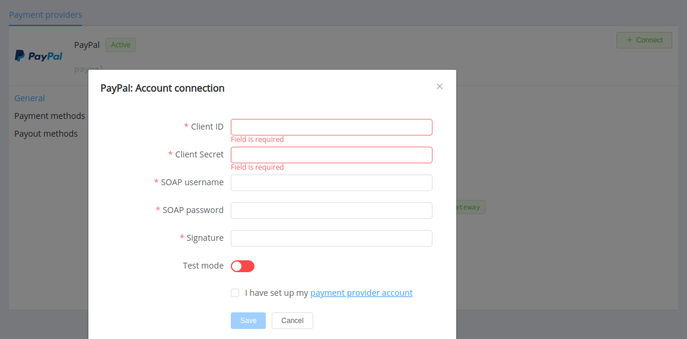

# PayPal

!!! quote ""
    The platform that grows with you

**Website**: [paypal.com/uk/business](https://www.paypal.com/uk/business)

**Login**: [paypal.com/uk/signin](https://www.paypal.com/uk/signin)

Follow the guidance for setting up a connection with PayPal payment service provider.

## Set Up Account

### Step 1: Contact PayPal support manager

Sign up for a business account on the [website](https://www.paypal.com/bizsignup/#/checkAccount) or contact support team via hotline. Submit the required documents to verify your account and gain access to the Sandbox and then, after testing, to the live account.

### Step 2: Create new App or select one from the list 

Log in to the [Developer Dashboard](https://www.paypal.com/signin?returnUri=https%3A%2F%2Fdeveloper.paypal.com%2Fdeveloper%2Fapplications&_ga=1.13091063.1562130854.1623839968) with your PayPal account. 

Go to the *DASHBOARD* menu, select *My Apps & Credentials*.

Press the *Create App* button and set *App Name*, or choose one of the existing app entries as *Default*.

!!! tip ""
    
    

!!! attention ""
    Make sure you're on the *Sandbox* tab to get the API credentials you'll use while you're testing connection. After you test and before you go live, switch to the *Live* tab to get live credentials and complete *Live App* setup.

     

### Step 3: Get credentials

The *Default Application* page displays your API credentials, including your client ID and secret.

You also can log in to the *Sandbox* (or *Live*) store account and find API credentials at *App Centre* --> *Streamline operations* --> *API credentials*. 

Credentials that have to be issued there:

* Client ID
* Secret

!!! tip ""
    
    

Also, SOAP API credentials you can find at *Account settings* --> *Account access* --> *API access* --> *NVP/SOAP API integration (Classic)*.

* API Username
* API Password
* Signature

!!! tip ""
    
    
    

!!! important
    Be sure to check with the manager if you require to provide a white list of IPs, and if so, specify IP addresses from the [Corefy list](/integration/ips/).

## Connect Provider Account

### Step 1. Connect account at the {{custom.company_name}} Dashboard

Press **Connect** at [*PayPal Provider Overview*]({{custom.dashboard_base_url}}connect-directory/payment-providers/paypal/general) page in *'New connection'* and choose **Provider account** option to open Connection form.

Enter credentials:

* Client ID
* Secret --> Client Secret
* API Username --> SOAP username
* API Password --> SOAP password
* Signature

Select Test or Live mode according to the type of account to connect with PayPal.

!!! success
    You have connected **PayPal** account!

!!! question "Still looking for help connecting your PayPal account?"
    <!--email_off-->[Please contact our support team!](mailto:{{custom.support_email}})<!--/email_off-->
