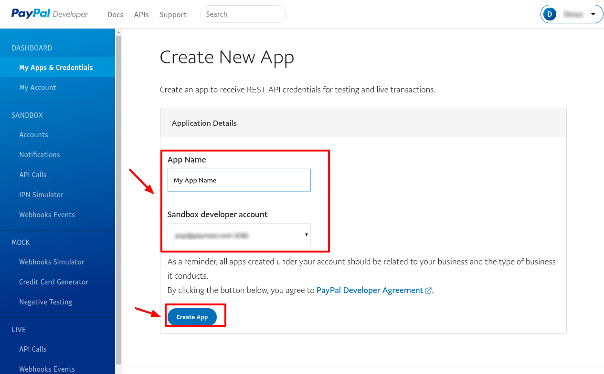
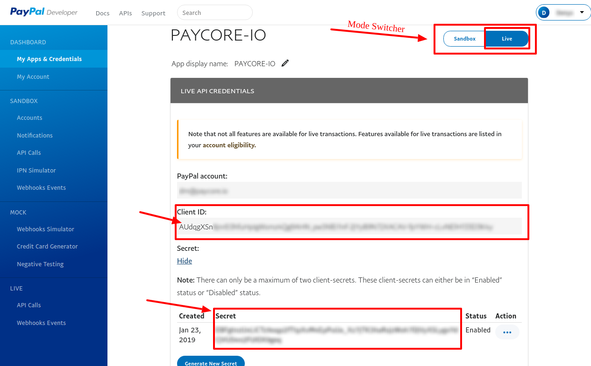
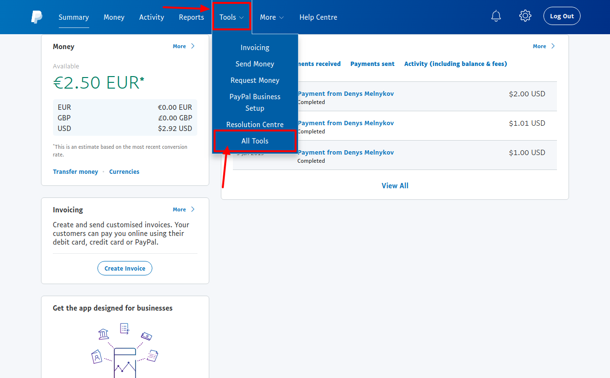
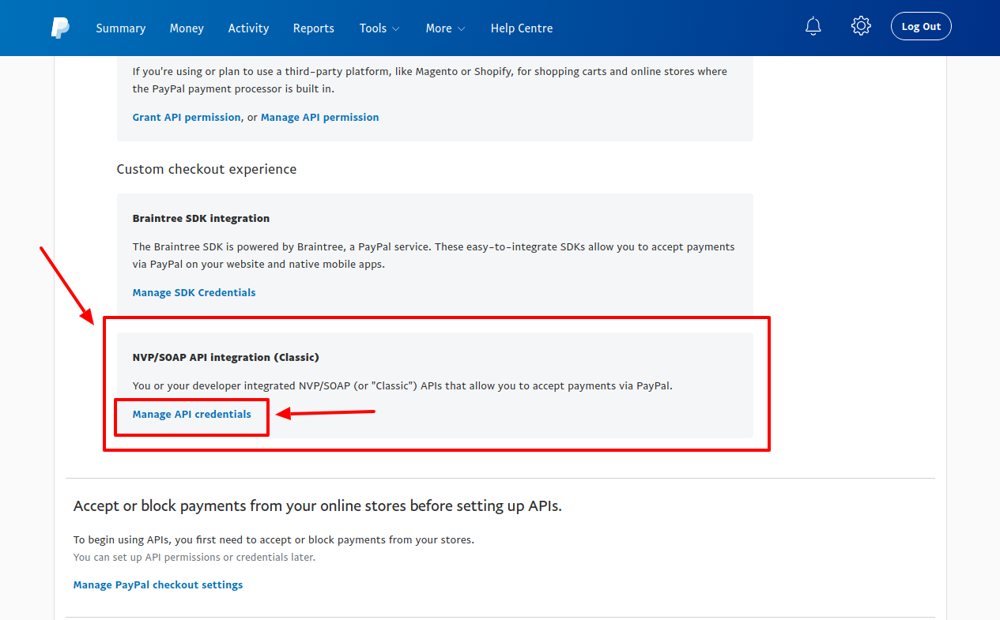
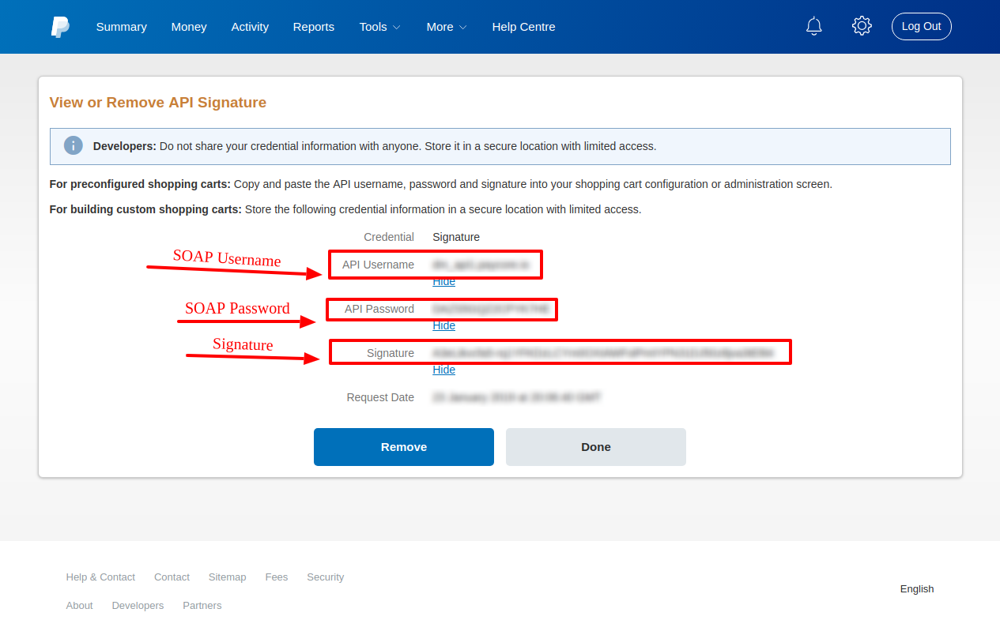

# PayPal Connector

## Introduction

Here You can find  instructions for setting up [ **PayPal** account](https://developer.paypal.com/).

## Setup account

#### Step 1: Create App

!!! info
     Skip this step if You have already configured it.

- Go to the **`REST API apps`** section
- Press **`Create App`**
- Set **`App Name`** 
- Choose **`Sandbox developer account`**

    

    

!!! Note
    You will be automaticaly redirected to Created app!

#### Step 2: Get App credentials

-  Client ID
-  Client Secret

!!! warning
    Ensure that **`Mode Switcher`** has **`Live`** state, if you want to connect **`Live`** account!
    
!!! tip
    You can find **`Mode Switcher`** on the upper right.

#### Step 3: Set Up App settings
- Go to the  **`LIVE APP SETTINGS`**
- Set the necessary parameters

!!! note
    If **`Mode Switcher`** has **`Sanbox`** state - this section has **`SANDBOX APP SETTINGS`** title!

!!! tip
    Don't forget to confirm action!

    

#### Step 4: Get Account credentials

Besides App credentials You also need:

-  SOAP Username
-  SOAP Password
-  Signature

To get them - folow this flow:

1. Log In at  [  **PayPal.com**](https://paypal.com/) 
2. Open **`Tools`** -> **`All Tools`** 
    
    !!! tip
        You can find this on the **`Navigation bar`**

3. Find  and Open **`API Credentials`**

5. Go to the **`NVP/SOAP API integration (classic)`** section
6. Press **`Manage API Credentials`**

- Find:
    -  SOAP Username
    -  SOAP Password
    -  Signature

    

    

    

    

!!! success
    You have configured account!

## Connect account

#### Step 1: Copy required credentials

-  Client ID
-  Client Secret
-  SOAP Username
-  SOAP Password
-  Signature

#### Step 2: Enter credentials

!!! tip
    Press **`Connect`** at PayPal **`Provider Overview page`** in **`New connection`** section to open Connection form!

#### Step 3: Set additional parameters

-  Test mode

!!! info
    **`Test mode`** is set **_according to your PayPal account settings_**!

!!! success
    You have connected **PayPal**!