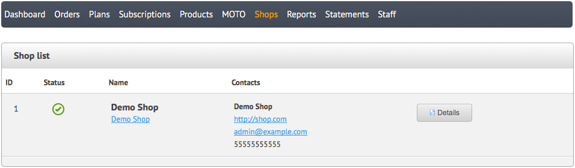
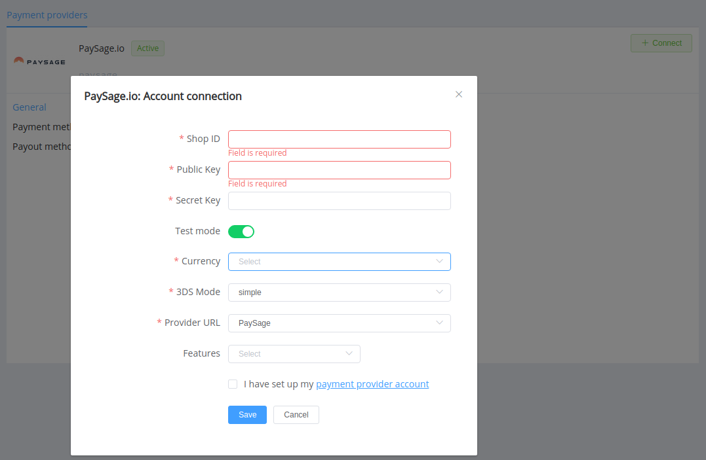

# PaySage.io

> Discover solutions that’ll help you keep up with the evolving payments world.

**Website**: [PaySage.io](https://paysage.io/)

**Login**: [backoffice](https://backoffice.paysage.io/)

Follow the guidance for setting up a connection with PaySage.io payment service provider.

## Set Up Account

### Step 1: Contact PaySage.io support

Send a request on the [website](https://paysage.io/get-started/). Submit the required documents to verify your account and gain access to the *Backoffice*.

### Step 2: Get credentials

Find them in your backoffice: *Shops* --> *Shop list* --> *Details*

Credentials that have to be issued:

* Shop ID
* Secret key
* Public key

!!! note "Please note"
    Be aware if you generate new keys in the PaySage.io backoffice, you will also should re-connect your account with new credentials in the PayCore.io dashboard.

## Connect Provider Account

### Step 1. Connect account at dashboard.paycore.io

Press **Connect** at [*PaySage.io Provider Overview*](https://dashboard.paycore.io/connect-directory/payment-providers/paysage/general) page in *'New connection'* and choose **Provider account** option to open Connection form.

Enter your credentials and choose Provider URL (*PaySage*).

Also, choose Test Mode for test connection with PaySage.io.

!!! success
    Just right: you have connected **PaySage.io** account!

<!--
## Connect H2H Merchant Account

### Step 1. Connect H2H account at dashboard.paycore.io

Press **Connect** at [*PaySage.io Provider Overview*](https://dashboard.paycore.io/connect-directory/payment-providers/PaySage.io/general) page in *'New connection'* and choose **H2H Merchant account** option to open Connection form.

Enter credentials:

[//]: # (Choose Test Mode for test connection with PaySage.io.)

Choose Currency and Features: set these parameters according to available currencies and features for your PaySage.io account.

!!! success
    You have connected **PaySage.io** H2H merchant account!

-->

!!! question "Still looking for help connecting your PaySage.io account?"
    [Please contact our support team!](mailto:support@paycore.io)
