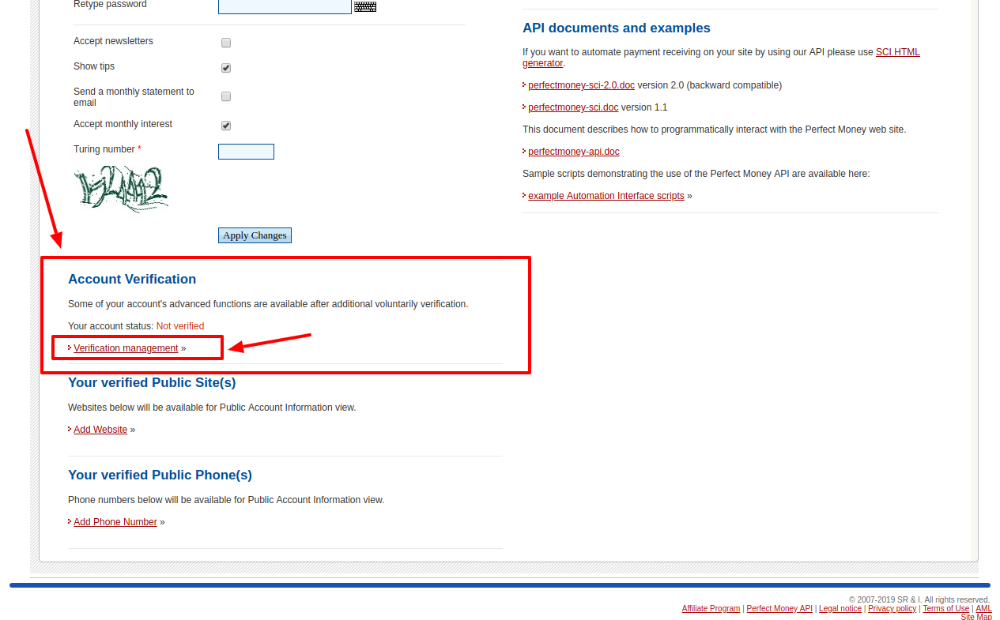
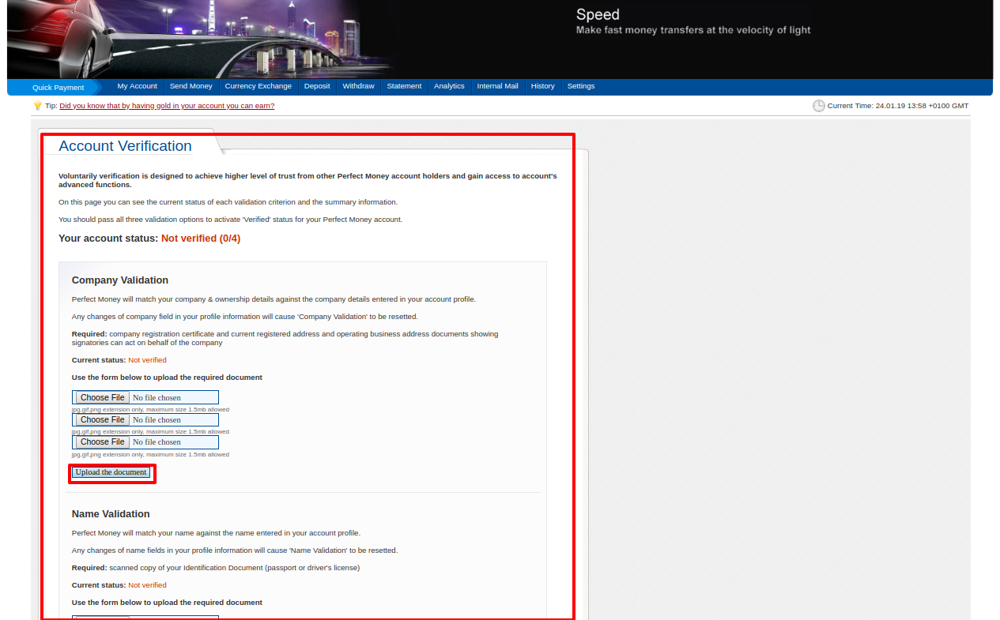
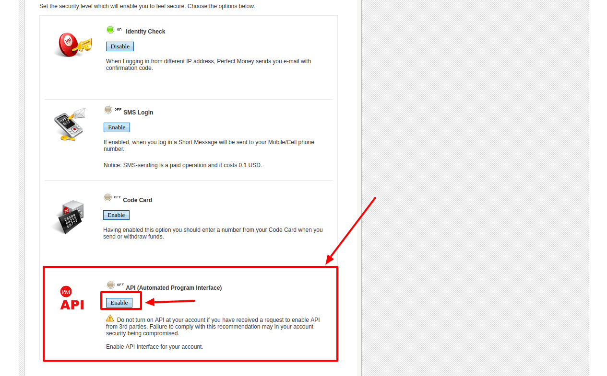
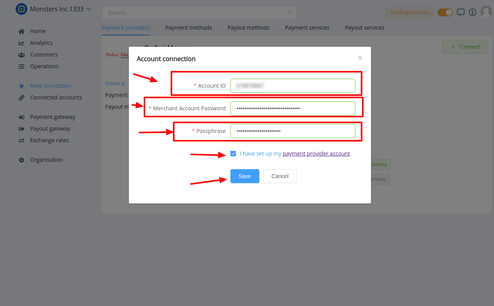

# PerfectMoney Connector

## Introduction

Here You can find  instructions for setting up [ **PerfectMoney** account](https://perfectmoney.is/login.html).

## Setup account

### Step 1: Open Commerce setting

### Step 2: Verify your business account

!!! tip
    You just need to verify **all documents** and **additional info**, which is necessary for successful setting up an account!

### Step 3: Set up API access

- Go to the **`Settings`**
- Find **`Security`**  section
- Enable **`API access`**
- Add all necessary IP adressess to the White list, including  [{{custom.company_name}} white-list IP addresses](/integration/ips/)
    
    !!! tip
        IP list should contains IP adresses separated with **`;`**.

        **_For example_**: _54.36.117.30; 51.38.147.254; 54.38.139.222_

### Step 3: Get required credentials

- Return to the Settings

- Find and copy next credential:

    -  Alternate Passphrase (Passphrase)

- Go to the **`Public Account Information`**

- Press **`Change Public Account Information settings`**

- Find and copy next credential:

    -  Member ID (Account ID)

 
## Connect account

### Step 1: Copy required credentials

-  Account ID

-  Passphrase

-  Merchant Account Password
    
    !!! info
        **`Merchant Account Password`** - is the password, you use to Sign in to the [PerfectMoney Dashboard](https://perfectmoney.is/login.html)

### Step 2: Enter credentials

!!! tip
    Press **`Connect`** at PerfectMoney **`Provider Overview page`** in **`New connection`** section to open Connection form!

!!! success
    You have connected **PerfectMoney**!