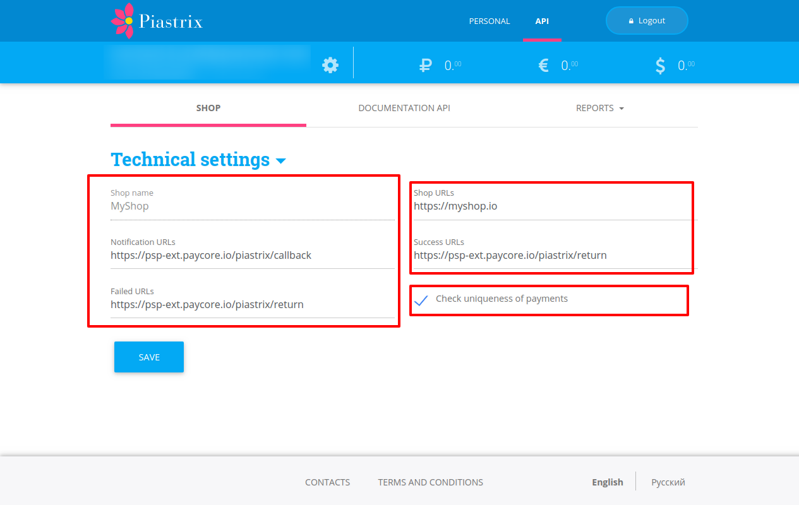
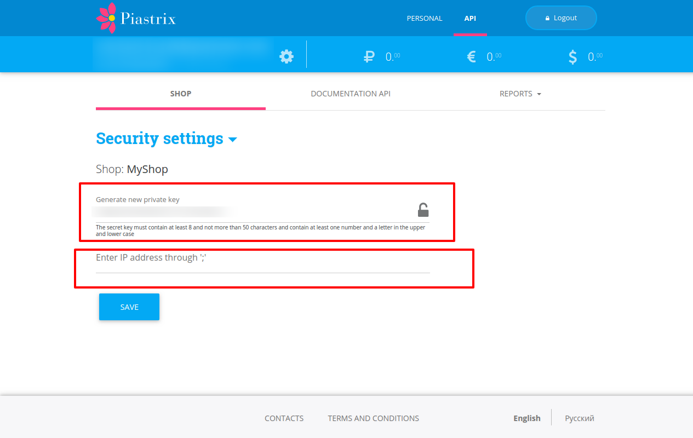
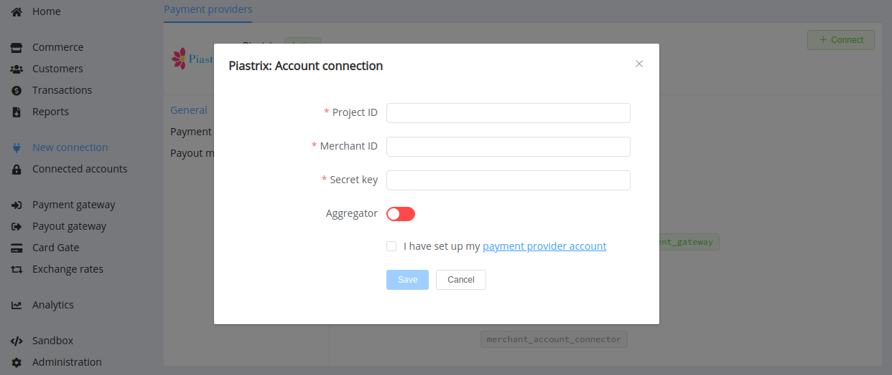
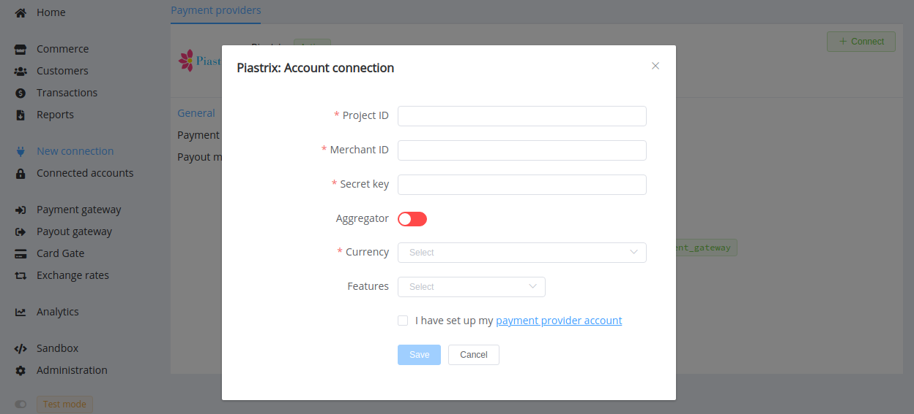

# Piastrix

!!! quote ""
    Piastrix is a new electronic wallet standard

**Website**: [Piastrix](https://piastrix.com/)

**Login**: [Piastrix Wallet](https://wallet.piastrix.com/auth/login)

Follow the guidance for setting up a connection with the Piastrix payment service provider.

## Set Up Account

### Step 1: Contact the Piastrix support team

Register on the [website](https://wallet.piastrix.com/auth/register). Submit the required documents to verify your account and gain access.

### Step 2: Create a shop

1. Switch to the *API* mode
2. Open the *Shop* section
3. Create a *New shop*

!!! tip ""
    

### Step 3: Set required parameters

* Notification URL ```https://psp-ext.paycore.io/piastrix/callback```
* Success URL ```https://psp-ext.paycore.io/piastrix/return```
* Failed URL ```https://psp-ext.paycore.io/piastrix/return```
* Check uniqueness of payments: yes

!!! tip ""
    

### Step 4: Get credentials

* *Shop ID*: find in the relevant row in the *Shops* table.

!!! top ""
    

* *Project ID*: request it from your Piastrix manager.
* *Secret Key*: set new or get existed in the shop's *Security* settings.

!!! top ""

    
    

!!! important
    Also, specify IP addresses from the [{{custom.company_name}} list](/integration/ips/) there.

## Connect Provider Account

### Step 1. Connect account at the {{custom.company_name}} Dashboard

Press **Connect** at [*Piastrix Provider Overview*]({{custom.dashboard_base_url}}connect-directory/payment-providers/piastrix/general) page in *'New connection'* and choose **Provider account** option to open Connection form.



Enter credentials:

* Project ID
* Shop ID --> Merchant ID
* Secret key

Toggle the *Aggregator* feature if you work with this account as a payment aggregator.

!!! success
    You have connected **Piastrix** account!

## Connect H2H Merchant Account

### Step 1. Connect H2H account at the {{custom.company_name}} Dashboard

Press **Connect** at [*Piastrix Provider Overview*]({{custom.dashboard_base_url}}connect-directory/payment-providers/piastrix/general) page in *'New connection'* and choose **H2H Merchant account** option to open Connection form.



Enter credentials:

* Project ID
* Shop ID --> Merchant ID
* Secret key

Toggle the *Aggregator* feature if you work with this account as a payment aggregator.

Choose Currencies and Features. You can set these parameters according to available currencies and features for your Piastrix account, but it's necessary to verify details of the connection with your {{custom.company_name}} account manager.

!!! success
    You have connected **Piastrix** H2H merchant account!

!!! question "Still looking for help connecting your Piastrix account?"
    <!--email_off-->[Please contact our support team!](mailto:{{custom.support_email}})<!--/email_off-->
