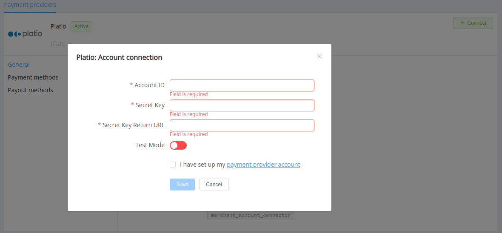

# Platio

> Transfers between cards made easy

**Website**: [Platio](https://platio.com/)
**Login**: [Platio](https://w.platio.com/sign-in)

Follow the guidance for setting up a connection with Platio payment service provider.

## Set Up Account

### Step 1: Register your account

Register on the [website](https://w.platio.com/sign-up), verify your account, and gain access.

### Step 2: Create a new outlet

### Step 3: Get credentials

Credentials that have to be issued:

* Outlet ID
* Secret Key
* Secret Key for Result URL

## Connect Provider Account

### Step 1. Connect account at dashboard.paycore.io

Press **Connect** at [*Platio Provider Overview*](https://dashboard.paycore.io/connect-directory/payment-providers/platio/general) page in *'New connection'* and choose **Provider account** option to open Connection form.

Enter credentials:

* Outlet ID as Account ID
* Secret Key
* Secret Key for Result URL as Secret Key Return URL

Also, choose Test Mode for test connection.

!!! success
    You have connected **Platio** account!

## Connect H2H Merchant Account

### Step 1. Connect H2H account at dashboard.paycore.io

Press **Connect** at [*Platio Provider Overview*](https://dashboard.paycore.io/connect-directory/payment-providers/platio/general) page in *'New connection'* and choose **H2H Merchant account** option to open Connection form.

Enter credentials:

* Outlet ID as Account ID
* Secret Key
* Secret Key for Result URL as Secret Key Return URL

Choose Test Mode for test connection.

Enable *Send Merchant URL* option for sending the Merchant's shop URL to Platio.

Enable *Save Instant Token* if you plan on using payments by token with the connected Outlet ID.

Also, choose Currency and Features. You can set these parameters according to available currencies and features for your Platio account, but it is necessary to check the details of their connection with your PayCore.io account manager.

!!! success
    You have connected **Platio** H2H merchant account!

!!! question "Still looking for help connecting your Platio account?"
    [Please contact our support team!](mailto:support@paycore.io)
