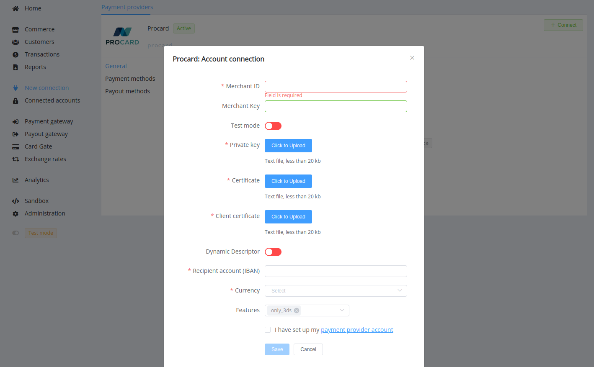

# Procard

**Website**: [Procard](http://www.procard.ua/)

Follow the guidance for setting up a connection with Procard payment service provider.

## Set Up Account

### Step 1: Contact Procard support manager

Send a request via the [e-mail](mailto:info@procard-ltd.com
) or call the [hotline](tel:+380567940548). Submit the required documents to verify your account and gain access.

### Step 2: Get credentials

You require your merchant ID (`MerchantID`), merchant key (`MerchantKey`), and a certificate file with a password to it in the .p12 format. After obtaining, you should convert the .p12 certificate file to the set of the .pem files: for the Private Key, the Certificate, and the Client Certificate separately.

??? example "The console commands' example (for the Linux OS or MacOs)"

    ``` bash
        # the Private key
    openssl pkcs12 -in <file.p12> -out filekey.pem -nocerts -nodes
        # the Certificate 
    openssl pkcs12 -in <file.p12> -out filecert.pem -clcerts -nodes -nokeys
        # the Client Certificate
    openssl pkcs12 -in <file.p12> -out fileCA.pem -cacerts -nodes -nokeys
    ```

If your Merchant Key is not specified, it matches the Certificate password.

## Connect H2H Merchant Account

### Step 1. Connect H2H account at dashboard.{{custom.company_name}}

Press **Connect** at [*Procard Provider Overview*]({{custom.dashboard_base_url}}connect-directory/payment-providers/procard/general) page in *'New connection'* and choose **H2H Merchant account** option to open Connection form.



Enter credentials:

* Merchant ID
* Merchant Key
* Bank Account (IBAN) for payments

Choose Test Mode for test connection with Procard, and the Dynamic Descriptor option if you if you want to allow changing in the payment description.

Upload the prepared key and certificates files.

Choose Currency and Features. You can set these parameters according to available currencies and features for your Procard account, but it is necessary to check details of the connection with your {{custom.company_name}} account manager.

!!! success
    You have connected **Procard** H2H merchant account!

!!! question "Still looking for help connecting your Procard account?"
    [Please contact our support team!](mailto:{{custom.support_email}})