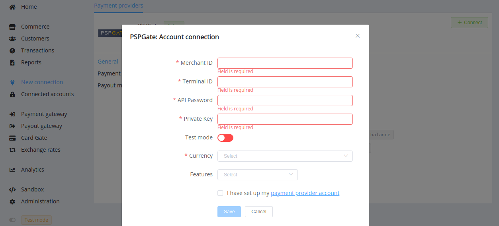

# PSPGate

**Website**: [PSPGate](https://pspgate.com/)

**Login**: [PSPGate](https://pspgate.com/merchant/)

Follow the guidance for setting up a connection with the PSPGate payment service provider.

## Set Up Account

### Step 1: Contact PSPGate support manager

Send a request for registration at the PSPGate [Merchant Dashboard](https://pspgate.com/merchant/). Submit the required documents to verify your account and gain access.

### Step 2: Get credentials

Set up your merchant account and get the credentials for connection:

* Merchant ID
* Terminal ID
* Terminal password
* Private key

!!! important
    Be sure to check with your account manager if you require to provide a white list of IPs, and if so, specify IP addresses from the [Corefy list](/integration/ips/).

## Connect H2H Merchant Account

### Step 1. Connect H2H account at the {{custom.company_name}} Dashboard

Press **Connect** at [*PSPGate Provider Overview*]({{custom.dashboard_base_url}}connect-directory/payment-providers/pspgate/general) page in *'New connection'* and choose **H2H Merchant account** option to open Connection form.

Enter credentials:

* Merchant ID
* Terminal ID
* Terminal password --> API Password
* Private key

Select Test or Live mode according to the type of account to connect with PSPGate.

Choose Currencies and Features. You can set these parameters according to available currencies and features for your PSPGate account, but it's necessary to verify details of the connection with your {{custom.company_name}} account manager.

!!! success
    You have connected **PSPGate** H2H merchant account!

!!! question "Still looking for help connecting your PSPGate account?"
    <!--email_off-->[Please contact our support team!](mailto:{{custom.support_email}})<!--/email_off-->
