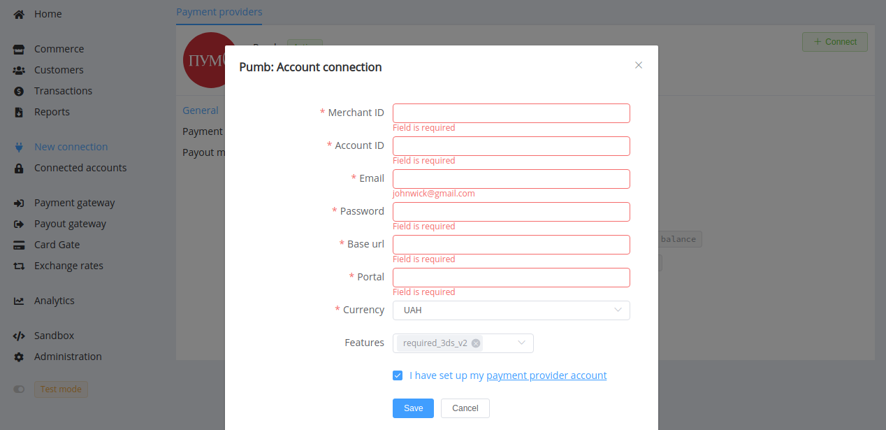

# PUMB (The First Ukrainian International Bank: Bank FUIB)

**Website**: [PUMB](https://b2b.pumb.ua/en)

Follow the guidance for setting up a connection with PUMB as a payment service provider.

## Set Up Account

### Step 1: Contact PUMB support manager

Send a request on the [website](https://b2b.pumb.ua/en). Submit the required documents to verify your account and gain access.

### Step 2: Get credentials

Credentials that have to be issued:

* Merchant ID
* Account ID
* API URL for requests
* Portal ID corresponding to a web application, a mobile application, or a server outside the bank system

You also provide your email and get a registration in the bank digital system, and then you use this email and password to connect your H2H Merchant Account at the {{custom.company_name}} Dashboard.

!!! important
    Be sure to check with the bank manager if you require to provide a white list of IPs, and if so, specify IP addresses from the [Corefy list](/integration/ips/).

## Connect H2H Merchant Account

### Step 1. Connect H2H account at the {{custom.company_name}} Dashboard

Press **Connect** at [*PUMB Provider Overview*]({{custom.dashboard_base_url}}connect-directory/payment-providers/pumb/general) page in *'New connection'* and choose **H2H Merchant account** option to open Connection form.

Enter credentials:

* Merchant ID
* Account ID
* Email (to the bank digital system)
* Password
* API URL
* Portal ID

Choose Currencies and Features. You can set these parameters according to available currencies and features for your PUMB account, but it is necessary to check details of the connection with your {{custom.company_name}} account manager.

!!! caution "3DS 2.0 settings"
    The `required_3ds_v2` feature is mandatory if such client authentication protocol is defined by your bank merchant account settings.

!!! success
    You have connected the **PUMB** H2H merchant account!

!!! question "Still looking for help connecting your PUMB account?"
    [Please contact our support team!](mailto:{{custom.support_email}})
