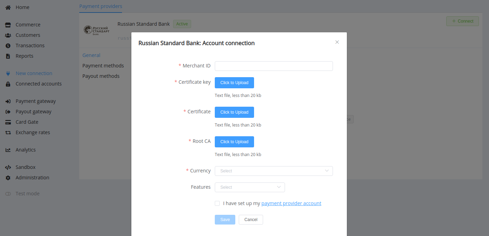

# Russian Standard Bank

**Website**: [Russian Standard Bank](https://business.rsb.ru/)

**Login**: [Ecomm_portal](https://securepay.rsb.ru:8443/ecomm_portal/)

Follow the guidance for setting up a connection with Russian Standard Bank as the payment service provider.

## Set Up Account

### Step 1: Contact Russian Standard Bank manager

Send a request on the [website](https://business.rsb.ru/) or call the hotline. Submit the required documents to verify your account and gain access.

### Step 2: Get credentials

You obtain your Merchant ID to the Ecomm system. The bank send you instructions and Openssl generator files. You need to check that you have installed the latest version of Openssl, generate the `MerchantID.key` and `MerchantID.req` files according to the instructions. You should send the `MerchantID.req` file to your Bank account manager also indicating your Merchant ID and your legal name, your site Return URL, and a list of IP addresses which payment requests will be sent from (be sure to specify IP addresses from the [Corefy list](/integration/ips/)).

Credentials that have to be obtained from the Bank response:

* Merchant certificate (`MerchantID.pem`)
* Root Certificate (`root-ca.crt`)
* Ecomm Certificate (`ecomm-ca.crt`)

Then, you need to generate a file container for in PKCS12 format where the Merchant private key and certificate will be stored.

!!! example ""

    ``` bash
    openssl pkcs12 -export -inkey MerchantID.key -in MerchantID.pem -out MerchantID.pkcs12 -name MerchantID
    ```

## Connect H2H Merchant Account

### Step 1. Connect H2H account at the {{custom.company_name}} Dashboard

Press **Connect** at [*Russian Standard Bank Provider Overview*]({{custom.dashboard_base_url}}connect-directory/payment-providers/russianstandardbank/general) page in *'New connection'* and choose **H2H Merchant account** option to open Connection form.



Enter your Merchant ID and upload the certificates:

* Container with Private key and Merchant certificate (`MerchantID.pkcs12`) --> Certificate key
* Ecomm Certificate (`ecomm-ca.crt`) --> Certificate
* Root Certificate (`root-ca.crt`) --> Root CA

Select Test or Live mode according to the type of account to connect with Russian Standard Bank.

Choose Currency and Features. You can set these parameters according to available currencies and features for your Russian Standard Bank account, but it is necessary to check details of the connection with your {{custom.company_name}} account manager.

!!! success
    You have connected **Russian Standard Bank** H2H merchant account!

!!! question "Still looking for help connecting your Russian Standard Bank account?"
    <!--email_off-->[Please contact our support team!](mailto:{{custom.support_email}})<!--/email_off-->
