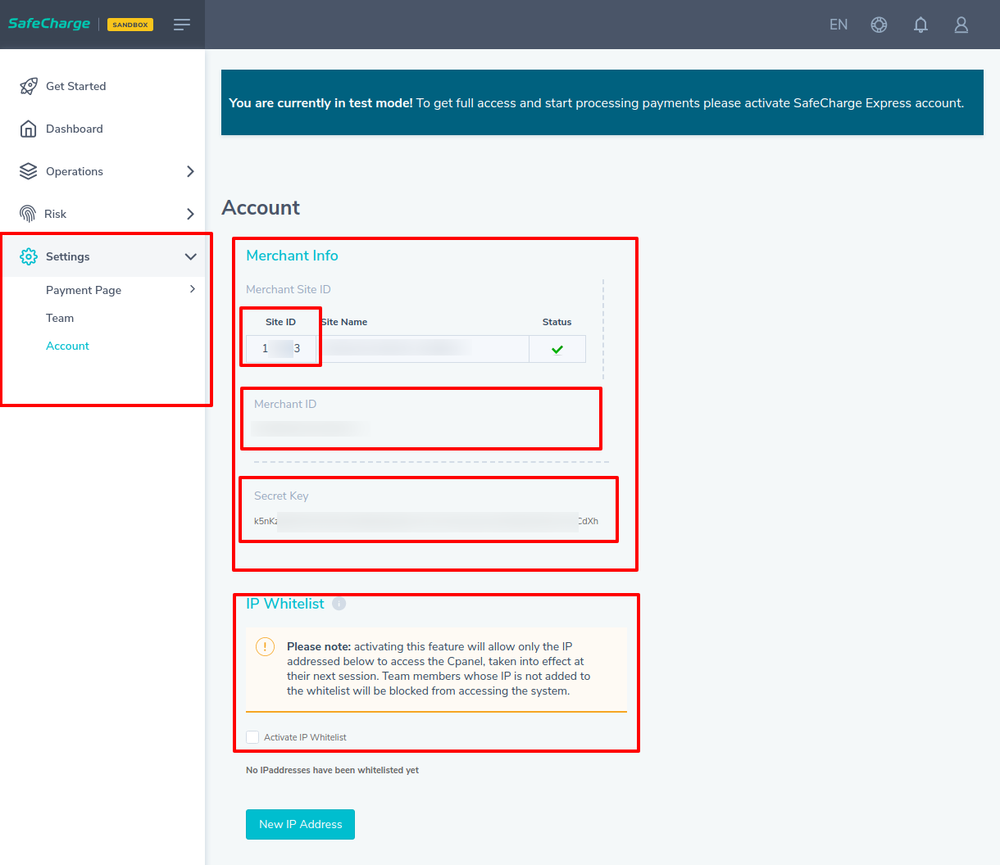
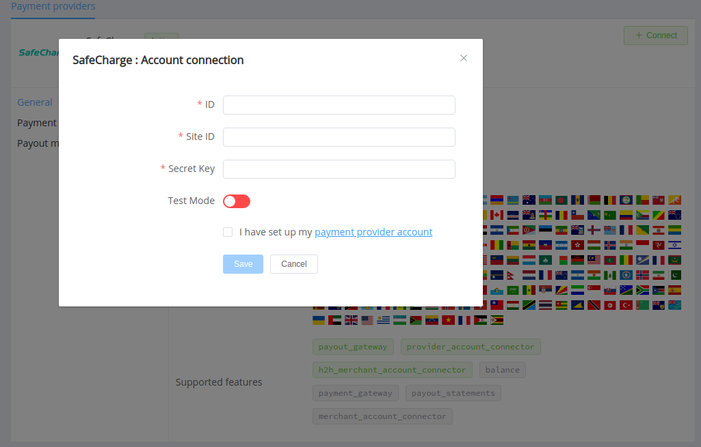
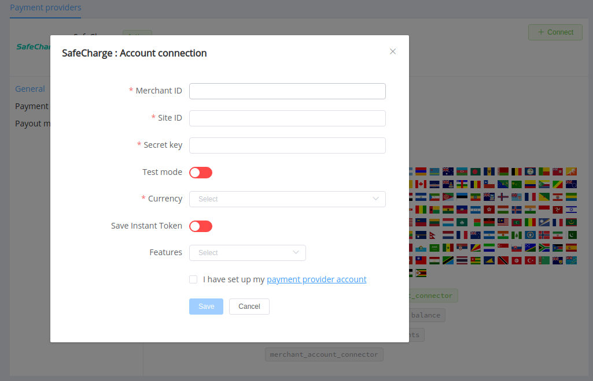

# SafeCharge

**Website**: [safecharge.com](https://www.safecharge.com/)

**Login**: [cpanel.safecharge.com](https://cpanel.safecharge.com/)

Follow the guidance for setting up a connection with SafeCharge payment service provider.

## Set up account

### Step 1: Contact SafeCharge support team

Send a request on the [website](https://www.safecharge.com/contacts/) to obtain a merchant ID. Submit the required documents to verify your account and gain full access.

### Step 2: Get credentials

Find in the *Account Settings*:

* Site ID
* Secret Key

!!! important
    If you require to provide a white list of IPs, be sure to include the [Corefy IP addresses](/integration/ips/) on the list.

## Connect Provider Account

### Step 1. Connect account at the {{custom.company_name}} Dashboard

Press **Connect** at [*SafeCharge Provider Overview*]({{custom.dashboard_base_url}}connect-directory/payment-providers/safecharge/general) page in *'New connection'* and choose **Provider account** option to open Connection form.

Enter credentials:

* Merchant ID
* Site ID
* Secret key

Also, choose Test Mode for test connection with SafeCharge.

!!! success
    You have connected **SafeCharge** account!

## Connect H2H Merchant Account

### Step 1. Connect H2H account at the {{custom.company_name}} Dashboard

Press **Connect** at [*SafeCharge Provider Overview*]({{custom.dashboard_base_url}}connect-directory/payment-providers/safecharge/general) page in *'New connection'* and choose **H2H Merchant account** option to open Connection form.

Enter credentials:

* Merchant ID
* Site ID
* Secret key

Choose Test Mode for test connection with SafeCharge.

Choose Currencies and Features. You can set these parameters according to available currencies and features for your SafeCharge account, but it's necessary to verify details of the connection with your {{custom.company_name}} account manager.

Also, choose *Save Instant Token* option if you plan to use the SafeCharge account for instant payments.

!!! success
    You have connected **SafeCharge** H2H merchant account!

!!! question "Still looking for help connecting your SafeCharge account?"
    <!--email_off-->[Please contact our support team!](mailto:{{custom.support_email}})<!--/email_off-->
