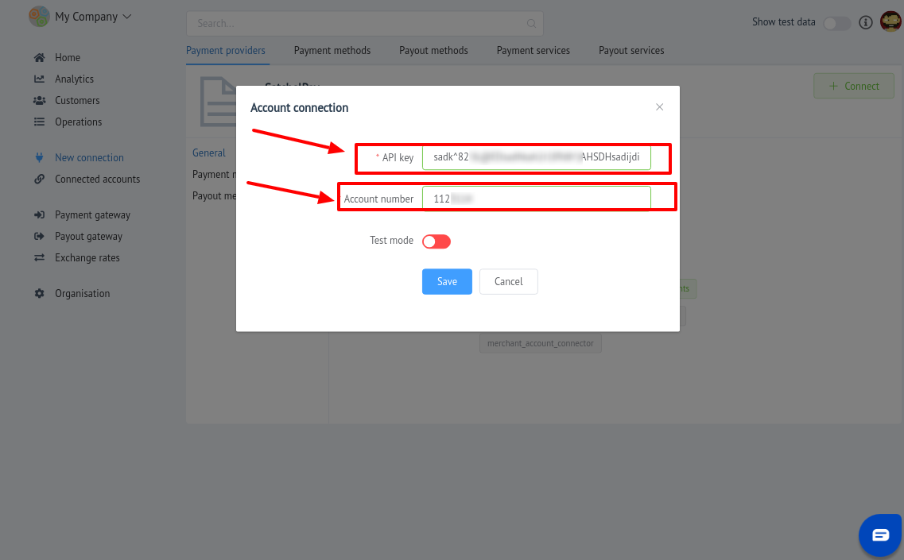

# SatchelPay Connector

## Introduction

Here You can find  instructions for setting up **SatchelPay** account!

## Setup account

#### Step 1:  Contact with SatchelPay Support Manager

This Payment Provoider gives acoount credentials personaly to their merchants!

#### Step 2: Get required credentials

-  API key

-  Account number

!!! success
    You are ready to connect!
    
## Connect account

#### Step 1: Copy credentials

#### Step 2: Enter credentials

-  API key

-  Account number

!!! tip
    Press **`Connect`** at SatchelPay **`Provider Overview page`** in **`New connection`** section to open Connection form!

!!! info "Screenshot"
    
    

!!! success
    You have connected **SatchelPay**!