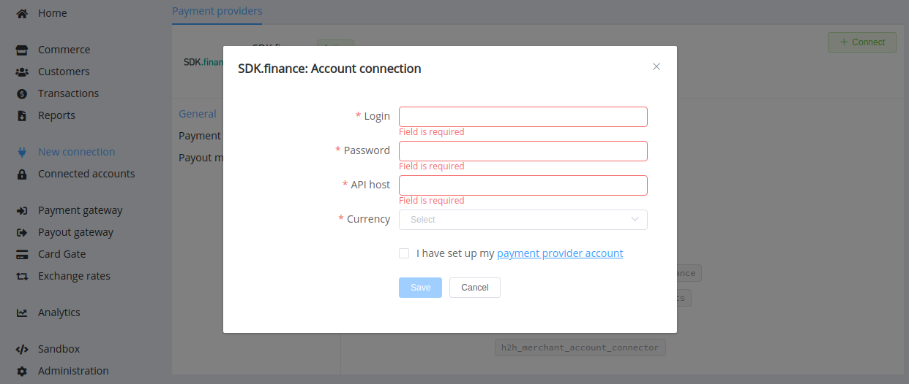

# SDK.finance 

!!! quote ""
    Everything you need to launch your payment product

**Website**: [SDK.finance](https://sdk.finance/)

**Login**: [SDK.finance.app](https://sdkfinance.app/)

Follow the guidance for setting up a connection with the SDK.finance payment service provider.

## Set Up Account

### Step 1: Contact SDK.finance support manager

Send a request on the [website](https://sdk.finance/). Submit the required documents to verify your account and gain access to the user's back office.

Set up your Profile info, system notifications, two-factor authentication and login credentials.

### Step 2: Get credentials

After setting up your account, you obtain the API host URLs, separate for the test and live environment.

!!! important
    Be sure to check with the manager if you require to provide a white list of IPs, and if so, specify IP addresses from the [Corefy list](/integration/ips/).

## Connect Provider Account

### Step 1. Connect account at the {{custom.company_name}} Dashboard

Press **Connect** at [*SDK.finance Provider Overview*]({{custom.dashboard_base_url}}connect-directory/payment-providers/sdkfinance/general) page in *'New connection'* and choose **Provider account** option to open Connection form.

Enter credentials:

* Merchant Login
* Password
* API host (without `api/ui` prefix, for example: `https://sandbox.sdk.finance/`)

Also, choose a currency available for your SDK.finance account.

!!! success
    You have connected **SDK.finance** account!

!!! question "Still looking for help connecting your SDK.finance account?"
    <!--email_off-->[Please contact our support team!](mailto:{{custom.support_email}})<!--/email_off-->
