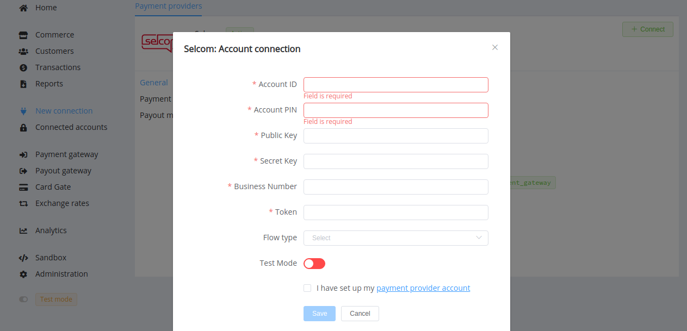

# Selcom Connector

!!! quote ""
    Looking to digitize payments?

    Searching for an easy payments integration?

    Need a revamped loyalty program for your customer?

    Leave it to us. 

**Website**: [Selcom](https://www.selcom.net/)

Follow the guidance for setting up a connection with Selcom payment service provider.

## Set Up Account

### Step 1: Contact Selcom support manager

Send a request on the [website](https://www.selcom.net/selcom-contactus), [email](mailto:helpdesk@selcom.net) or call the hotlines. Submit the required documents to verify your account and gain access.

### Step 2: Get credentials

Credentials that have to be issued:

* `vendor`: Float account identifier
* `pin`: Float account PIN
* API key and API secret to allow access to the API
* Business Number
* Authentication Token

!!! important
    Be sure to check with the manager if you require to provide a white list of IPs, and if so, specify IP addresses from the [Corefy list](/integration/ips/).

## Connect Provider Account

### Step 1. Connect account at the {{custom.company_name}} Dashboard

Press **Connect** at [*Selcom Provider Overview*]({{custom.dashboard_base_url}}connect-directory/payment-providers/selcom/general) page in *'New connection'* and choose **Provider account** option to open Connection form.

Enter credentials:

* Account ID <-- Float account identifier
* PIN <-- Float account PIN
* Public key <-- API key 
* Secret key <-- API secret
* Business Number
* Authentication Token

Choose your Flow type from the drop-down list. Also, select Test or Live mode according to the type of account to connect with Selcom.

!!! success
    You have connected **Selcom** account!

!!! question "Looking for help connecting your Selcom account?"
    <!--email_off-->[Please contact our support team!](mailto:{{custom.support_email}})<!--/email_off-->
