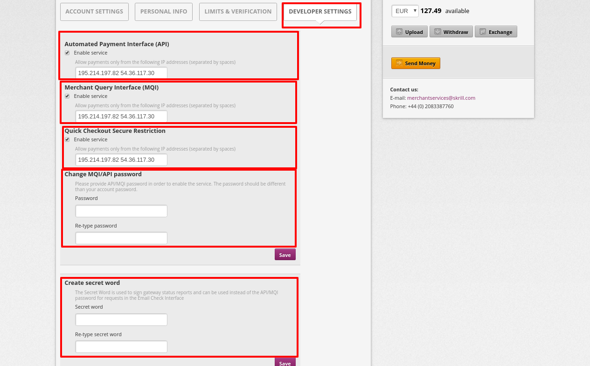
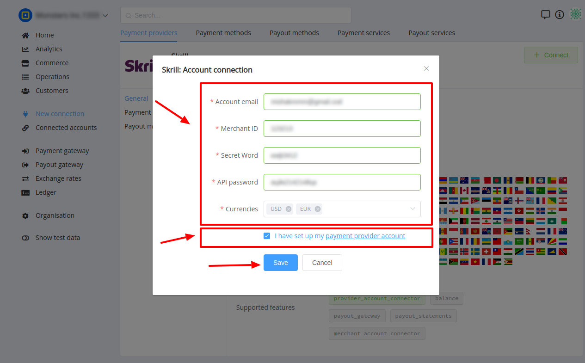

# Skrill Connector

## Introduction

Here You can find  instructions for setting up <a href="https://account.skrill.com/" target="_blank" rel="noopener">**Skrill**  account</a>.

## Setup account

### Step 1: Ensure that your accoutn is verified as Merchant

!!! note
    If the Settings > Developer Settings section is not displayed in your account, contact <a href="mailto:support@paycore.io" target="_blank" rel="noopener"><b>merchantservices@skrill.com</b></a>

### Step 2: Enable automated payments

- Go to the **`Settings`** —> **`Account settings`**
- Set **`Auto accept payments`** property

!!! info "Screenshot"
    

### Step 3: Set up API access

1. Go to the **`Developers`** settings
2. Enable services:
    - Automated Payment Interface (API)
    - Merchant Query Interface (MQI)
    - Quick Checkout Secure Restriction
3. Add all necessary IP adressess to the White list, including  [PayСore.io white-list IP addresses](/ips/#white-list-ip-addresses) to **each** service
4. Set up parameters:
    - MQI/API password 
    - Secret word

!!! tip
    Follow the Skrill recomendations for passwords and secrets requirements!

!!! info "Screenshot"
    

### Step 4: Get required credentials

-  Account email
-  Merchant ID
-  Secret Word
-  API password

!!! success
    You have configured account!

## Connect account

### Step 1: Copy required credentials

### Step 2: Enter credentials

-  Account email
-  Merchant ID
-  Secret Word
-  API password
-  Currencies (available in Your Skrill account)

!!! tip
    Press **`Connect`** at Skrill **`Provider Overview page`** in **`New connection`** section to open Connection form!

!!! info "Screenshot"
    

!!! success
    You have connected **Skrill**!