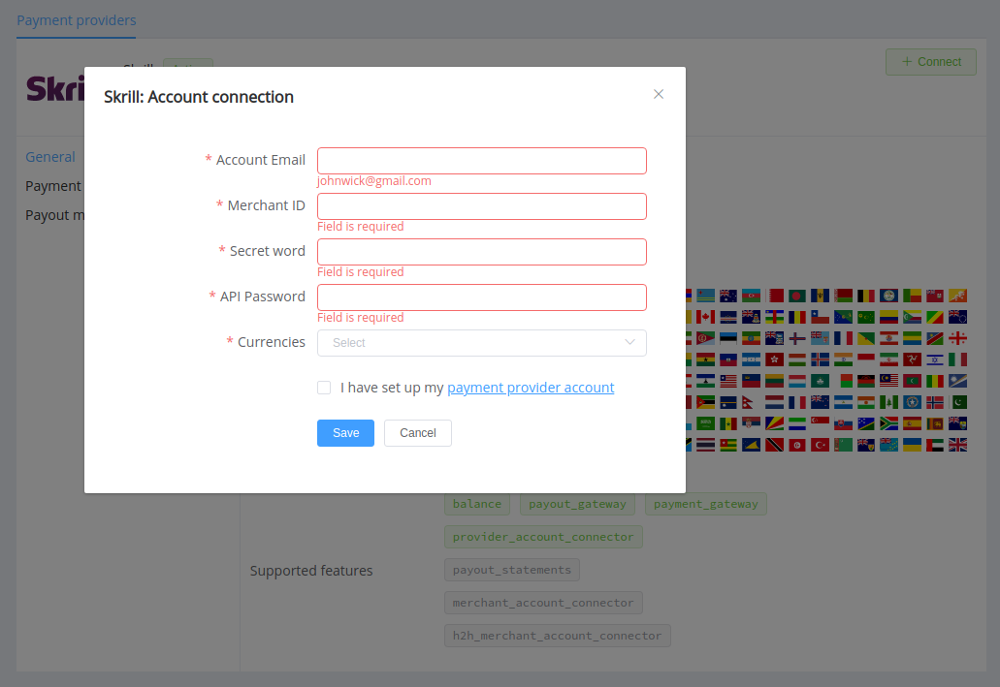

# Skrill

!!! quote ""
    Online payments made simple, for you and your customers

**Website**: [Skrill.com](https://www.skrill.com/en/business/)

**Login**: [account.skrill.com](https://account.skrill.com/)

Follow the guidance for setting up a connection with Skrill as a payment service provider.

## Set up account

### Step 1: Contact the Skrill support team

Register on the [website](https://account.skrill.com/wallet/account/sign-up?locale=en), and then contact the Skrill Merchant Services team with the account details to enable it.

Wait for your account to be verified as a Merchant.

!!! note ""
    When testing payments, set the beneficiary email to the same account to ensure that the test account has sufficient virtual funds.

### Step 2: Enable automatic payments

Start from the *Settings* --> *Account settings* and enable the *Auto accept payments* option:

!!! tip ""

    

### Step 3: Set up API access

1. Go to the *Developer settings*.
2. Enable services:
    * *Automated Payment Interface (API)*;
    * *Merchant Query Interface (MQI)*;
    * *Quick Checkout Secure Restriction*.
3. Add all necessary IP addresses to the White list, including  [{{custom.company_name}} white-list IP addresses](/integration/ips/) to each service.
4. Set up security parameters following the Skrill recommendations:
    * MQI/API password;
    * Secret word.

!!! tip ""

    

!!! note ""

    If the *Settings* --> *Account Settings* section isn't displayed in the back office, contact [merchantservices@skrill.com](mailto:merchantservices@skrill.com).

### Step 4: Check your Merchant ID and available currencies

!!! note "Be aware"

    If you have several Skrill accounts to operate with the same currency, their balances will be summed up to one currency account at the {{custom.company_name}} Dashboard.  

## Connect Provider Account

### Step 1. Connect account at the {{custom.company_name}} Dashboard

Press **Connect** at [*Skrill Provider Overview*]({{custom.dashboard_base_url}}connect-directory/payment-providers/skrill/general) page in *'New connection'* and choose **Provider account** option to open Connection form.

Enter credentials:

* Account email
* Merchant ID
* Secret word
* API password

Choose *Currencies* according to available currencies for your Skrill accounts, but it's necessary to verify details of the connection with your {{custom.company_name}} account manager.

!!! success
    You have connected **Skrill** account!

!!! question "Still looking for help connecting your Skrill account?"
    <!--email_off-->[Please contact our support team!](mailto:{{custom.support_email}})<!--/email_off-->
