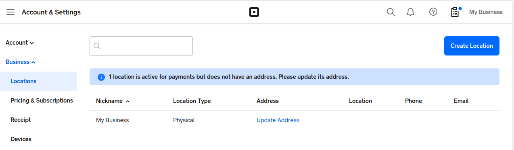
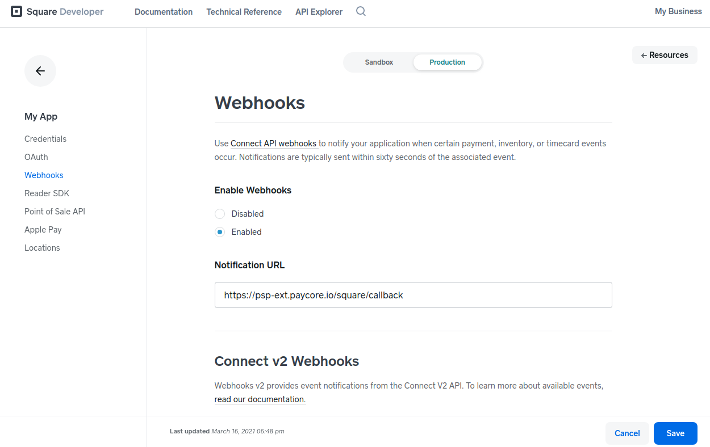

# Square

!!! quote ""
    The future of business is yours to shape.

**Website**: [Square](https://squareup.com/us/en)

**Login**: [Square](https://squareup.com/login)

Follow the guidance for setting up a connection with Square payment service provider.

## Set up account

### Step 1: Sign up for the Square account

Sign up to the [Square system](https://squareup.com/login) and create an account. Then at your [online Square Dashboard](https://squareup.com/dashboard/), go to the Seller portal and provide details about your store.

Verify your identity to be allowed to accept payments at your Point of Sale. Link your bank accounts for payments.

!!! warning
    You must activate your Square account for payments by visiting [squareup.com/activate](https://squareup.com/activate) before you can process card payments in production.

Set up your production *Location* in the *Seller Dashboard*: *Account & Settings* --> *Business* --> *Locations*.

### Step 2: Get credentials

Note that Square uses different credentials for testing and production. Find them at the *Developer Dashboard*.

* Access Token at *[Application]* --> *Credentials*

    

* Location ID at *[Application]* --> *Locations* (you can also control them in the *Seller Dashboard* settings).

    

To receive Callbacks (Webhooks) from Square, enable them at *[Application]* --> *Webhooks* and add `https://psp-ext.paycore.io/square/callback` as Notification URL.

## Connect Account

### Step 1. Connect account at the {{custom.company_name}} Dashboard

Press **Connect** at [*Square Provider Overview*]({{custom.dashboard_base_url}}connect-directory/payment-providers/square/general) page in *'New connection'* and choose **Provider account** option to open Connection form.

Enter credentials:

* Access Token
* Location

Also, toggle Test Mode for test connection and, in that case, use test credentials.

!!! success
    You have connected **Square** account.

!!! question "Still looking for help connecting your Square account?"
    <!--email_off-->[Please contact our support team!](mailto:{{custom.support_email}})<!--/email_off-->
