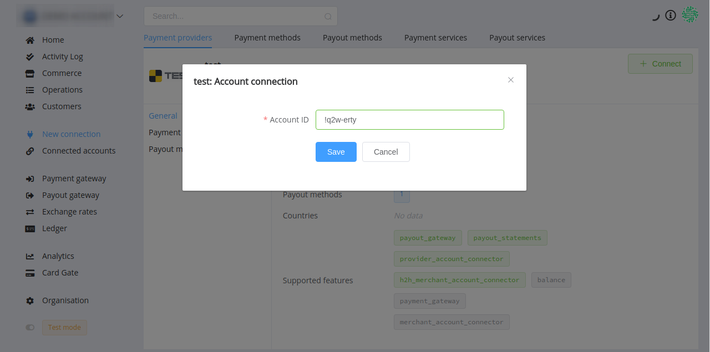
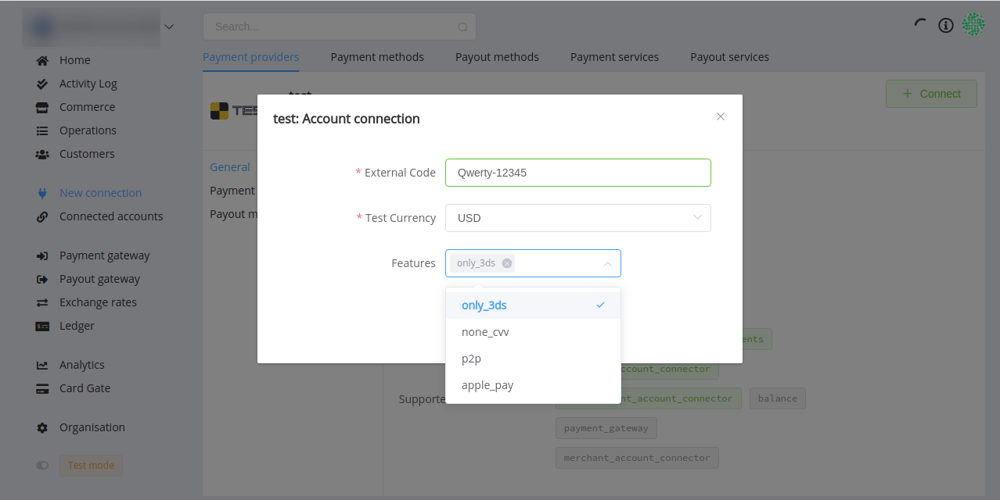
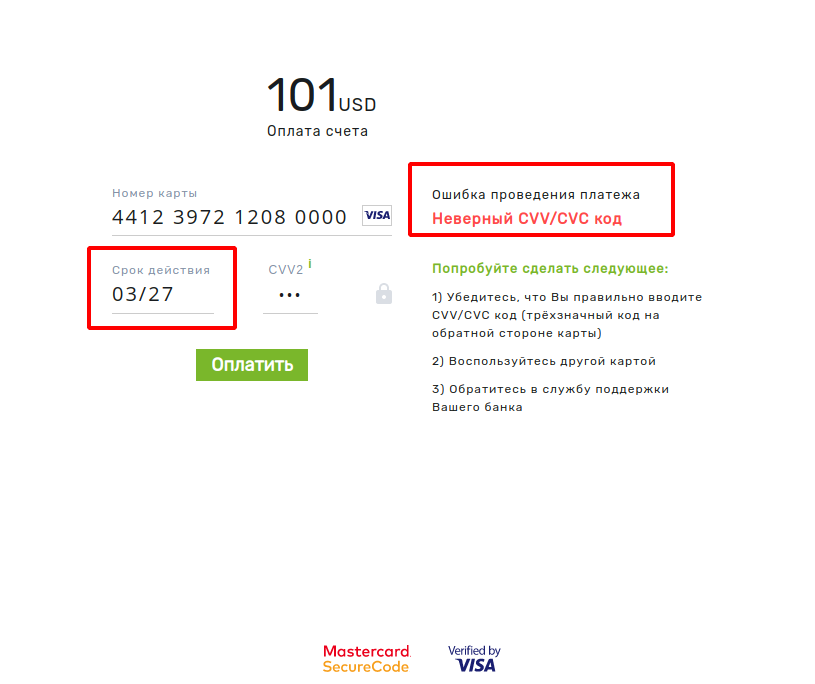

# Test Connector

For setting up a connection with the **Test** payment provider, follow the step-by-step instructions below.

## Setup account

You don't need to create an account for Test connector, we have already set up everything for you.

## Connect account

!!! tip
    To open Connection form, go to *New connection* &rarr; *Payment providers*, choose **Test** and press **+ Connect** button at the top right corner of the block.

### Provider account

#### Step 1: Enter credentials

- Account ID

Use any combination of printable characters (letters, digits, punctuation) up to 32 in total.

#### Step 2. Press **Save**.

!!! success
    That's all! You have connected the **Test** provider account.

### Host-to-host merchant account

### Step 1. Enter credentials

- External Code

Use any combination of letters and digits (and also hyphen) from 8 to 32 in total.

- Test Currency

Choose one from the dropdown list.

- Features

Optional. Choose one or more features that you need to test.

#### Step 2. Press **Save**.

!!! success
    That's all! You have connected the **Test** H2H merchant account.

#### Test Card Numbers

!!! attention
    Remember to use **Test Mode** to process any test transactions.
    

You can use the **Test** H2H merchant account to test Card Gate connection. We prepare a list of credit card numbers that you can submit and check payment status codes. 

| Card number | CVV2 | Expiry date | 3DS |Status code |
|-------------|:---:|:------:|:---:|------|
| 5123817234060000 | any | any | yes| success (`processed`) |
| 5519283812030000 | any | any | no | success (`processed`) |
| 4412397212080000 | any | defined * |  yes | fail (`process_failed`) |
| 

\* Test different type of responses and Payment Retry with relevant values of the expiry date:

| Expiry date | Resolution |
|:-------------:|------------|
| 0856 | `ACCESS_DENIED` |
| 0755 | `ERROR` |
| 0654 | `PROVIDER_ERROR` |
| 0553 | `UNKNOWN` |
| 0452 | `DUPLICATED_TRANSACTION` |
| 0351 | `AUTH_FATAL_ERROR` |
| 0250 | `UNABLE_TO_DETERMINE_3DS_ENROLMENT` |
| 0149 | `CARD_IS_3DS_ENROLLED` |
| 1248 | `CARD_IS_NOT_3DS_ENROLLED` |
| 1147 | `ISSUER_DECLINE` |
| 1046 |  `CLIENT_AUTH_FAILED` |
| 0945 | `PROVIDER_FATAL_ERROR` |
| 0844 | `INVALID_DETAILS` |
| 0743 |  `INVALID_PIN` |
| 0642 | `ANTIFRAUD_ERROR` |
| 0541 | `INVALID_CARD` |
| 0440 | `FATAL_ERROR` |
| 0339 | `UNABLE_TO_RECONCILE` |
| 0238 | `INVALID_AMOUNT` |
| 0137 | `LIMIT_VIOLATION` |
| 1236 | `FUNCTIONALITY_IS_NOT_PERMITTED` |
| 1135 | `INVALID_REQUEST` |
| 1034 | `LOST_OR_STOLEN_CARD` |
| 0933 | `DECLINED` |
| 0832 | `INVALID_OTP` |
| 0731 | `INVALID_3DS_CODE` |
| 0630 | `INVALID_CARD_STATUS` |
| 0529 | `INSUFFICIENT_FUNDS` |
| 0428 | `CARD_EXPIRED` |
| 0327 | `INVALID_CVV` |
| 0226 | ` INVALID_PAN` |
| 0125 | `INVALID_CREDENTIALS` |

