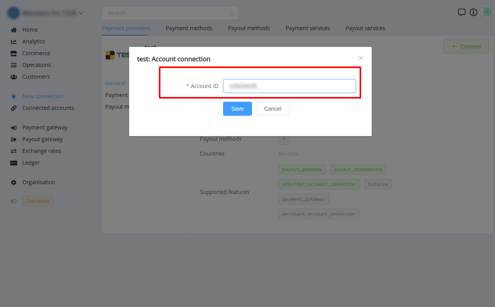

# Test Connector

## Introduction

Here You can find  instructions for setting up **Test**  account.

## Connect account

#### Step 1: Enter credentials

- Account ID

It should have 32 characters or less!

!!! tip
    Press **`Connect`** at Test **`Provider Overview page`** in **`New connection`** section to open Connection form!

!!! info "Screenshot"
    

!!! success
    You have connected **Test**!