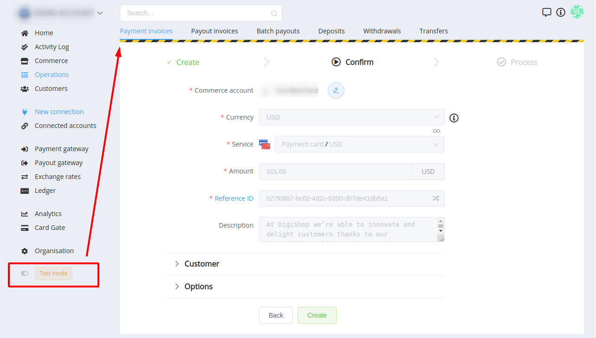
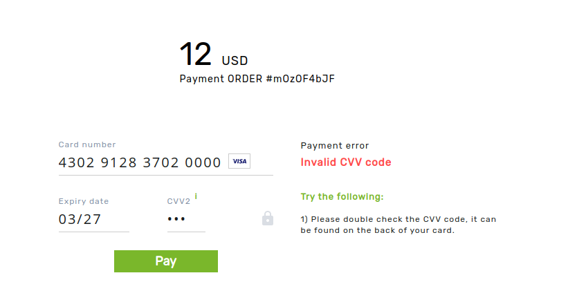

# Test Card Numbers

!!! attention
    Remember to use **Test Mode** to process any test transactions.
    

To test card payments, you can use our [Test H2H connector](/connectors/test/#host-to-host-merchant-account) and test card numbers. We also prepare a list of possible resolutions associated with an assigned expiry date.

| Card number | CVV2 | Expiry date | 3DS |Status code |
|-------------|:---:|:------:|:---:|------|
| 5123817234060000 | any | defined * | yes | success (`processed`) |
| 5519283812030000 | any | defined ** | no | success (`processed`) |
| 4412397212080000 | any | defined *** |  yes | fail (`process_failed`) |
| 4302912837020000 | any | defined *** | no |  fail (`process_failed`) |

\* Use any valid expiry date except `0777` for successful processing. And use `0777` to receive status `pending` (resolution `auth_3ds_required`) on reconciliation.

\** Use any valid expiry date except `0777` for successful processing. And use `0777` to receive status `pending` on reconciliation.

\*** Test different type of responses and Payment Retry function with 'unsuccessful' cards and relevant expiry date values:

| Expiry date | Resolution |
|:-------------:|------------|
| `0856` | `access_denied` |
| `0755` | `error` |
| `0654` | `provider_error` |
| `0553` | `unknown` |
| `0452` | `duplicated_transaction` |
| `0351` | `auth_fatal_error` |
| `0250` | `unable_to_determine_3ds_enrolment` |
| `0149` | `card_is_3ds_enrolled` |
| `1248` | `card_is_not_3ds_enrolled` |
| `1147` | `issuer_decline` |
| `1046` |  `client_auth_failed` |
| `0945` | `provider_fatal_error` |
| `0844` | `invalid_details` |
| `0743` |  `invalid_pin` |
| `0642` | `antifraud_error` |
| `0541` | `invalid_card` |
| `0440` | `fatal_error` |
| `0339` | `unable_to_reconcile` |
| `0238` | `invalid_amount` |
| `0137` | `limit_violation` |
| `1236` | `functionality_is_not_permitted` |
| `1135` | `invalid_request` |
| `1034` | `lost_or_stolen_card` |
| `0933` | `declined` |
| `0832` | `invalid_otp` |
| `0731` | `invalid_3ds_code` |
| `0630` | `invalid_card_status` |
| `0529` | `insufficient_funds` |
| `0428` | `card_expired` |
| `0327` | `invalid_cvv` |
| `0226` | `invalid_pan` |
| `0125` | `invalid_credentials` |

If testing, you specify for unsuccessful cards any other valid period, the expected resolution will be `general_fatal_error`.
