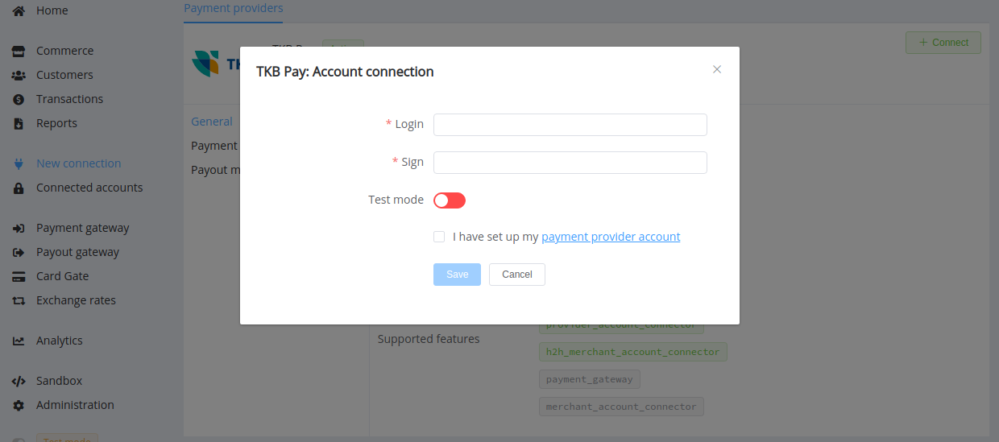
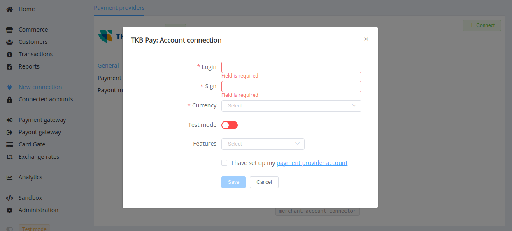

# TKB pay

**Website**: [TKB bank](https://www.tkbbank.ru/)

**Login**: [pay TKB bank](https://pay.tkbbank.ru/)

Follow the guidance for setting up a connection with TKB pay payment service provider.

## Set Up Account

### Step 1: Contact TKB pay support manager

Send a request on the [website](https://www.tkbbank.ru/) or call the hotline. Submit the required documents to verify your account and gain access.

### Step 2: Get credentials

Once your request is approved, the TKBpay support team sends you a protected archive with the `TCB-Header-Login` and the API key (Sign key). The credentials are separate for test and live connection.

!!! important
    Be sure to check with the manager if you require to provide a white list of IPs, and if so, specify IP addresses from the [Corefy list](/integration/ips/).

## Connect Provider Account

### Step 1. Connect account at the {{custom.company_name}} Dashboard

Press **Connect** at [*TKB pay Provider Overview*]({{custom.dashboard_base_url}}connect-directory/payment-providers/tkbpay/general) page in *'New connection'* and choose **Provider account** option to open Connection form.

Enter credentials:

* Login
* Sign key

To test connection with TKB pay, toggle Test Mode and use test credentials.

!!! success
    You have connected **TKB pay** account!

## Connect H2H Merchant Account

### Step 1. Connect H2H account at the {{custom.company_name}} Dashboard

Press **Connect** at [*TKB pay Provider Overview*]({{custom.dashboard_base_url}}connect-directory/payment-providers/tkbpay/general) page in *'New connection'* and choose **H2H Merchant account** option to open Connection form.

Enter credentials:

* Login
* Sign key

To test connection with TKB pay, toggle Test Mode and use test credentials.

Choose Currencies and Features. You can set these parameters according to available currencies and features for your TKB pay account, but it's necessary to verify details of the connection with your {{custom.company_name}} account manager.

!!! success
    You have connected **TKB pay** H2H merchant account!

!!! question "Still looking for help connecting your TKB pay account?"
    <!--email_off-->[Please contact our support team!](mailto:{{custom.support_email}})<!--/email_off-->
