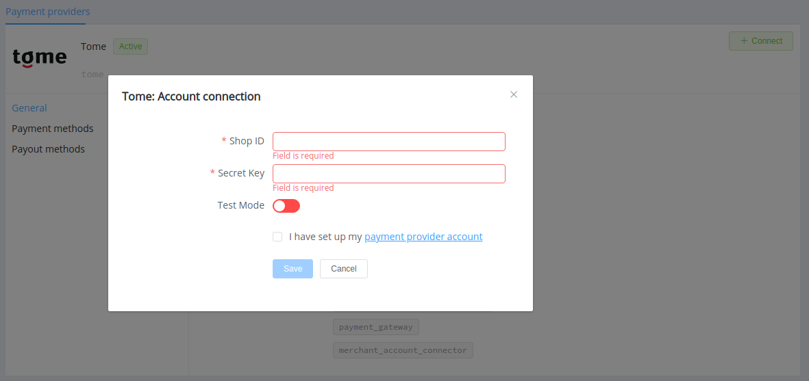
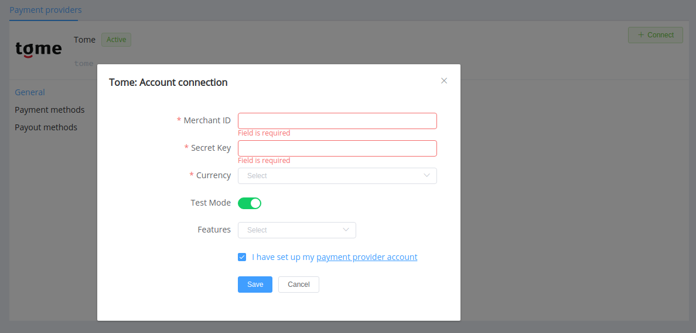

# tome

!!! quote ""
    Accepting payments for the self-employed.

    Excellent for customer service, payments and payments, with quick connection and convenient API.

**Website**: [tome.ru](https://tome.ru/)

**Login**: [lk.tome.ru](https://lk.tome.ru/signin)

Follow the guidance for setting up a connection with tome payment service provider.

## Set Up Account

### Step 1: Sign up or sign in to your account at tome.ru

Login on the [website](https://lk.tome.ru/signin), verify your account and gain access.

### Step 2: Get credentials

Credentials that have to be issued:

* Shop ID
* API Secret Key

## Connect Provider Account

### Step 1. Connect account at the {{custom.company_name}} Dashboard

Press **Connect** at [*Tome Provider Overview*]({{custom.dashboard_base_url}}connect-directory/payment-providers/tome/general) page in *'New connection'* and choose **Provider account** option to open Connection form.

Enter credentials:

* Shop ID
* API Secret Key

Also, choose Test Mode for test connection with tome.

!!! success
    You have connected **tome** account!

## Connect H2H Merchant Account

### Step 1. Connect H2H account at the {{custom.company_name}} Dashboard

Press **Connect** at [*Tome Provider Overview*]({{custom.dashboard_base_url}}connect-directory/payment-providers/tome/general) page in *'New connection'* and choose **H2H Merchant account** option to open Connection form.

Enter credentials:

* Shop ID
* API Secret Key

Choose Test Mode for test connection with tome.

Choose Currency and Features. You can set these parameters according to available currencies and features for your tome account, but it is necessary to check details of the connection with your {{custom.company_name}} account manager.

!!! success
    You have connected **tome** H2H merchant account!

!!! question "Still looking for help connecting your tome account?"
    [Please contact our support team!](mailto:{{custom.support_email}})
