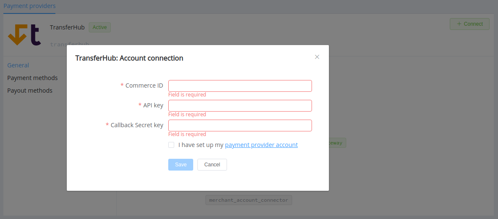
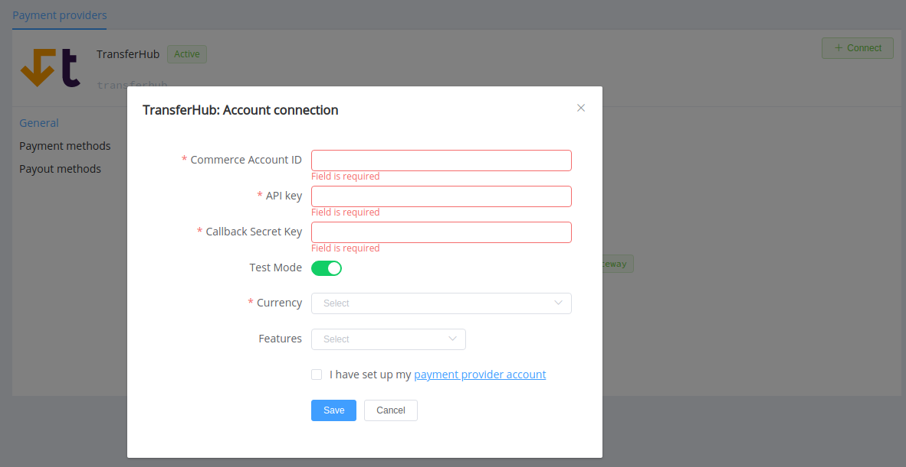

# TransferHub

Follow the guidance for setting up a connection with TransferHub PSP.

## Set Up Account

### Step 1: Apply for integration

Contact TransferHub support manager, submit the required documents to verify your account, and gain access.

### Step 2: Get credentials

Credentials that have to be issued:

* Your Commerce Account ID
* API Key
* Callback Secret Key

## Connect Provider Account

### Step 1. Connect account at dashboard.paycore.io

Press **Connect** at [*TransferHub Provider Overview*](https://dashboard.paycore.io/connect-directory/payment-providers/transferhub/general) page in *'New connection'* and choose **Provider account** option to open Connection form.

Enter credentials:

* Commerce Account ID
* API Key
* Callback Secret Key

!!! success
    You have connected **TransferHub** account!

## Connect H2H Merchant Account

### Step 1. Connect H2H account at dashboard.paycore.io

Press **Connect** at [*TransferHub Provider Overview*](https://dashboard.paycore.io/connect-directory/payment-providers/transferhub/general) page in *'New connection'* and choose **H2H Merchant account** option to open Connection form.

Enter credentials:

* Commerce Account ID
* API Key
* Callback Secret Key

Choose Test Mode for test connection with TransferHub.

Choose Currency and Features and check details of the connection with your PayCore.io account manager.

!!! success
    You have connected **TransferHub** H2H merchant account!

!!! question "Still looking for help connecting your TransferHub account?"
    [Please contact our support team!](mailto:support@paycore.io)
