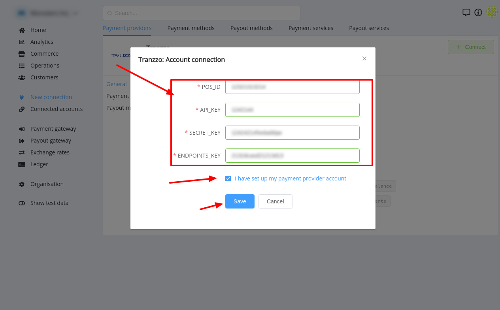

# Tranzzo Connector

## Introduction

Here You can find  instructions for setting up **Tranzzo**  account.

## Setup account

#### Step 1 Contact with Tranzzo Support Manager
#### Step 2: Get required credentials

-  POS_ID
-  API_KEY
-  Secret
-  ENDPOINTS_KEY

!!! success
    You have configured account!

## Connect account

#### Step 1: Copy required credentials

#### Step 2: Enter credentials

-  POS_ID
-  API_KEY
-  Secret
-  ENDPOINTS_KEY

!!! tip
    Press **`Connect`** at Xpay **`Provider Overview page`** in **`New connection`** section to open Connection form!

!!! success
    You have connected **Tranzzo**!