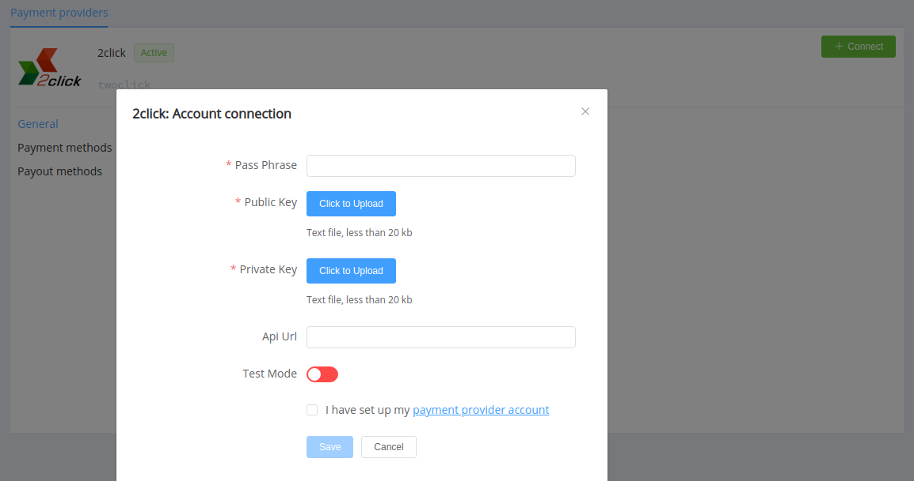

# 2click

!!! quote ""
    A convenient service for bright people.

**Website**: [2click](https://2click.money/)

**Login**: [2click](https://partner.2click.money/Account/login?ReturnUrl=%2f)

Follow the guidance for setting up a connection with 2click payment service provider.

## Set Up Account

### Step 1: Contact 2click support manager

Send a request on the [website](https://2click.money/) or call the hotline. Submit the required documents to verify your account and gain access.

### Step 2: Get credentials

Credentials that have to be issued:

* API URL to call

### Step 3: Generate a key pair

Generate a key pair using the passphrase.

!!! example "Example of key generating commands"

    openssl.exe genrsa -des3 -passout pass:XXXXX -out merchant_name.key 2048
    openssl.exe rsa -in merchant_name.key -passin pass:XXXXX -out merchant_name.pub -pubout

Share the generated `merchant_name.pub` with the 2click support manager and get the 2click Public key.

!!! important
    Be sure to check with the manager if you require to provide a white list of IPs, and if so, specify IP addresses from the [Corefy list](/integration/ips/).

## Connect Provider Account

### Step 1. Connect account at the {{custom.company_name}} Dashboard

Press **Connect** at [*2click Provider Overview*]({{custom.dashboard_base_url}}connect-directory/payment-providers/twoclick/general) page in *'New connection'* and choose **Provider account** option to open Connection form.

Enter credentials:

* Passphrase for private key
* API URL to call

Upload Public and Private (`merchant_name.key`) keys.

Also, select Test or Live mode according to the type of account to connect with 2click.

!!! success
    You have connected **2click** account!

!!! question "Still looking for help connecting your 2click account?"
    <!--email_off-->[Please contact our support team!](mailto:{{custom.support_email}})<!--/email_off-->
