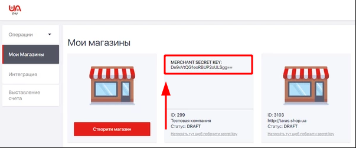

# UAPay

> Payments and transfers without undue effort

**Website**: [uapay.ua](https://uapay.ua/en)

Follow the guidance for setting up a connection with UAPay payment service provider.

## Set Up Account

### Step 1: Contact UApay support manager

Send a request on the [website](https://business.uapay.ua/about/contacts/) or call the hotline. Submit the required documents to verify your account and gain access.

### Step 2: Get credentials

1. Log into your UAPay account. Find out your **Client ID**.

2. Go to the *'My Shops'* page. There may be several Shops in your account, and each will have a unique Secret key. So, you should go to the certain Shop and use the *'Click here to see the secret key'* option to copy related **Secret key**.

## Connect Provider Account

### Step 1. Connect account at the {{custom.company_name}} Dashboard

Press **Connect** at [*UAPay Provider Overview*]({{custom.dashboard_base_url}}connect-directory/payment-providers/uapay/general) page in *'New connection'* and choose **Provider account** option to open Connection form.

Enter credentials:

* Client ID
* Secret key
* Virtual ID **\***

!!! info ""
    **\*** Virtual ID is a random number you set by yourself. It should be unique and, as appropriate, you can use another ones to connect multiple Shop accounts with the same Client ID. It also may or may not coincide with the Shop ID that you set at the UAPay account.

Also, choose Test Mode for test connection with UAPay, P2P mode for connection in  peer-to-peer payment network, and *'Get Balances'* option if you want to obtain your UAPay account balances through {{custom.company_name}} system.

!!! success
    You have connected **UAPay** account!

## Connect H2H Merchant Account

### Step 1. Connect H2H account at the {{custom.company_name}} Dashboard

Press **Connect** at [*UApay Provider Overview*]({{custom.dashboard_base_url}}connect-directory/payment-providers/uapay/general) page in *'New connection'* and choose **H2H Merchant account** option to open Connection form.

Enter credentials:

* Client ID
* Secret key

Choose Test Mode for test connection with UApay. Choose your Account type: *Acquiring* or *P2P*.

Choose Currency and Features. You can set these parameters according to available currencies and features for your UApay account, but it is necessary to check details of the connection with your {{custom.company_name}} account manager.

!!! success
    You have connected **UApay** H2H merchant account!

!!! question "Still looking for help connecting your UApay account?"
    [Please contact our support team!](mailto:{{custom.support_email}})
