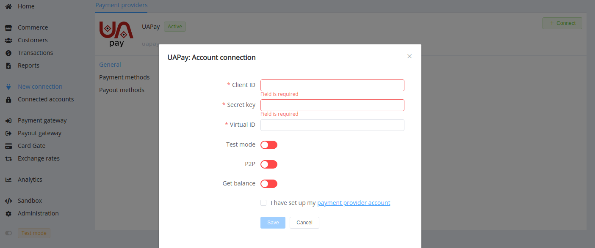

# UAPay Connector

> Payments and transfers without undue effort

**Website**: [uapay.ua](https://uapay.ua/en)

Follow the guidance for setting up a connection with UApay payment service provider.

## Set Up Account

### Step 1: Contact UApay support manager

Send a request on the [website](https://business.uapay.ua/about/contacts/) or call the hotline. Submit the required documents to verify your account and gain access.

### Step 2: Get credentials

Credentials that have to be issued:

* Client ID
* Secret key

## Connect Provider Account

### Step 1. Connect account at the {{custom.company_name}} Dashboard

Press **Connect** at [*UApay Provider Overview*]({{custom.dashboard_base_url}}connect-directory/payment-providers/uapay/general) page in *'New connection'* and choose **Provider account** option to open Connection form.

Enter credentials:

* Client ID
* Secret key
* Virtual ID (a random number you set yourself, should be unique: as appropriate, use another ones to connect multiple accounts with the same credentials)

Also, choose Test Mode for test connection with UApay, and P2P mode for connection in  peer-to-peer payment network.

!!! success
    You have connected **UApay** account!

## Connect H2H Merchant Account

### Step 1. Connect H2H account at the {{custom.company_name}} Dashboard

Press **Connect** at [*UApay Provider Overview*]({{custom.dashboard_base_url}}connect-directory/payment-providers/uapay/general) page in *'New connection'* and choose **H2H Merchant account** option to open Connection form.

Enter credentials:

* Client ID
* Secret key

Choose Test Mode for test connection with UApay.

Choose Currency and Features. You can set these parameters according to available currencies and features for your UApay account, but it is necessary to check details of the connection with your {{custom.company_name}} account manager.

!!! success
    You have connected **UApay** H2H merchant account!

!!! question "Still looking for help connecting your UApay account?"
    [Please contact our support team!](mailto:{{custom.support_email}})
