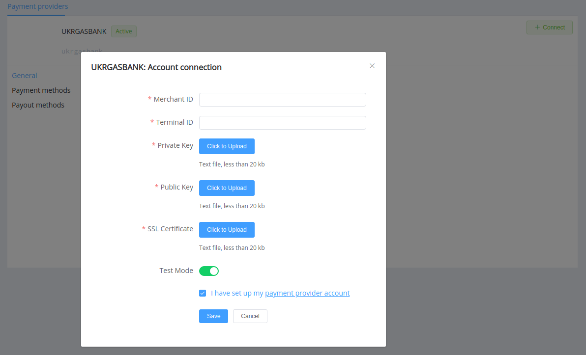
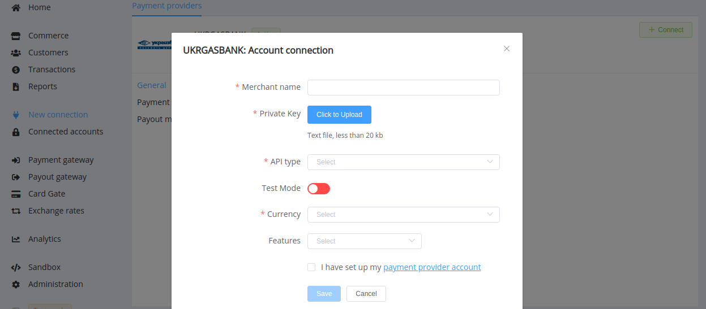

# UKRGASBANK

!!! quote ""
    A universal bank with a focus on green finance

**Website**: [UKRGASBANK](https://ukrgasbank.com/)

**Login**: [UKRGASBANK](https://ecomm.ukrgasbank.com/)

Follow the guidance for setting up a connection with UKRGASBANK payment service provider.

## Set Up Account

### Step 1: Contact UKRGASBANK support manager

Send a request on the [website](https://www.ukrgasbank.com/) or call the hotline. Verify your account, submit all required documents, and gain access.

### Step 2: Get credentials

* Get registered and sign in to [your account](https://ecomm.ukrgasbank.com/).

* Jump to the *AccountToCard* section --> *Terminals* tab --> *Add new terminal*.

!!! caution
    Be sure to specify a whitelist IP address for requests.

    Each terminal must be added separately.

* Upon registration, the bank should verify and activate the new terminal. After that, you can go to the *AccountToCard* section --> *Key Generation*. Download a file with the key generator according to the operating system of your device.

!!! caution
    You have to choose and unpack a key generator file on the device which future transaction requests should be executed from.

* Unpack the file, run *KeyGen.bat* or *KeyGen.sh* on your device , and generate keys. You get your Private Key (`{terminal_id}_PrivateKey.key`) and your Certificate Request file for SSL-connection (`{terminal_id}_Certificate.csr`).

* After the terminal getting status *Key generation waiting*, upload to the bank server the certificate request file for SSL-connection (`{terminal_id}_Certificate.csr`).

* Get and download a zip-archive with your Public Key (`{terminal_id}_Public.key`) and Certificate for SSL-connection (`{terminal_id}_SSL.crt`).

## Connect Provider Account

### Step 1. Connect account at dashboard.{{custom.company_name}}

After receiving UKRGASBANK confirmation of the terminal activation, press **Connect** at [*UKRGASBANK Provider Overview*]({{custom.dashboard_base_url}}connect-directory/payment-providers/UKRGASBANK/general) page in *'New connection'* and choose **Provider account** option to open Connection form.

Enter credentials:

* Your Merchant ID
* Terminal ID

Upload files with:

* Private Key (`{terminal_id}_PrivateKey.key`)
* Public Key (`{terminal_id}_Public.key`)
* SSL Certificate (`{terminal_id}_SSL.crt`)

Also, choose Test Mode for test connection with UKRGASBANK.

!!! success
    You have connected **UKRGASBANK** account!

<!--
## Connect H2H Merchant Account

### Step 1. Connect H2H account at dashboard.{{custom.company_name}}

Press **Connect** at [*UKRGASBANK Provider Overview*]({{custom.dashboard_base_url}}connect-directory/payment-providers/UKRGASBANK/general) page in *'New connection'* and choose **H2H Merchant account** option to open Connection form.

Enter credentials:

[//]: # (Choose Test Mode for test connection with UKRGASBANK.)

Choose Currency and Features. You can set these parameters according to available currencies and features for your UKRGASBANK account, but it is necessary to check details of the connection with your {{custom.company_name}} account manager.

!!! success
    You have connected **UKRGASBANK** H2H merchant account!

--->

!!! question "Still looking for help connecting your UKRGASBANK account?"
    [Please contact our support team!](mailto:{{custom.support_email}})
