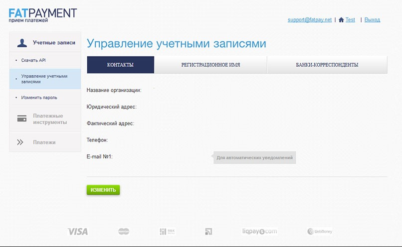
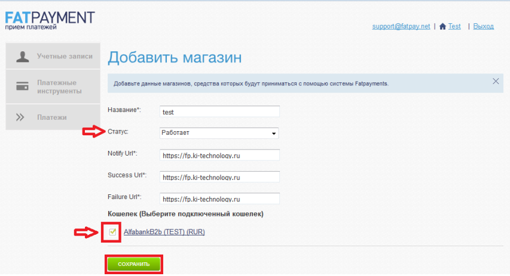
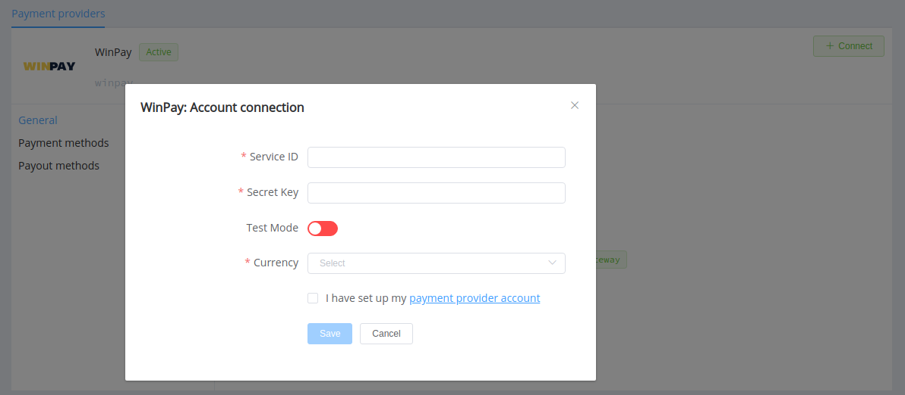
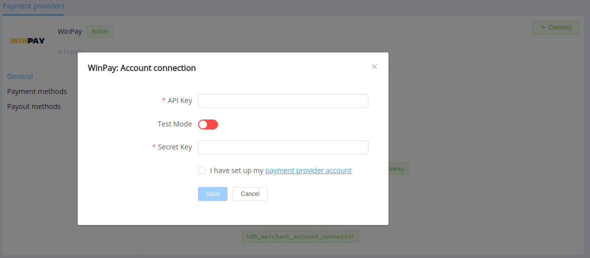
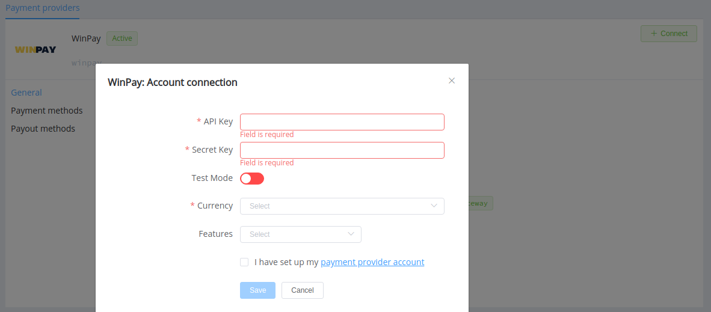

# Win Pay

> Expert service for payment processing

**Website**: [win-pay.ru](https://win-pay.ru/en/)

**Login**: [FatPayment](https://fp.ki-technology.ru/?lang=en)

Follow the guidance for setting up a connection with Win Pay payment service provider.

## Set Up Account

### Step 1: Contact Win Pay support managers

Send a request on the [website](https://win-pay.ru/en/) or call the [hotline](tel:+74994010261). Gain access to the [FatPayment](https://fp.ki-technology.ru/?lang=en) platform.

### Step 2: Set up your account

In the personal area, specify your contacts, registration name, and correspondent banks.

### Step 3: Get credentials

Go to the *Payment Tools* --> *My Shops* section and add your first shop.

Save it and get credentials:

* api_key
* secret_key

To connect Provider Account, you should also copy ID for the chosen wallet.

!!! important
    Be sure to check with the manager if you require to provide a white list of IPs, and if so, specify IP addresses from the [Corefy list](/integration/ips/).

## Connect Provider Account

### Step 1. Connect account at the {{custom.company_name}} Dashboard

Press **Connect** at [*Win Pay Provider Overview*]({{custom.dashboard_base_url}}connect-directory/payment-providers/winpay/general) page in *'New connection'* and choose **Provider account** option to open Connection form.

Enter credentials:

* wallet ID as Service ID
* secret_key as Secret Key

Select Test or Live mode according to the type of account to connect with Win Pay and Currency according to the currency of chosen wallet.

!!! success
    You have connected **Win Pay** Provider account!

## Connect Merchant Account

### Step 1. Connect Merchant account at the {{custom.company_name}} Dashboard

Press **Connect** at [*Win Pay Provider Overview*]({{custom.dashboard_base_url}}connect-directory/payment-providers/winpay/general) page in *'New connection'* and choose **Merchant account** option to open Connection form.

Enter credentials:

* api_key as API Key
* secret_key as Secret Key

Select Test or Live mode according to the type of account to connect.

!!! success
    You have connected **Win Pay** Merchant account!

## Connect H2H Merchant Account

### Step 1. Connect H2H account at the {{custom.company_name}} Dashboard

Press **Connect** at [*Win Pay Provider Overview*]({{custom.dashboard_base_url}}connect-directory/payment-providers/winpay/general) page in *'New connection'* and choose **H2H Merchant account** option to open Connection form.

Enter credentials:

* api_key as API Key
* secret_key as Secret Key

Select Test or Live mode according to the type of account to connect with Win Pay.

Choose Currency and Features. You can set these parameters according to available currencies and features for your Win Pay wallet, but it is necessary to check details of the connection with your {{custom.company_name}} account manager.

!!! success
    You have connected **Win Pay** H2H merchant account!

!!! question "Still looking for help connecting your Win Pay account?"
    <!--email_off-->[Please contact our support team!](mailto:{{custom.support_email}})<!--/email_off-->
