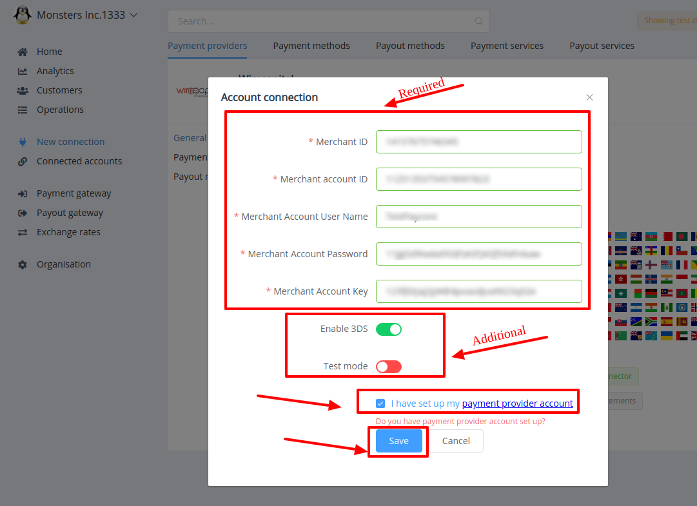

# Wirecapital Connector

## Introduction

Here You can find  instructions for setting up **Wirecapital**  account.

## Setup account

#### Step 1: Contact with Wirecapital Support Manager

This Payment Provoider gives acoount credentials personaly to their merchants!

#### Step 2: Get required credentials

-  Merchant ID
-  Merchant account ID
-  Merchant Account User Name
-  Merchant Account Password
-  Merchant Account Key

!!! success
    You have configured account!

## Connect account

#### Step 1: Copy required credentials

-  Merchant ID
-  Merchant account ID
-  Merchant Account User Name
-  Merchant Account Password
-  Merchant Account Key

#### Step 2: Enter credentials

!!! tip
    Press **`Connect`** at Wirecapital **`Provider Overview`** page in **`New connection`** section!

#### Step 3: Set additional parameters

-  <a href="https://en.wikipedia.org/wiki/3-D_Secure" target="_blank" rel="noopener">3DS (3D - Secure)</a>

-  Test mode

!!! info
    **` Additional`** parameters are set  at your choice **_according to your needs_**!

!!! info "Screenshot"
    

!!! success
    You have connected **Wirecapital**!