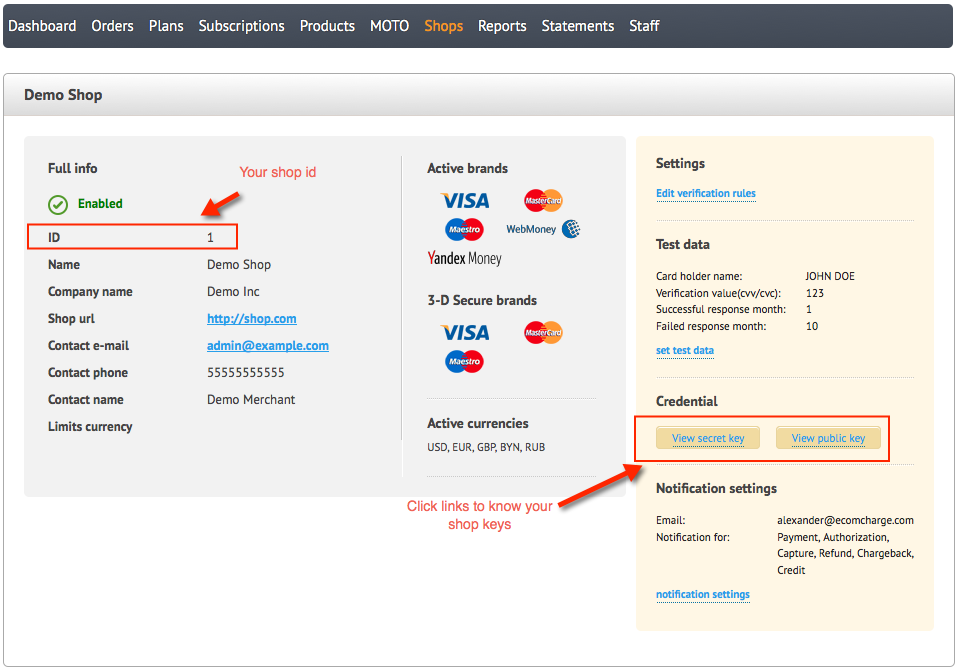
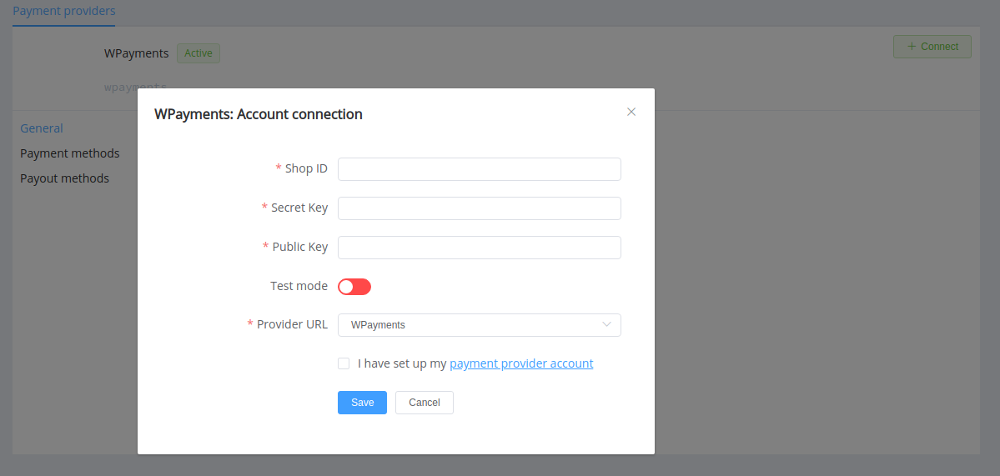

# WPayments

**Login**: [backoffice](https://backoffice.wpayments.eu/)

Follow the guidance for setting up a connection with *WPayments* payment service provider.

## Set Up Account

### Step 1: Contact *WPayments* support

Send a request, submit the required documents to verify your account and gain access to the *Backoffice*.

### Step 2: Get credentials

Find them in your backoffice: *Shops* --> *Shop list* --> *Details*

Credentials that have to be issued:

* Shop ID
* Secret key
* Public key

!!! important
    Be sure to check with the manager if you require to provide a white list of IPs, and if so, specify IP addresses from the [Corefy list](/integration/ips/).

!!! note "Please note"
    If you generate new keys in the *WPayments* backoffice, you will also should re-connect your account with new credentials in the {{custom.company_name}} dashboard.

## Connect Provider Account

### Step 1. Connect account at the {{custom.company_name}} Dashboard

Press **Connect** at [*WPayments Provider Overview*]({{custom.dashboard_base_url}}connect-directory/payment-providers/wpayments/general) page in *'New connection'* and choose **Provider account** option to open Connection form.

Enter your credentials and choose Provider URL (*WPayments*).

Also, choose Test Mode for test connection.

!!! success
    Just right: you have connected **WPayments** account!

## Connect H2H Merchant Account

### Step 1. Connect H2H account at the {{custom.company_name}} Dashboard

Press **Connect** at [*WPayments Provider Overview*]({{custom.dashboard_base_url}}connect-directory/payment-providers/WPayments/general) page in *'New connection'* and choose **H2H Merchant account** option to open Connection form.

Switch to the Test Mode if you want to test connection with *WPayments*.

Enter your credentials and choose Provider URL (*WPayments*).

Choose 3DS mode:

* **simple** if your Merchant's application simply sends customers to Redirect URL for 3DS verification
* **advanced** if your Merchant's application builds a form for customer verification and operates, collects, and stores values of ACS URL, PaReq, Merchant Data (MD), and PaRes URL on your side.

!!! info "Before implementation of the **advanced** 3DS Mode"
    You need to check with your *WPayments* account manager if it is available for you.

Finally, choose Currency and Features. You can set these parameters according to available currencies and features for your Wpayments account, but it is necessary to check details of the connection with your {{custom.company_name}} account manager.
!!! success
    You have connected **WPayments** H2H merchant account!

!!! question "Still looking for help connecting your WPayments account?"
    <!--email_off-->[Please contact our support team!](mailto:{{custom.support_email}})<!--/email_off-->
