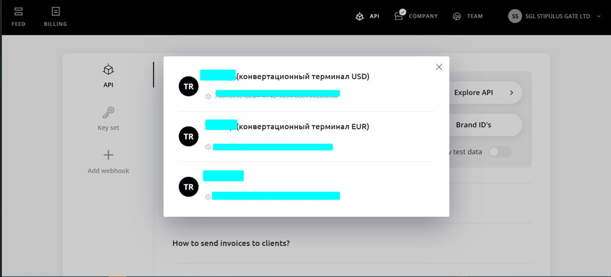
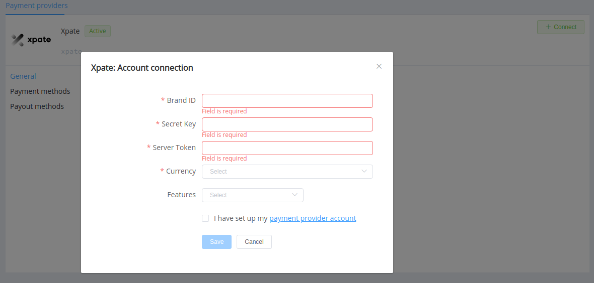

# xpate

> The first genuine drag-and-drop payment experience in the world

**Website**: [xpate.com](https://www.xpate.com/)
**Login**: [beta early access](https://app.xpate.com/login)

Follow the guidance for setting up a connection with xpate payment service provider.

## Set Up Account

### Step 1: Contact xpate support manager

Send a request on the [website](https://www.xpate.com/). Submit the required documents to verify your account and gain access to the [application](https://app.xpate.com/).

### Step 2: Get credentials

Credentials that have to be issued:

* Brand ID
* `Bearer` API Key

Find it in the *API* section of the UI.

If you’re going to set up a H2H connection, you will also need the Server Token.

## Connect Provider Account

### Step 1. Connect account at dashboard.paycore.io

Press **Connect** at [*xpate Provider Overview*](https://dashboard.paycore.io/connect-directory/payment-providers/xpate/general) page in *'New connection'* and choose **Provider account** option to open Connection form.

Enter credentials:

* Brand ID
* API Key as Secret Key

Also, choose Test Mode for test connection with xpate.

!!! success
    You have connected **xpate** account!

## Connect H2H Merchant Account

### Step 1. Connect H2H account at dashboard.paycore.io

Press **Connect** at [*xpate Provider Overview*](https://dashboard.paycore.io/connect-directory/payment-providers/xpate/general) page in *'New connection'* and choose **H2H Merchant account** option to open Connection form.

Enter credentials:

* Brand ID
* API Key as Secret Key
* Server Token

Choose Currency and Features. You can set these parameters according to available currencies and features for your xpate account, but it is necessary to check details of the connection with your PayCore.io account manager.

!!! success
    You have connected **xpate** H2H merchant account!

!!! question "Still looking for help connecting your xpate account?"
    [Please contact our support team!](mailto:support@paycore.io)
