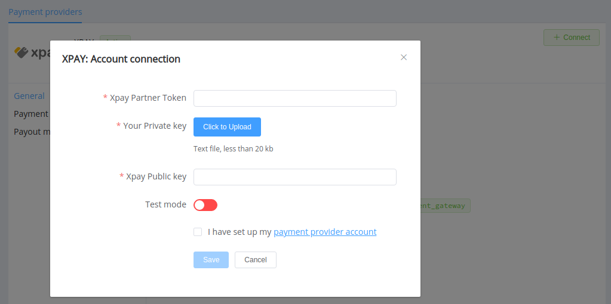

# XPAY

!!! quote ""
    One application managing your finances

**Website**: [xpay.com.ua](https://www.xpay.com.ua/en/)

Follow the guidance for setting up a connection with XPAY payment service provider.

## Set Up Account

### Step 1: Contact XPAY support

Send a request on the [website](https://www.xpay.com.ua/en/), call the hotline, or connect with the XPAY support team via Telegram or Facebook. You also may use the XPAY application for registration.

Submit the required documents to verify your account and gain access.

### Step 2: Generate a key pair

Use our [library for XPAY](https://github.com/paycoreio/xpayua) or generate the keys on your own. Requirements for encryption keys: RSA key 2048 bits length, packaged by the PKIX algorithm, .pem format.

!!! example "Example of key generating commands"

    ``` bash
    openssl genrsa -out keypair.pem 2048
    openssl rsa -in keypair.pem -pubout -out publickey.crt
    ```

Save your private key to a .txt file but never share it unless [connecting XPAY at the {{custom.company_name}} dashboard](#step-1-connect-account-at-the-corefy-dashboard).

### Step 3: Share your Public key with XPAY and get credentials

Send the generated public key to the XPAY support manager. Receive from XPAY:

* Partner Token
* XPAY Public Key

To configure your merchant ID, XPAY may request URLs for payment status checking. Define accordingly:

* `https://psp-ext.paycore.io/xpayua/check` as the Check request URL
* `https://psp-ext.paycore.io/xpayua/callback` as the Pay request URL

!!! important
    You require to provide a white list of IPs for connecting XPAY, so be sure to include the [Corefy IP addresses](/integration/ips/) on the list.

## Connect Provider Account

### Step 1. Connect account at the {{custom.company_name}} Dashboard

Press **Connect** at [*XPAY Provider Overview*]({{custom.dashboard_base_url}}connect-directory/payment-providers/xpay/general) page in *'New connection'* and choose **Provider account** option to open Connection form.



Enter credentials:

* XPAY partner token
* XPAY public key

Upload the .txt file with your private key. Also, select Test or Live mode according to the type of account to connect.

!!! success
    You have connected **XPAY** account!
