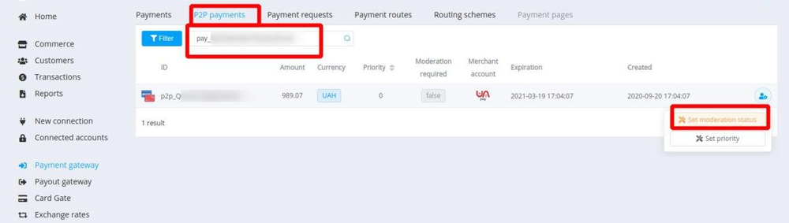

# {{custom.company_name}} FAQ

Welcome to the Frequently Asked Questions about interaction and working with {{custom.company_name}}! This list is not conclusive, and we regularly improve and update it with new cases. If you don’t find the answer you’re looking for here, submit your request to [our support team](mailto:{{custom.support_email}}), we’ll be happy to help you.

## Troubleshoot Password, Email Address, and Login Problems

??? question "Did you not receive new account invitation email?"
    To register with {{custom.company_name}}, you need to give the account manager the existing e-mail address to send the invitation. Firstly, if you cannot find the e-mail, check the Spam folder.

    Contact the account administrator to verify that the address is correct and ask about resending the invitation. If the email is still missing, you might need to use another e-mail address.

??? question "Do you forget the password or the existing password doesn’t fit?"
    Use the password recovery button: enter an e-mail and request a link to change the password. If the email does not arrive, check the Spam folder.

    On the off chance, contact your account administrator to ensure that you have all the necessary access and activated user profile.

??? question "Have you enabled Two-Factor Authentication (2FA) but forgot the connected mobile device?"
    If you enabled Two-Factor Authentication, you need to enter the secret code to access the application. But what if you don't have your mobile device to get that code? There are several steps you can take.

    1. If you use the Authy app, download the desktop version to your laptop or desktop computer. You can then get the authentication code on your computer and use that code to log in.
    2. Also, you can [change the mobile phone number with Authy :material-launch:](https://www.authy.com/phones/change/) and have the authentication code sent to a different mobile phone number.
    3. If you have saved list with one-time 10-digits codes to restore access, enter one of them in the field for two-factor authentication.
    4. Contact [{{custom.company_name}} support](mailto:{{custom.support_email}}) to disable two-factor authentication on your profile, so you can log in with a password only. But after that, don't forget to return 2FA with the right device.

??? question "Does your authentication fail several times?"
    1. If your authentication fails several times, you may need to synchronize your phone's clock with your mobile provider. Often, this involves checking the "Set automatically" option on your phone's clock, rather than providing your time zone.
    2. Code not working? Make sure you are not entering spaces between the numbers from the Authy app.
    3. Use your saved list with one-time 10-digits codes to restore access and enter one of them in the field for two-factor authentication.
    4. Contact [{{custom.company_name}} support](mailto:{{custom.support_email}}) to disable two-factor authentication on your profile, so you can log in with a password only. But after that, don't forget to return 2FA with the right device.

## Troubleshoot Dashboard Errors

??? question "The 403 forbidden error"
    There are two probable causes for error 403 when passing between pages:

    * the active user session ended on your device: refresh the page to re-login and continue working;
    * check if you have permission to access this section: contact the account administrator to clarify the situation.

??? question "What timezone is used for transactions' date and time?"
    You can customize transactions' date and time in the dashboard. Configure the time zone in the user profile but consider this option if you have team members from different time zones. When you exchange information about transactions in the process, use unique payment ID, not date and time only.

## API Integration

??? question "What is the REST based API? What is the input and output data format for request and response?"
    Our API has been designed as a REST API. It uses the HTTP protocol as its ground. Each resource is accessible under a clearly named URL, and the HTTP response codes are used to deliver status. We use HTTP Verbs like GET and POST to interact with the resources. To support accessibility by clients directly, our servers support cross-origin resource sharing. We use JSON for all our payloads, including error messages.

    All these characteristics mean that you will be able to use standard off-the-shelf software to interact with our platform. To make the integration even easier, we also offer SDKs that wrap both the complete Server API as well as the complete Client API.

??? question "How you can obtain Commerce API keys?"
    Find all the integration keys for public API and private API in the Commerce Account settings --> *Integration*.

??? question "Description of the transaction status codes"
    - **201**: Successfully created
    - **4xx**: Creation failed. Check Server response for details
    - **5xx**: Server error. Need to clarify operation state via API request

??? question "Is the CVV stored in card payment processes?"
    {{custom.company_name}} properly maintains PCI-DSS compliance for processing of Card Not Present transactions. That means the CVV, submitted by the client and sent to the issuer bank with the first payment attempt, should not be stored. So that it cannot be sent for recurring series transactions.

    {{custom.company_name}}  includes to payload a recurring flag that goes out to the issuer bank and alerts about CVV is not coming with repeat authorizations you submit.  This possibility is based on the recurring nature of the agreement or relationship with your client.

??? question "May 3D Secure be enabled only for certain payments and countries?"
    When 3D secure is enabled for all card types; by default 3D authentication will take place for card transaction in all countries.

    {{custom.company_name}} includes to payload a recurring flag to alert the issuing bank about skipping the 3D secure check. This possibility is based on your business logic and relationship with your clients.

??? question "Can you save a card and charge it later?"
    If you create card payment invoice with enabled tokenization, we save card details on our servers and store a related token on your side. You can use this token to charge the card at a later date.

    To resolve any other refund issues, contact [our support team](mailto:{{custom.support_email}}), and we will help you as soon as possible.

??? question "Does token have an expiration date?"
    A token is valid until expiring the linked card.

??? question "How long does it take to receive a response from the payment platform?"
    On average, the {{custom.company_name}} platform responds within one to two seconds. Certain responses can take a bit longer in case various third-party platforms need to be reached.

??? question "Can you submit more than one refund on the same order on the same day?"
    Yes, you can. But be aware: some local card acquirers (for example, in Argentina, Brazil, Mexico, and Columbia) impose restrictions on multiple refunds.

??? question "How do you know if the refund is successful?"
    Refund requests are executed as a reverse payment request. It takes a few business days depending on the country and the payment provider used to credit the client's account.

    Once we have received the confirmation that the client has received the funds, you get a payment status `refunded` or `partially_refunded` in the Callbacks.

??? question "How to choose fee strategy"
    Used value of the fee is the sum of the *rate fee* (in percentage with two decimal places) and the *fixed fee* (in base currency). Also, it always lies within the *minimum* and *maximum* setpoints (in base currency).

    Depending on the commerce account's payment options, {{custom.company_name}} platform enables to use of 4 types of fee strategy:

    1. Internal strategy and Direct calculation
        - `fee_strategy:internal`, `reverse_fee:false`
    2. Internal strategy and Reverse calculation
        - `fee_strategy:internal`, `reverse_fee:true`
    3. External Strategy and Direct calculation
        - `fee_strategy:external`, `reverse_fee:false`
    4. External strategy and Reverse calculation
        - `fee_strategy:external`, `reverse_fee:true`

    Any set of options can be chosen as the preferred, at your discretion.

    [Check the different types of fee calculation at Google Spreadsheets -->](https://docs.google.com/spreadsheets/d/1yvQ3kdyuB7S0DbDgqBgdXq_F_YYHDt-qeAtOo7B9kk8/edit#gid=1939885920)

    
    

    And thereby:

    * *Internal* strategy and *Direct* calculation:
        - Paid Amount = Input Amount;
        - Fee = Rate Fee × Input Amount + Fixed Fee;
        - Deposit Amount = Input Amount - Fee;
        - thus:
            
    * *Internal* strategy and *Reverse* calculation:
        - Deposit Amount = Input Amount;
        - Fee = Rate Fee × Paid Amount + Fixed Fee;
        - Paid Amount = Input Amount + Fee;
        - thus:
            

    * *External* Strategy and *Direct* calculation:
        - Deposit Amount = Input Amount;
        - Fee = Rate Fee × Input Amount + Fixed Fee;
        - Paid Amount = Input Amount + Fee;
        - thus:
            

    * *External* strategy and *Reverse* calculation:
        - Paid Amount = Input Amount;
        - Fee =  Rate Fee × Deposit Amount + Fixed Fee;
        - Deposit Amount = Input Amount - Fee;
        - thus: 
            

    where *Input Amount* — `amount` — initiated amount of the invoice;

    *Paid Amount* — `payment_amount` — value to be paid by the customer;

    *Deposit Amount* — `deposit` — amount to be charged to the account, always less than `payment_amount` by `fee`;

    *Fee* — `fee` — current fee amount (don't forget that its value lies within the minimum and maximum setpoints). 

## Transactions handling

??? question "Does the transaction has an incorrect status?"
    Go to the transaction Overview page and add the valid statement and related provider data manually.

??? question "Unable to initiate invoice via Public API?"
    Turn off the *Forbid creation through the Public API* option in the Commerce account settings (Payment options)

??? question "How to understand that the transaction with a certain ID(Reference ID) successfully created in the {{custom.company_name}} system"
    You should reconcile the transaction status or use response codes:

    * **201**: Successfully created
    * **4xx**: The request is unsuccessful. Check the request and authorisation data.
    * **5xx**: Server error. Check the transaction status. If there is no transaction with this ID on the server, you can request the creation method again

    Additionally, Analytics service can be used to get operations by statuses, resolutions or another property.

??? question "What is the difference between a transaction status and a resolution?"
    **Status** describes a current state of the transaction.

    **Resolution** describes and extends a reason why the transaction has the relevant status.

??? question "Do you get "OK" resolution and status relates to the ERROR or FAIL group?"
    Resolution is a description of the status, but they are independent. Each status can combine with "OK" resolution: it means the process occurred in the planned scenario.

??? question "What is the difference between Payment Invoice `processed_amount` and `amount`?"
    Amounts with `processed`-prefix are the actual amounts after the payment process is completed.

    * `processed_amount` — amount that was paid by the customer (can be less than initiated `payment_amount`, in that case, we recalculate the `fee`)
    * `processed_fee` — `fee` that was taken from `processed_amount`
    * `processed_deposit` — amount that was charged to the account

    Basic rules for the amount verification:

    1. `payment_amount` = `deposit` + `fee`
    2. `processed_amount` = `processed_fee` + `processed_deposit`
    3. `processed_deposit` = `deposit`
    4. `processed_amount` = `payment_amount`

    where `payment_amount` — value to be paid by the customer

    `deposit` — amount to be charged to the account, always less than `payment_amount` by the `fee`

    `fee` — current fee amount

??? question "How to block a p2p-payment if payouts cannot be processed on it"
    1. Find the payment by an external (Reference) ID
        
    2. Find the related p2p-payment by payment ID (`pay_...`)
    3. Set a moderation status for the p2p-payment
        

## API Security

??? question "Is it necessary to whitelist your IP in the white access list to API?"
    IP whitelisting is not required to access REST-based API calls.

    But to enhance the API security and as an additional test either, your public IP address(es) need to be whitelisted in our portal.

!!! question "Have you found an answer to your question?"
    If no, ask [our support team](mailto:{{custom.support_email}}), we are always here for help!

## {{custom.company_name}} HPP

??? question "How do you enable the device-specific Checkout page?"  
    The {{custom.company_name}} HPP is responsive. The page adapts to the screen size and format of your client's device. This makes sure that the payment page is optimized for use on desktop, tablet and mobile phone screens, both in the portrait and landscape modes.

    If you wish to create specific versions of your checkout page for specific devices, you can create and design as many variants as want. And through the REST API, you can direct your users to each of these variants.

??? question "Is it possible to hide the header, footer, or any other basic elements of the HPP?"
    You can hide any of the elements other than the main: client-available payment methods.

    Test the look and feel of the HPP in the [Sandbox]({{custom.dashboard_base_url}}sandbox/hpp) and choose the best combination of options.

??? question "Which browsers does the HPP support?"
    The following browsers are supported:

    * Desktop:
        - Chrome version 41 and later
        - Firefox version 43 and later
        - Safari version 8 and later
        - Opera version 12 and later
        - Edge version 14 and later
        - Internet Explorer version 11 and later
    * Mobile:
        - Chrome version 41 and later
        - Firefox version 15 and later
        - Safari version 9 and later
        - Samsung Browser 8.2 and later
        - Silk Browser 72 and later

    For any browsers not in the list, the HPP may work, but compatibility is not guaranteed.

<!--
??? question ""
-->