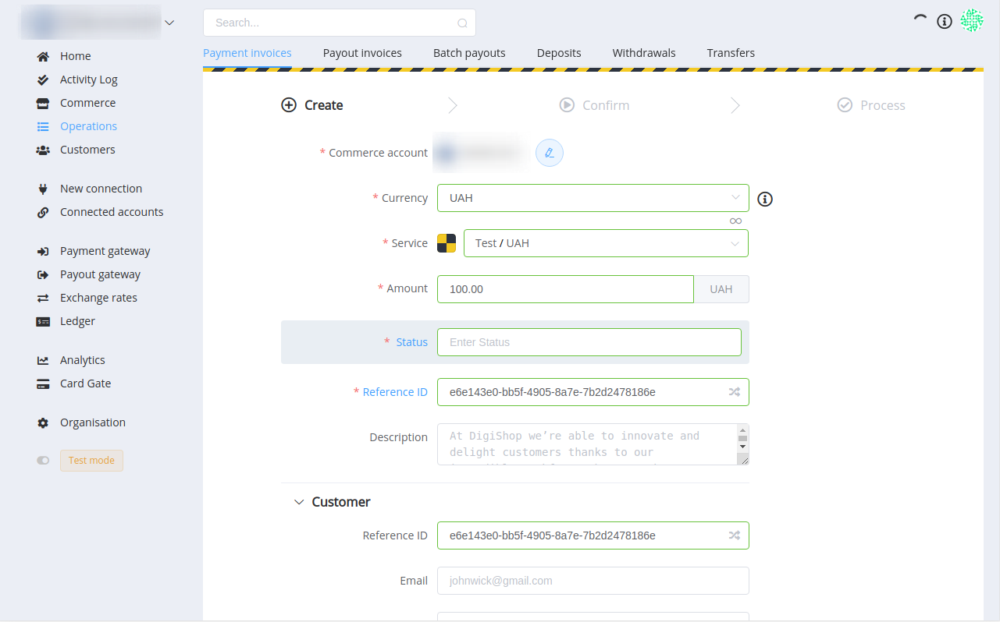
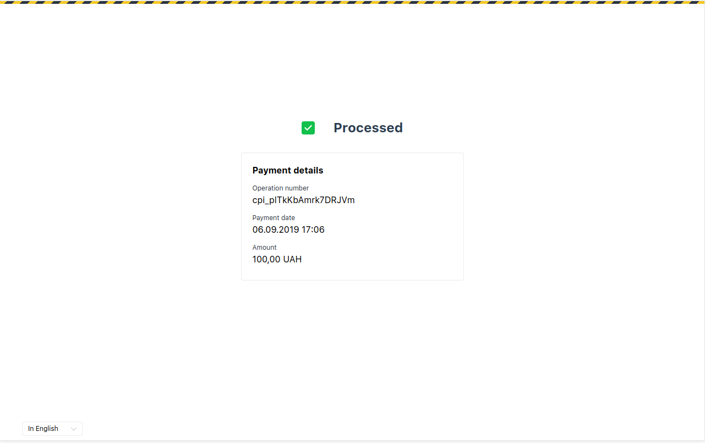
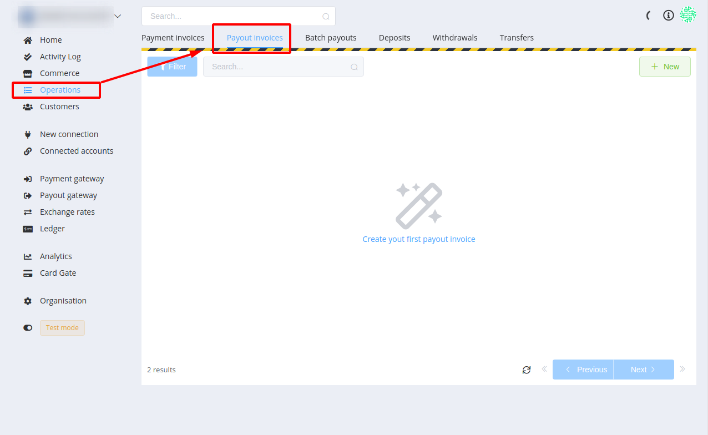
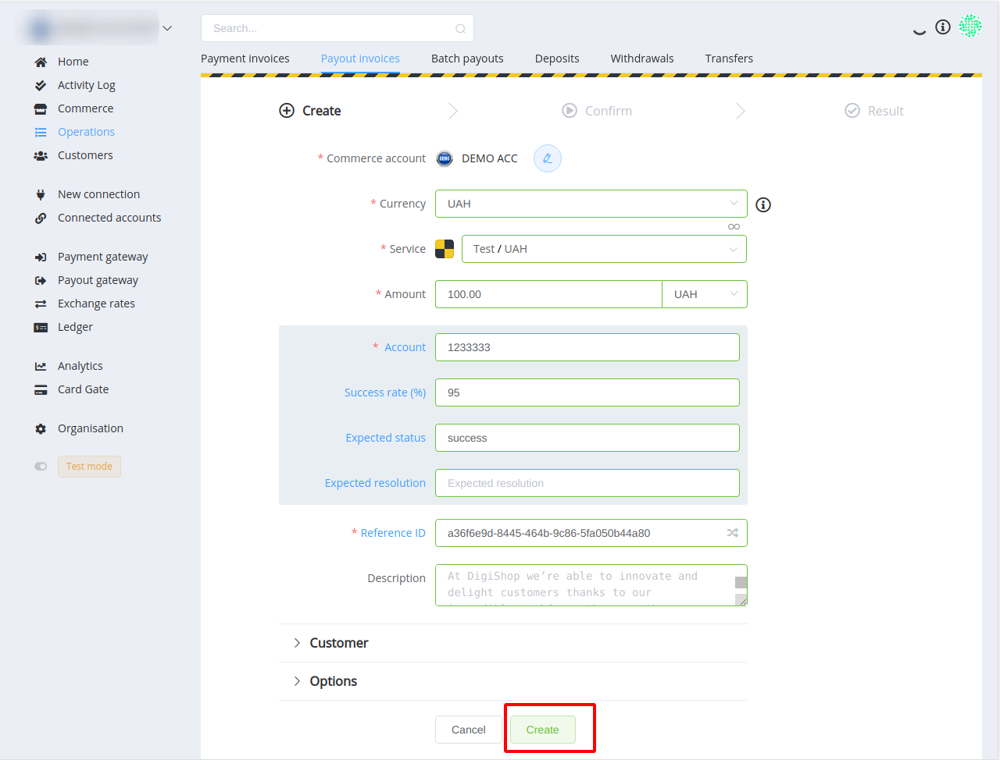
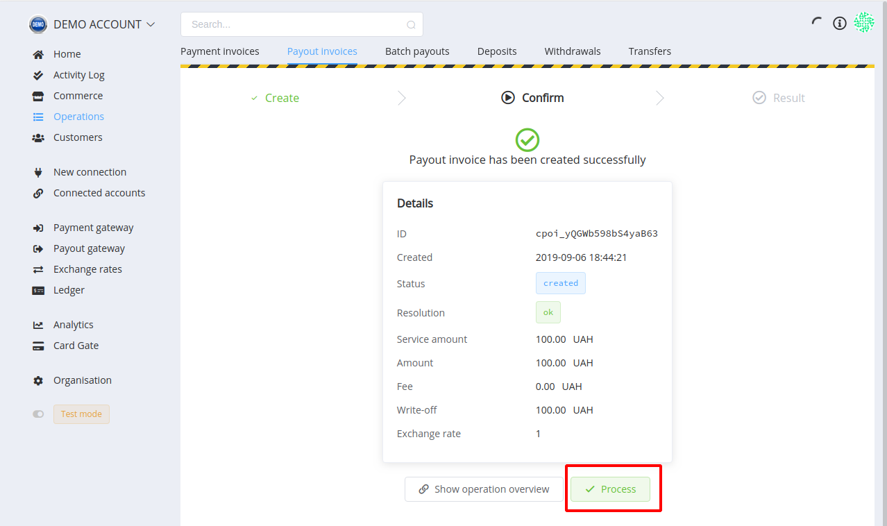

# Create your first payment & payout

## Introduction

To execute payments and payouts, your account should be previously configured and have connected payment providers with active payment routes.

If you haven't set up your account yet, we recommend going to the ['Setting up'](/getting-started/setting-up-account/) article at first.

## Receiving your first payment

* **Step 1**. Go to ['Operations' → 'Payment invoices'](https://the {{custom.company_name}} Dashboardompany_name}}/operations/payment-invoices).

* **Step 2**. Press **+New** button.
* **Step 3**. Choose Commerce account, Currency, Service, fill in all the necessary fields and press **Next**.

* **Step 4**. Confirm your operation

Congratulations! You have just created your first payment invoice. If you send invoice's ID to your merchant HPP, you can also process this payment and see the Status page.

## Make your first payout

* **Step 1**: Go to ['Operations' – 'Payout invoices'](https://the {{custom.company_name}} Dashboardompany_name}}/operations/payout-invoices).

* **Step 2**: Press **+New**.
* **Step 3**. Choose Commerce account, Currency, Service, fill in all the necessary fields and press **Create**.

* **Step 4**. Confirm your operation.

You have just created your first payout invoice!

## And what's next?

Since you tried out the first manual transactions, we suggest going to the next stage and play with [API integration](/integration/).