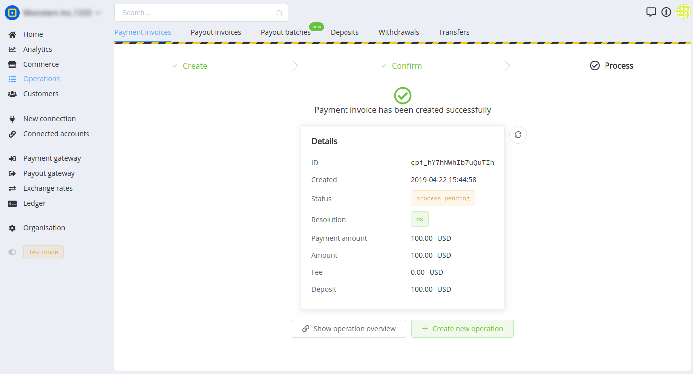
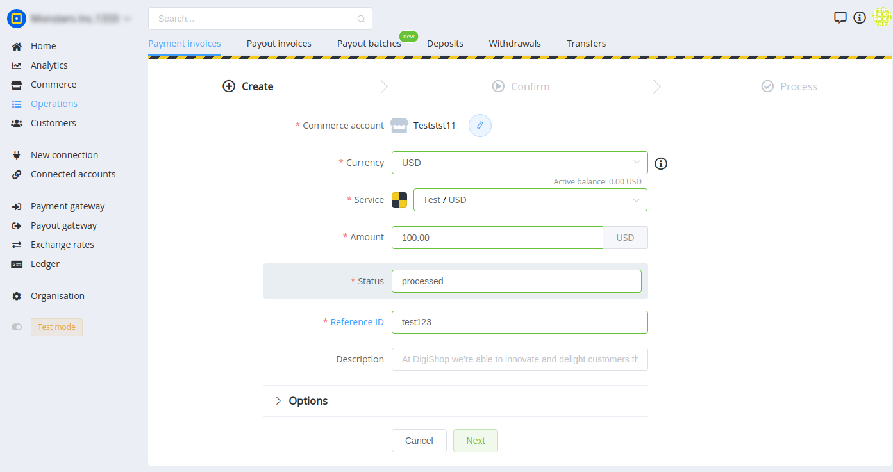
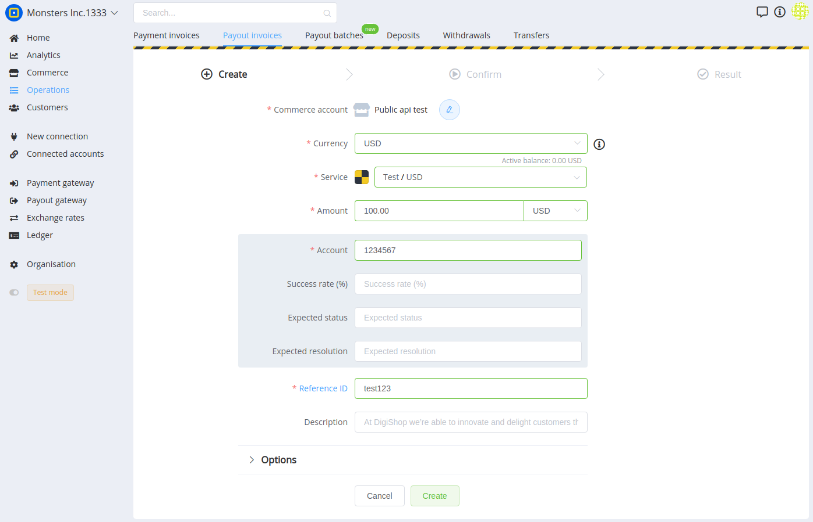

# Create your first payment & payout

## Введение

Для совершения платежей и выплат ваш аккаунт должен быть должным образом сконфигурирован и иметь подключенные платежные провайдеры с активными платежными маршрутами.

Если вы не произвели настройку вашего аккаунта, перейдите на статью с его [быстрой конфигурацией](#).

## Приймите ваш первый платеж

-   Шаг 1: Откройте "Операции" → "Платежи" ([https://dashboard.paycore.io/operations/payment-invoices](https://dashboard.paycore.io/operations/payment-invoices))
-   Шаг 2: Нажмите "+ Новый"
-   Шаг 3: Выберите Коммерческий аккаунт, Валюту, Сервис (тестовый), заполните поля и нажмите "Далее"
-   Шаг 4: Подтвердите создание операции.
-   Поздравляем! Ваш первый платеж совершен!

## Совершите вашу первую выплату

-   Шаг 1: Откройте "Операции" → "Выплаты" ([https://dashboard.paycore.io/operations/payout-invoices](https://dashboard.paycore.io/operations/payout-invoices))
-   Шаг 2: Нажмите "+ Новая"
-   Шаг 3: Выберите Коммерческий аккаунт, Валюту, Сервис (тестовый), заполните поля и нажмите "Далее"
-   Шаг 4: Подтвердите создание операции.
-   Поздравляем! Ваша первая выплата совершина!

.png")

## Что дальше?

После успешного проведения операций в ручном режиме, предлагаем ознакомится с [технической интеграций по нашему API](#).