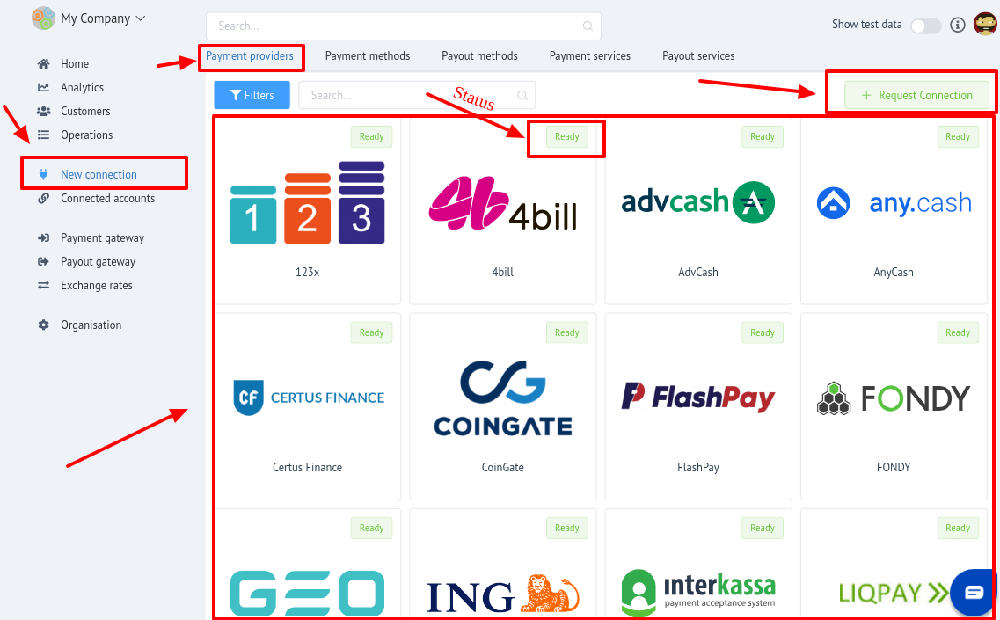
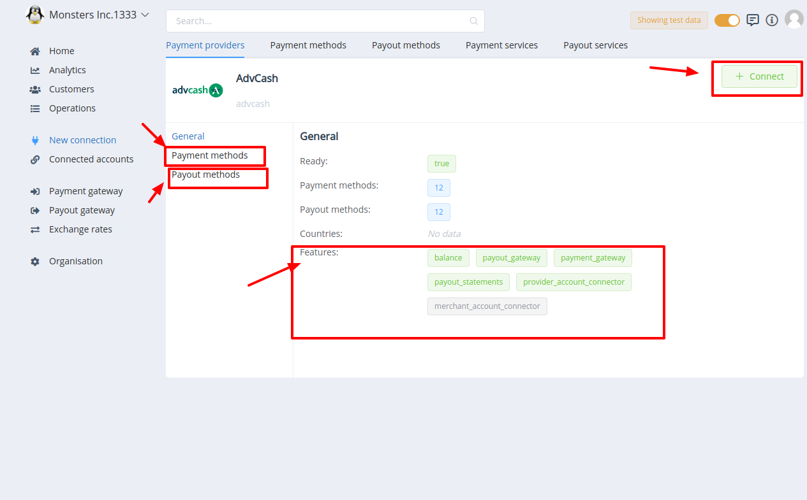

# Integration

PayСore.io is the software platform  - it means that PayСore.io  is payment aggregator **not in financial** but **only in technical** sence.

In this case you need to do basic steps before total onboarding.

1. First of all you need to have created and verified accounts on the provider side. 
2. Then **```Sign up```** in <a href="https://dashboard.paycore.io/register" target="_blank" rel="noopener">PayСore.io</a>.

    !!! info
        After registration you will be redirected to dashboard of your organisation, which will be created automaticaly.
    !!! tip
        You can read more about **```Organisation```** in PayСore.io Dashboard  and setting it up at [**PayСore.io: Organisations and it's preferences**](../organisation/)

3. Go to the "New connection" section

    !!! info
        "New connection" section  contains the collections of **```Payment Providers```** and related to them:
    
        - Payment methods
        - Payout methods
        - Payment services
        - Payout services

4. Find the necessary provider(-s) in Paylment providers list.

    !!! tip
        Detailed connecton guides for all **```Implemented (Ready)```** Payment Providers You can find at [**Payment Providers connecting**](../../payment-providers/)


## Payment Providers 

!!! info "Definition"
    **Payment Provider** - is an institution that offers online services for accepting electronic payments by a variety of payment methods including credit card, bank-based payments such as direct debit, bank transfer, and real-time bank transfer based on online banking. Typically, they use a software as a service model and form a single payment gateway for their clients (merchants) to multiple payment methods.

Payment Provider  can be in **2 statuses**:

1. **Ready**: means, that this Payment provider has been already implemented to PayСore.io 
2. **Not Ready**: means, that this Payment provider has  not been implemented to PayСore.io yet.

!!! info
    
    - To connect certain provider:

        1. Go to the **```Provider Overview page```** by clicking on it's logo
        2. Click **```Connect```** button
        3. Enter the credentials 
        4. Confirm action
        
        !!! tip
            You can find detailed instructions for each provider at <a href="https://docs.paycore.io/payment-providers/" target="_blank" rel="noopener"> Integration    Manuals </a>.

    - To ask PayCore.io<sup>®</sup> to implement **NEW** Payment provider, use **```Request a connection```** button!

!!! info "Screenshots"
    [](images/newconn1.png)

    [](images/newconn2.png)


## Payment methods

!!! info "Definition"
    **Payment method** - the way that a customer chooses to pay to the merchant. Typical payment methods used in a modern business context include cash, checks, credit or debit cards, money orders, bank transfers and online payment services such as PayPal.
    
    <a href="http://www.businessdictionary.com/definition/payment-method.html" target="_blank" rel="noopener">*Read more...*</a>

## Payout methods

!!! info "Definition"
    **Payout method** - is the way a merchant pay to the customers through.

## Payment services

!!! info "Definition"
    **Payment service** - is a virtual entity, that means "payment method in view of certain currency"

## Payout services 

!!! info "Definition"
    **Payout service** - is a virtual entity, that means "payout method in view of certain currency"