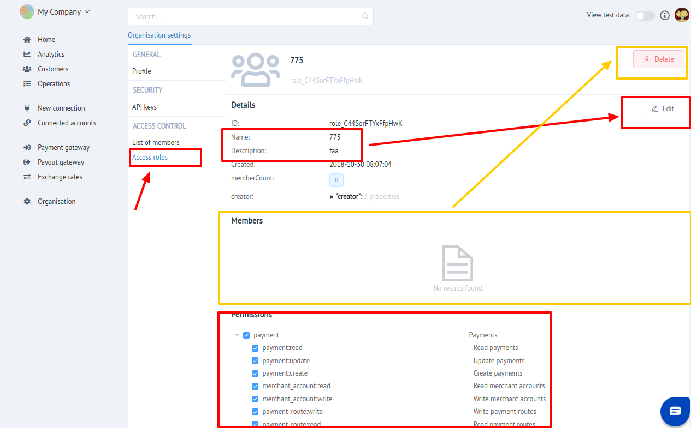

#Organisation: Access Control

"Access control" is intended to delimit User access to different Dashboard sections  through User Roles assignment.

It is divided into **2 parts**:

- [x] Members management
- [x] Role Access management 

##Members management

Here you can manage your organisation team:

- [x] Invite new members
- [x] Assign Role to member
- [x] Set up and Change Individual access scope (Permission set) for each member
- [x] Change Member status
    - Deactivate
    - Activate
    - Archive
- [x] Edit Member description 

!!! tip
    **Don't forget to Save changes to confirm your choice!**

##Role Access management 

In this section You can manage Access roles in current organisation!

!!! info 
    Take stock, that You **can NOT Modify or Delete  System Roles** 
|    **ID**      |               **Name**       |
|:--------------:|:----------------------------:|
| **owner**      | Owner of organisation        |
| **admin**      | Organisation administrator   |
| **manager**    | Organisation manager         |
| **developer**  | Organisation developer       |
| **watcher**    | Watcher of  organisation     |

Here you can manage your organisation roles and their access scope:

- [x] Create New Role
- [x] Edit name and description of exsising roles
- [x] Set up permission set (access scope) _(Custom roles only)_
- [x] Delete out-of-use access roles _(Custom roles only)_
    
    !!! warning
        You can Delete **only if It has NO members assigned to**!

!!! tip
    **Don't forget to Save changes to confirm your choice!**

??? info "Screenshots"
    
    

