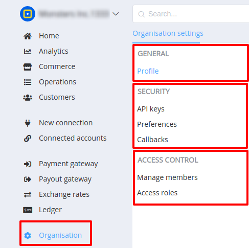

# Organisation

Organisation is an important management part of <a href="https://dashboard.paycore.io/" target="_blank" rel="noopener">PayCore Dashboard</a>. 

It allows you to isolate data and operations of your organization from other accounts in the system

It is intened to for:

- setting up organisation info
- mebmers management
- functionlan access control

In these cases "Organisation settings" is structurally divided into 3 sections:

1. [General](general)

2. [Security](security)

3. [Access control](access)

!!! info "Screenshot"
    

