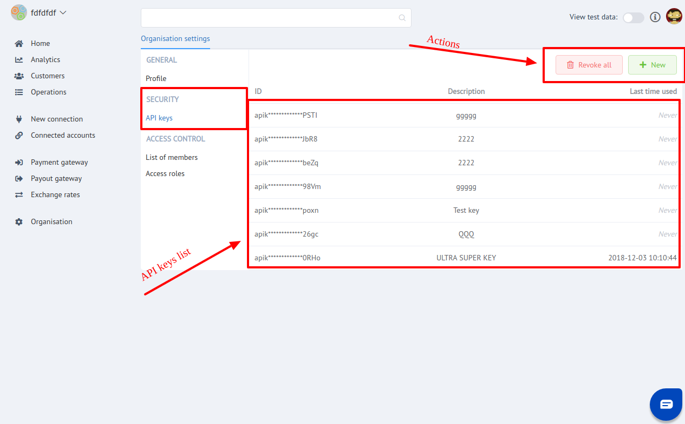

# Organisation: Security

Security section is intended  to prevent illegal access by connection  using API keys.

Here You can:

- [x] Create new API key 
- [x] Change description 
- [x] Add Whitelisted IP addresses
- [x] Change permission set of existing keys
- [x] Revoke out-of-use keys

!!! tip
    **Don't forget to Save changes to confirm your choice!**

!!! info "Screenshots"
    
    
    

As a result, You will be able to give API key to External system or user for functional accessing through API connection.
