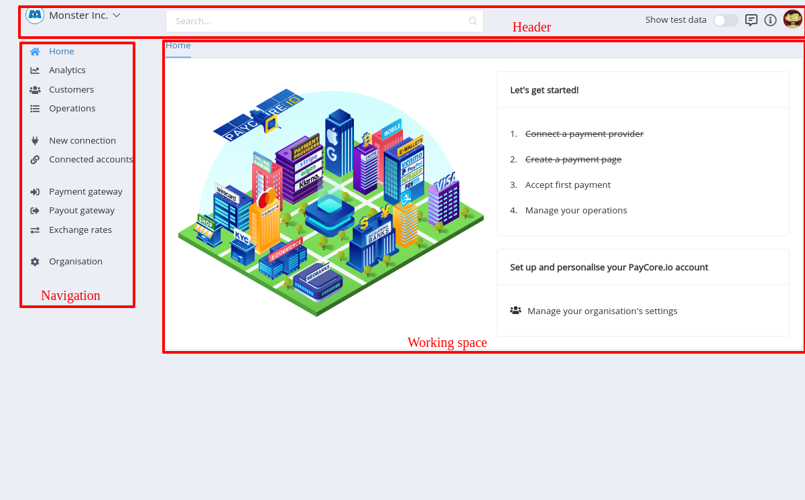
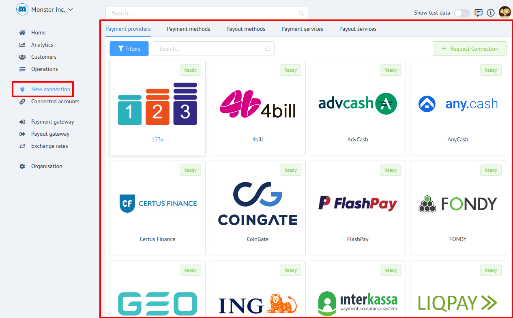
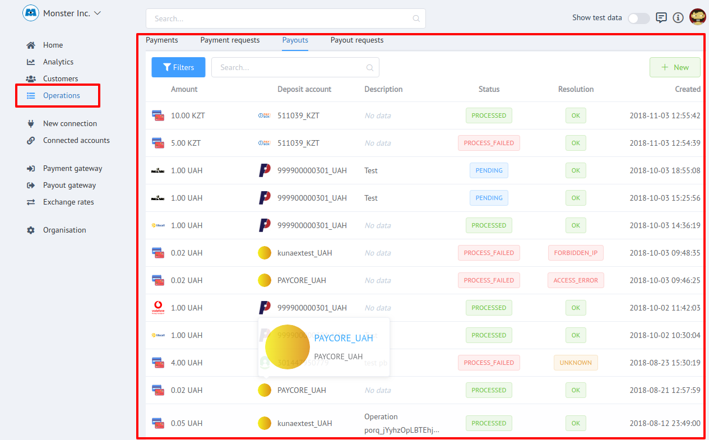
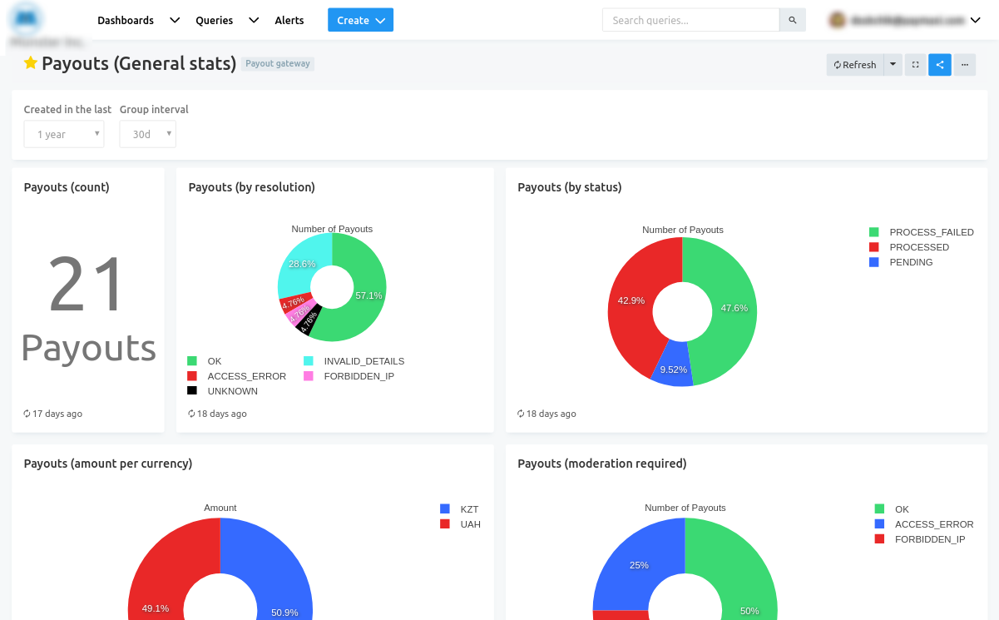

# General Overview

## Introduction

**PayCore.io** integrates payment providers and acquires all around the world to one hub and offers the unified communication interface. 

<a href="https://dashboard.paycore.io/" target="_blank" rel="noopener">PayCore.io Dashboard</a> is an information and management tool which is intended to help you manage your business based on **PayСore**.

[](images/dash_overview1.png)


## Basic structure

Generally Dashboard consists of the next parts:

- Navigation menu
- Working space
- Header

!!! info "Basic structure"
    [](images/dash_overview_struct1.png)

!!! info "Navigation menu"
    [](images/dash_overview_struct_nav.png)

!!! info "Working space"
    [](images/dash_overview_struct_workingspace.png)

!!! info "Header"
    [](images/dash_overview_struct_header.png)

## General facilities

Using **_PayCore.io Dashboard_**  you can:

- [x] Manage your organisations and it's preferences
    - invite and manage team members
    - control access rights
    - set security preferences
    
[](images/dash_overview_org1.png)
[](images/dash_overview_org2.png)

- [x] Connect [Payment Providers](../../payment-providers) (Provider or Merchant accounts) 
   
    !!! note
        Before connecting an acoount - ensure it is **```implemented```** to PayСore.

[](images/dash_overview_connect1.png)

- [x] Manage your [Connected Accounts](../../products/provider-hub/overview)

[](images/dash_overview_acc1.png)

- [x] Create and manage Customers

[](images/dash_overview_cust1.png)
[](images/dash_overview_cust2.png)

- [x] Manage Operations
    - [Payments](../../products/payment-gateway/payments)
    - [Payment Requests](../../products/payment-gateway/payment-requests)
    - [Payouts](../../products/payout-gateway/payouts)
    - [Payout Requests](../../products/payout-gateway/payout-requests)

[](images/dash_overview_operation1.png)
    
- [x] Create and  set up [Payment Pages](../../products/payment-gateway/payment-pages)  and [Payout points](../../products/payout-gateway/payout-points)
- [x] Create [Rate schemes](../../products/currency-rates/overview) for your operations
- [x] Generate and visualize [Analytics](../../products/analytics/overview) reports

[](images/dash_overview_analytics1.png)


!!! info "Note"
    If You have any questions, suggestions or comments, please, contat Us  through <a href="https://support.paycore.io/" target="_blank" rel="noopener">**PayСore.io Service Desk**</a>
    
    [](https://support.paycore.io/)