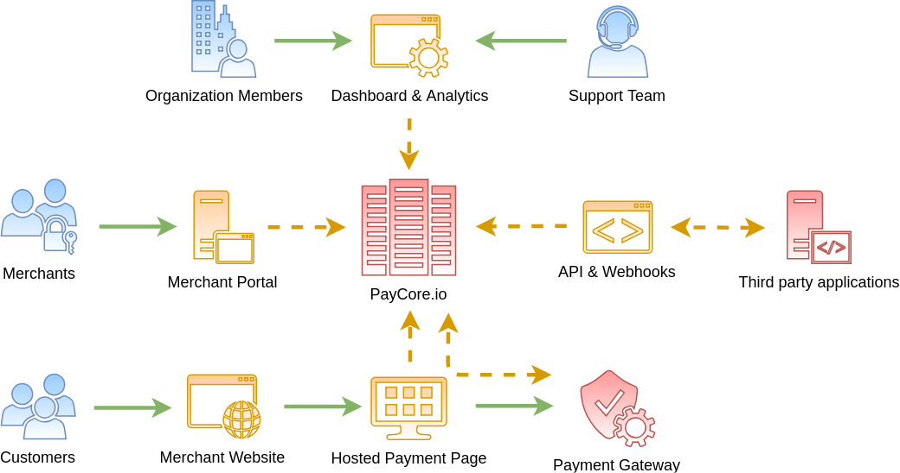

# PayCore.io ecosystem overview

You can interact with PayCore.io using the  [Dashboard](#dashboard), or using  [API](#api)  and  [Webhooks](#webhooks).  
PayCore.io also collects payment information from your customers via the  [hosted payment page](#hosted-payment-page)  and the  [merchant portal](#merchant-portal).

Here's an overview of how this works:

## Dashboard

The _Dashboard_ is the PayCore.io application. It allows you to create and configure your payment and payout gateway, provide access to your team members and assign them roles, and so on. All you have to do is log in with your credentials and you can start setting up your provider accounts and related settings. This would be the quickest way to kick start billing with PayCore.io. You could always decide to switch to PayCore.io's API for handling your payment needs.

## API

PayCore.io provides HTTP based, RESTful API that allows your application to interact with our system.  
To know more, take a look at  [PayCore.io's API documentation](/integration/api-references/) and  [client libraries](/integration/).

## Webhooks

Use webhooks to notify your site or your application of events that happen inside PayCore.io, such as payments processing, subscription renewal, payment success, and so on. Learn more about webhooks and how to configure them  [here](/integration/callbacks/).

## Hosted Payment Page

PayCore.io's  [PCI compliant](/integration/pci-dss-overview/) hosted payment page allow your customers to pay to your services and/or products. These are ready-to-use hosted pages that you can customize to suit your business needs, with no development effort.  [Learn more](/products/hpp/).

## Merchant Portal

PayCore.io offers a  _Merchant Portal_, which is a self service option you can provide to your merchants. It allows them to manage their payments and payouts information, reducing the customer requests your support team would receive for the same. PayCore.io's merchant portal is ready-to-use too and hence requires no development effort. More on Merchant Portals  [here](/products/merchant-portal/).