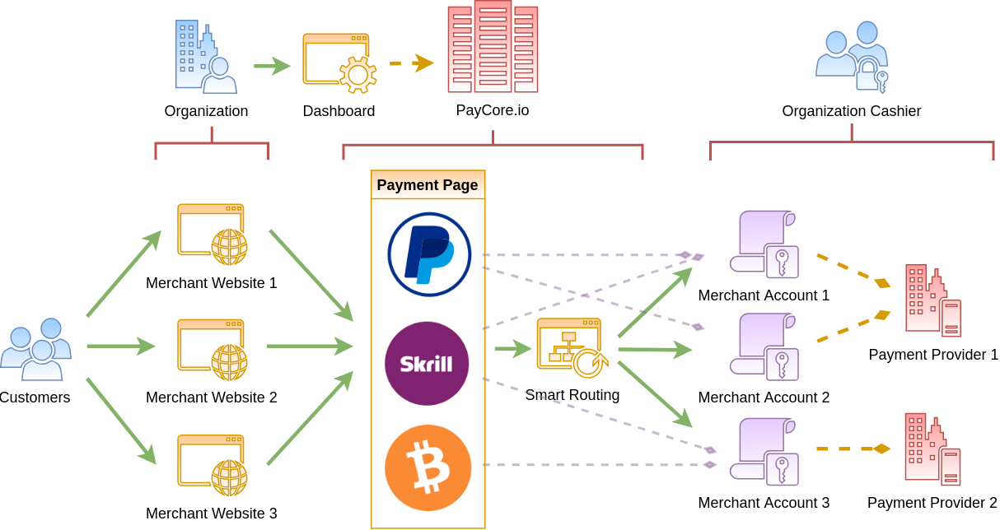

# PayCore.io Platform Overview

## Product Overview

## Ecosystem Overview

You can interact with PayCore.io using the  [Dashboard](#dashboard), or using  [APIs](#api)  and  [Webhooks](#webhooks).  
PayCore.io also collects payment information from your customers via the  [hosted payment page](#hosted-payment-page)  and the  [merchant portal](#merchant-portal).

Here's an overview of how this works:

### Dashboard

The **Dashboard** is the PayCore.io application. It allows you to create and configure your payment and payout gateways, provide access to your team members and assign them roles, and so on. 

All you have to do is log in with your credentials and you can start setting up your provider accounts and related settings. This would be the quickest way to kick start billing with PayCore.io. 

You could always decide to switch to PayCore.io's API for handling your payment needs. Learn more about the Dashboard [here](/products/dashboard/)

## APIs and Client Libraries

PayCore.io provides HTTP-based RESTful APIs that allow your application, system, product or service to interact with our system.
 To know more, take a look at [PayCore.io's API documentation](/integration/api-references/) and detailed [client library integration instructions](/integration/).

## Callbacks

Use callbacks to notify your site or your application of events that happen inside PayCore.io, such as payment status update, recurring charges, and so on. Implement callbacks to handle events when using our APIs to customise your customer's experience when specific events occur. Learn more about callbacks and how to configure them [here](/integration/callbacks/).

### Hosted Payment Page

Our hosted payment page allows your customers to pay for your products or services online. These are multi-themed [PCI compliant](/integration/pci-dss-overview/) hosted payment pages that you can customise to suit your business needs, with no development effort. There are several other different approaches you could take when it comes to integrating a payment page with your service provider. 

These approaches include a URL Redirect to a third-party hosted payment page, inline iFrame, embedded content in a merchant's page such as Direct Post or JavaScript-built forms, and directly against an API.

Look at the [Payment Page Introduction](/products/hpp/) section to learn more about integration options.

### Merchant Portal

PayCore.io offers a Merchant Portal, which is a self-service option you can provide to your merchants. It allows them to monitor and manage their payments, make mass payouts, access customer data and business insights, and many more. PayCore.io's merchant portal is ready-to-use and either be hosted by us or your infrastructure and hence requires no development effort. If you want to know more about the Merchant Portal – you can visit the  [Merchant Portal User Guide](/products/merchant-portal/).