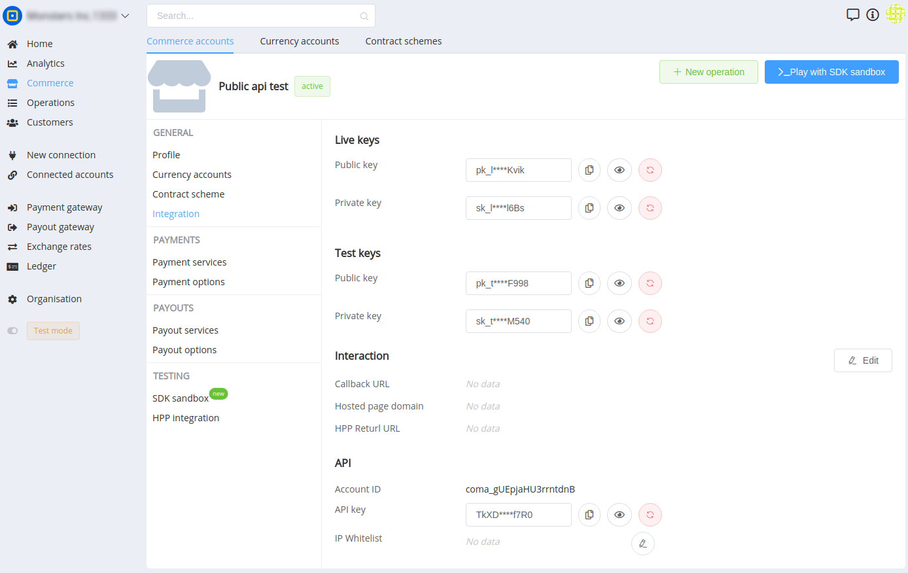
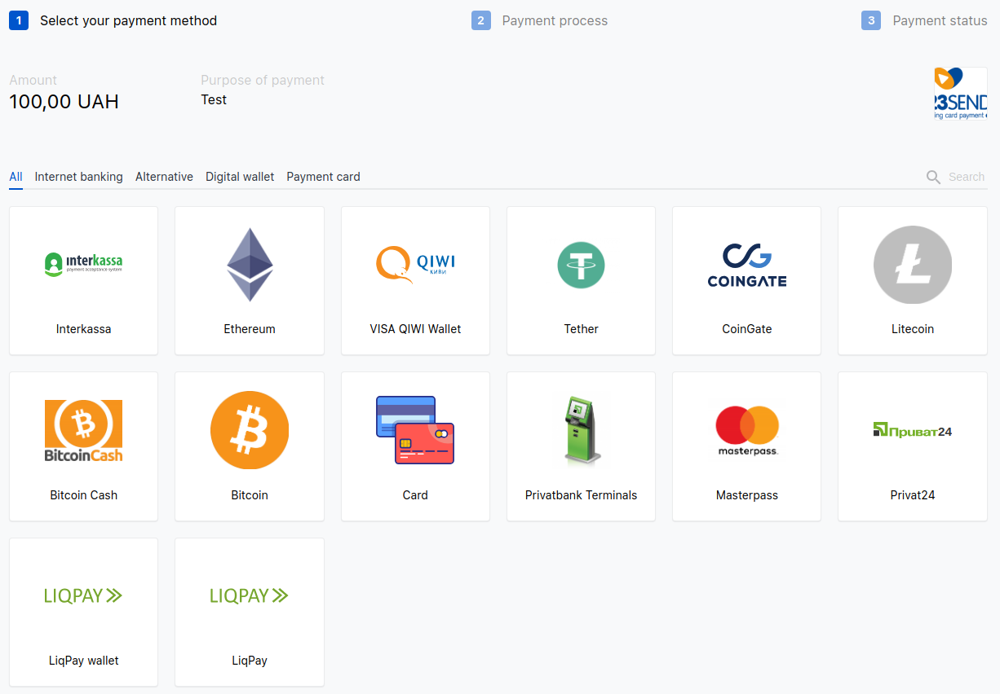

## Введение

Для совершения платежей и выплат ваш аккаунт должен быть должным образом сконфигурирован и иметь подключенные платежные провайдеры с активными платежными маршрутами.

Если вы не произвели настройку вашего аккаунта, перейдите на статью с его  [быстрой конфигурацией](#).

С полным перечнем инструментов для интеграции и готовыми решениями вы можете ознакомится в разделе "[Integration](#)".

Предлагаем получить API ключи попробовать наше API!


## Способы интеграции

Для интеграции с платформой есть множество инструментов и интерфейсов для интеграции. Давайте разберемся с некоторыми из них.


### Commerce Private API

Server-server интеграция для Commerce Account. Позволяет получать балансы аккаунта, создавать платежи, выплаты и т.п.

Swagger: [{{custom.swagger_base_url}}commerce/]({{custom.swagger_base_url}}commerce/)

Full Reference: [{{custom.redoc_base_url}}commerce/]({{custom.redoc_base_url}}commerce/)


### Commerce Public API

Client–server интеграция для Commerce Account со стороны Website. Позволяет получить прямо на frontend, минуя серверное взаимодействие список доступных платежных сервисов и сервисов выплат.

Swagger: [{{custom.swagger_base_url}}commerce-public/]({{custom.swagger_base_url}}commerce-public/)

Full Reference: [{{custom.redoc_base_url}}commerce-public/]({{custom.redoc_base_url}}commerce-public/)


### Commerce HPP API

интеграция для взаимодействия с Hosted Payment Page для приема платежей. Позволяет перенаправить клиента на готовую платежную страницу, где он сможет выбрать платежный метод и совершить платеж.

Swagger: [{{custom.swagger_base_url}}commerce-hpp/]({{custom.swagger_base_url}}commerce-public/)

Full Reference: [{{custom.redoc_base_url}}commerce-hpp/]({{custom.redoc_base_url}}commerce-hpp/)


### Platform API

Позволяет реализовать низкоуровневую интеграцию с платформой и ее сервисами. Вся фунциональность реализованная в Dashboard доступна через данное API.

Swagger: [{{custom.swagger_base_url}}]({{custom.swagger_base_url}}commerce-public/)

Full Reference: [{{custom.redoc_base_url}}]({{custom.redoc_base_url}})


## API ключи

Все ключи для Commerce Public API, Private API, HPP API доступны в личном кабинете в настройках Commerce Account → Integration.




### Live / Test keys

Разница в live и test ключах только в том, что для тестового режима используются тестовые ключи, а для боевого — боевые соответственно.


### Public / Private keys

Public keys и Private keys используются для взаимодействия с Commerce Public API и HPP API.

Public keys для взаимодействия с API, а Private keys — для проверки цифровой подписи.


### Callback URL

При изменении статуса по платежам или выплатам, будет произведена отправка Callback на Callback URL соответственно.

Цифровая подпись присутстует во всех Callback запросах, отправленных на Callback URL.

Это позволяет безопастно их обрабатывать и быть уверенным что запрос не был модифицирован.

Подпись передается в HTTP header с ключем "X-Signature".

Алгоритм формирования подписи очень простой:

`$signature = base64_encode(sha1($secret . $contentBody . $secret, true));`

Детальнее про формирование подписи и ее проверку мы можете ознакомится на странице "[Integration → Security](#)".


### API keys

Для Commerce Private API используется классическая HTTP Basic авторизация. Commerce Account ID используется в качестве Login, API Key в качестве Password.

Для повышения безопастности настроятельно рекомендует ограничить доступ к Private API через IP white-list filter.


## API usage

Our APIs accept and return JSON in the HTTP body and return HTTP response codes to indicate errors. You can consume the APIs directly using your favorite HTTP/REST library, or use [one of our SDKs](#).


### Authentication

To initiate a request to any of {{custom.company_name}},’s endpoints, you will need to provide an API key in the  `Authorization`  header. Unless otherwise specified, you should use your secret key.


### HTTP response codes

The table below describes the possible response codes you can receive when sending an API request.

Code Description

`200` OK

`201` Created

`202` Accepted

`401` Unauthorized

`403` Not allowed

`404` Not found

`422` Invalid data was sent

`429` Too many requests or duplicate request detected

`502` Bad gateway


### Validation errors

If an error occurs while validating a request, the API responds with a  `422 HTTP`  response code, accompanied by a JSON response containing the error details. Find out more in the example below.

The JSON response includes the following fields:

Field name Description

`request_id` The request ID used by {{custom.company_name}}  to trace what went wrong in the payment.

`error_type` The type of error.

`error_codes` An array of validation errors.


## Платежи


### Get available payment services over Commerce Public API

Для получения списка доступных платежных сервисов для Commerce Account используете Commerce Public API. Для получения тестовых сервисов используется соответственно тестовый.

Вы можете использовать данный тип взаимодействия для отображения списка доступных платежных сервисов прямо на вашей на странице оплаты.

**Endpoint:** POST /payment-prerequest

**Request:**

<example>

**Response:**

<example>


### Create payment over Commerce Public API

С помощью Commerce Public API можно инициациировать платеж прямо с вашего сайта на frontend.

Это необходимо, если вы хотите построить платежную страницу самостоятельно в вашем уникальном дизайне.

Мы рекомендуем использовать данный тип взаимодействия если:

-   Вы принимаете платежи для пополнения виртуальных лицевых счетов ваших клиентов.
-   Пользователи могут произвести платеж на производную сумму и в любое время.
-   Нет контроля уникальности запросов на произведение платежа.

Это упрощяет интеграцию и позволяет просто пополнять баланс клиенту на основании полученного Callback при успешной оплате.

После проведения платежа, вам будет отправлен Callback, содержащий все необходимые данные для его зачисления на вашей стороне.

Callback Request будет содержать уникальный ID платежа, Reference ID, сумму фактически принятого платежа и статус.

**Внимание!** Для возможности создавать платежи из по Public API необходимо, что бы флаг "Public Access" → "Forbid creation" был в состоянии OFF.

**Endpoint:** POST /payment-invoice

**Request:**

<example>

**Response:**

<example>


### Create payment over Commerce HPP API



**HPP** (hosted payment page) — это готовый UI интерфейс для проведения платежей.

Он покрывает все сценарии платежных процессов и кейсов. UX проработан для максимально эффективного и простого клиентского опыта.

Интейфес можно легко кастомизировать под свой стиль и дизайн.

Интеграция по данному интерфесу самая простая и быстрая.

Достаточно просто перенаправить клиента на HPP с параметрами платежа, такими как сумма, валюта, описание, ID референса.

Клиенту будет отрисован интерфейс где он сможет выбрать предпочитаемый для него платежный метод и произвести оплату.

**Пример запроса:**

```html
<form action="{{custom.pay_domain}}/hpp/" method="GET">
<input type="hidden" name="public_key"
 value="pk_live_mF-EbTQBhz15e4AWAQNq-CFrBIdAEKG2pFSuj7JudNY"/>
 <!-- Change this key. Don't forget to allow public creation -->
<input type="hidden" name="reference_id" id="reference_id" />
<input type="hidden" name="currency" value="UAH"/>
<input type="hidden" name="description" value="Test payment"/>
Amount: <input type="text" name="amount" value="100"/> <br/>
<input type="submit" value="PAY">
</form>

<script>
window.document.getElementById('reference_id').value 
		= Math.random().toString(36).slice(-10);
</script>

```

**Пример запроса с авто-перенаправлением на оплату:**

```html
<form action="{{custom.pay_domain}}/public-api/payment-invoices/process" method="POST">
    Amount: <input type="text" name="amount" value="100"/> <br/>
    <input type="hidden" name="public_key" 
				value="pk_live_mF-EbTQBhz15e4AWAQNq-CFrBIdAEKG2pFSuj7JudNY"/>
		<!-- Change this key. Don't forget to allow public creation -->
    <input type="hidden" id="reference_id" name="reference_id"/>
    <input type="hidden" name="currency" value="UAH"/>
    <input type="hidden" name="service" value="bank_card_uah_hpp"/>
    <input type="submit" value="PAY">
</form>

<script>
window.document.getElementById('reference_id').value 
		= Math.random().toString(36).slice(-10);
</script>
```

С полным справочником параметров и опций вы можете ознакомится в разделе "[Commerce HPP API](#)".

Для упрощения интеграции по данному интерфейсу рекомендуем использовать "[PaymentWidget.js](#)".


### Payment Invoice Callback

Для корректной обработки Callbackов ознакомьтесь с полным перечнем [статусов Payment Invoice](#).


## Выплаты


### Get available payout services over Commerce Public API

Для получения списка доступных сервисов выплат для Commerce Account используете Commerce Public API. Для получения тестовых сервисов используется соответственно тестовый.

Вы можете использовать данный тип взаимодействия для отображения списка доступных платежных сервисов прямо на вашей на странице оплаты.

**Endpoint:** POST /payout-prerequest

**Request:**

<example>

**Response:**

<example>


### Create payout over Commerce Private API

Через API вы можете быстро и легко производить выплаты по любому сервису в мире.

Создание выплаты доступно только для server-server взаимодействия используя ApiKey.

Незабывайте, что данный процесс требует реализации вашей внутренней бизнес-логики по блокировке и списанию средств с баланса клиента в процессе проведения выплаты.

**Endpoint:** POST "[{{custom.pay_domain}}/api/payout-invoices]({{custom.pay_domain}}/api/payout-invoices)"

**Request:**
```json
{
    "test_mode": false,
    "currency": "EUR",
    "amount": 100,
    "description": "Test payout",
    "reference_id": "f3WbQNCAMAQs2DMWLyBiKF9jwv36z1TCS",	
    "service": "payment_card_uah",
    "fields": {
        "card_number": "5404367504475264"
    }
}
```

**Response:**

<example>


### Payout Invoice Callback

Для корректной обработки Callbackов ознакомьтесь с полным перечнем [статусов Payout Invoice](#).


## Go live

Перед тем, как уйти в прод режим, рекомендуем проверить данный список:

-   Предоставить доступы в личный кабинет вашим сотрудникам и разработчикам.
-   Рекомендуем всем вашим пользователям активировать 2FA.
-   Проверить API ключи, их права, IP whitelist.
    
-   Проверить публичные ключи, для тестового и боевого режима они используются разные.
    
-   Проверить, что вы обрабатываете Callback.
    
-   Убедиться, что в процессе обработки Callback вы контролируете цифровую подпись.


## Что дальше?

Предлагаем ознакомиться с полным перечнем инструментов для интеграции и готовыми решениями в разделе "[Integration](#)".

А также, вам будет интересно прочесть руководства на различные типовые реализции интеграций в зависимости от вашего типа бизнеса в разделе "[Guides](#)".

В разделе FAQ вы можете найти ответы на типовые вопросы связанные с нашим продуктом и интеграцией.

Если у вас по прежднему еще остались вопросы, мы всегда готовы на них ответить!