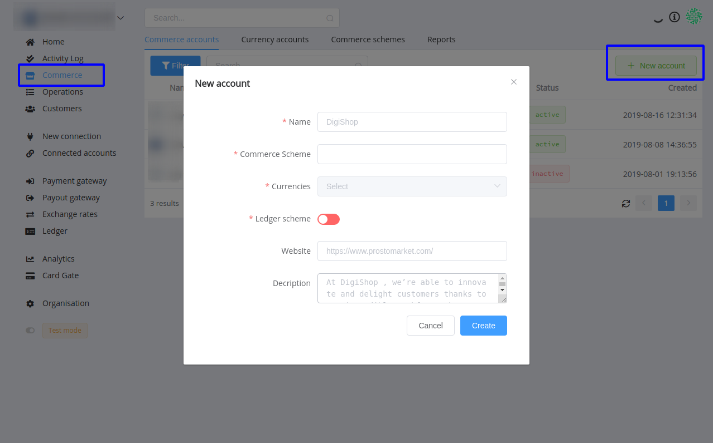

## Введение

Перед тем как начать взаимодействовать с PayCore.io вам необходимо провести базовую конфигурацию и подключить платежные провайдеры.

Но для начала, вам необходимо зарегистрироваться и вам автоматически будет создан новый аккаунт организации.

## Регистрация

Для регистрации в системе достаточно ввести email и предпочитаемый пароль и вы автоматически попадете в новый аккаунт организации.

После чего вы можете пригласить ваших коллег в эту организацию с различными ролями и доступами.

Детальнее об аккаунте организации и его настройках вы можете ознакомится в разделе "Account".

## Подключение платежных провадеров

.png")

После успешной регистрации для полноценной работы системы вам необходимо подключить платежные провайдеры в которых вы имеете мерчант-аккаунты.

Если платежного провайдера нет в списке доступных или коннектор не реализован, вы всегда можете обратиться к нам за помощью и он будет добавлен в максимально короткий срок.

Со списком всех реализованных подключений вы можете ознакомится в разделе "Connectors" ([https://docs.paycore.io/connectors/](https://docs.paycore.io/connectors/)).

Для подключение платежного провайдера выполните следующие действия:

-   Откройте каталог подключений платежных провайдеров.
-   Выберите необходимый провайдер и нажмите "Подключить".
-   Каждый коннектор имеет уникальные свойства и список необходимых параметров для подключения, с котороыми вы можете ознакомится в его инструкции подлючения.
-   В момент подключения аккаунта, система проверит их валидность, проведет синхронизацию доступных для него платежных маршрутов, маршрутов выплат, балансов и опций.

Для быстрого тестирования системы мы предлагаем подключить тестовое подключение (Test connector) в 2 клика! После подключения, для вас будут доступны тестовые платежные маршруты и маршруты выплат.

Что бы убедится, что аккаунт правильно сконфигурирован, вам необходимо проверить наличие активных платежных маршрутов в каждом из шлюзов соответственно:

-   Для платежного шлюза — [https://dashboard.paycore.io/payment-gateway/payment-routes](https://dashboard-dev.paycore.io/payment-gateway/payment-routes)
-   Для шлюза выплат — [https://dashboard.paycore.io/payment-gateway/payment-routes](https://dashboard-dev.paycore.io/payment-gateway/payment-routes)

Внимание! Учитывайте, что для тестового режима отображения данных отображаются только тестовые маршруты.

Детальнее о тестовом режиме вы можете ознакомится в разделе "[Тестирование](http://confluence.paymaxi.com)" ([https://docs.paycore.io/connectors/test/](https://docs.paycore.io/connectors/test/)).

## Создание коммерческого аккаунта

В рамках одной организации может быть множество вебсайтов, проектов, магазинов, витрин, бизнес аккаунтов, точек продаж и т.п.. Для учета всех операций для каждого из них, используется **Коммерческий аккаунт**.

**Коммерческий аккаунт** — это учетная запись, для которой учитываются все совершенные операции по приему платежей и выплатам в рамках всей вашей организации.

Для каждого **Коммерческого аккаута** можно задать индивидуальные бизнес-правила обработки операций и доступные ему платежные сервисы.

Конфигурация бизнес правил для **Коммерческого аккаунта** задается в **Коммерческой схеме**.

**Коммерческая схема** отвечает за доступные для **Коммерческого аккаунта** базовые валюты, схемы маршрутизации, схемы валютных курсов, индивидуальные комиссии соответственно для платежей и выплат.

При подключении первого платежного провайдера автоматически создается **Коммерческая схема** по умолчанию, которая включает в себя все доступные платежные маршруты и маршруты выплат. При желании, вы всегда можете сменить для Коммерческого аккаунта Коммерческую схему.

Для создания нового **Коммерческого аккаунта** достаточно просто указать его название, используемую **Коммерческую схему** и доступные для него базовые валюты.

Создайте ваш первый Коммерческий аккаунт в [Dashboard](https://dashboard.paycore.io/commerce/accounts) и перейдите к следующей главе, где мы проведем ваш первый платеж и совершим первую выплату!

## Поздравляем! Ваш аккаунт настроен и готов к работе!

После успешной конфиругации и подключении платежных провайдеров предлагаем [провести первые операции на прием платежей и выплаты](http://confluence.paymaxi.com).