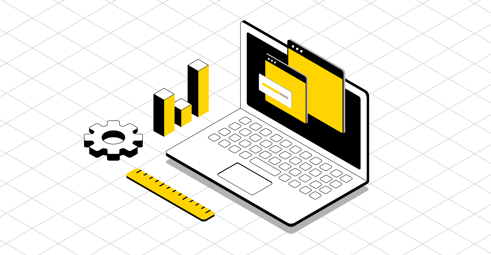
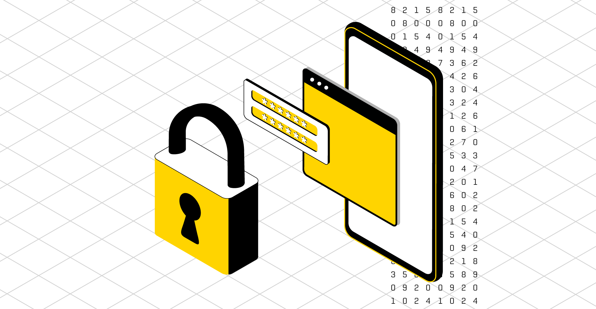

# Resources and tools to integrate [PayCore.io](https://paycore.io/) payments platform

## Welcome!

[PayCore.io](https://paycore.io/) is a payment platform and payments hub for online businesses and payment institutions. With the technical cloud-based infrastructure and payment tools required to operate an online payment system, we help you to create any payment flow and effectively address complex financial problems in industries.

[Look at the big picture -->](getting-started/platform-overview/)

## Accept payments

Accepting online payments, whether of products or services, is an essential part of any e-commerce project. The task is to ensure the process of transfer funds from one party to another, usually from a customer to a merchant.

One of the keys to achieving success and effectiveness in your e-commerce business is to guarantee the most convenient, fast, cheaper and safer way to pay online for your customers.

Also, the following challenges need to consider when scaling your online business; they are payment methods' availability in different regions, financial risk management from mitigation to optimization, payments security, payment processing faultless and its efficiency.

[Accept and process cards, wallets, and local payment methods -->](getting-started/first-payment/#receiving-your-first-payment)

## Make payouts

PayCore.io platform allows you to make transaction by any connected payout method, in any supported currency, and to almost any country across the globe. We support integration with multiple payment providers and acquirers to help you optimize your pricing and success rates.

Your organisation can send single or batch payouts to your clients, contract workers, claimers, freelancers, and retailers. To satisfy both your goals and your payee intentions, you need to customise payout processes, and our platform ready to assist in these regards.

[Save time and money with fast and cost-effective payouts -->](getting-started/first-payment/#make-your-first-payout)

## Design your own payment solution

Whether your business is simple or complex, we offer a robust set of building blocks to frame the payment solution. It can assist you in multiplying payment capabilities, reaching and supporting growth and keeping your consumers safe with no need to invest further in development or infrastructure.

[Choose the products you need -->](products/)

## Payment APIs and Tools for Developers

There is a range of different ways that you can integrate directly with PayCore's systems for seamless payment capability in your applications, systems, products, or services.

You can use our RESTful API and Checkout Pages to accept payments and Callbacks­ to handle changes in the transaction statuses. And you can develop your own Checkout page. In any case, our APIs provide a safe route through standard interfaces to all PayCore.io's features.

[Start by learning about our effective and flexible APIs -->](integration/)
